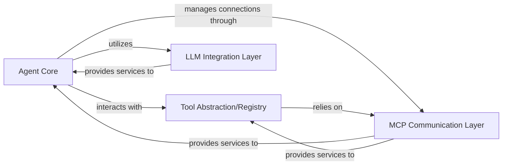

## Details

One paragraph explaining the functionality which is represented by this graph. What the main flow is and what is its purpose.

### Agent Core [[Expand]](./Agent_Core.md)
This is the central orchestrator of the agent's behavior. It manages the agent's lifecycle, makes decisions, and coordinates interactions with various internal and external systems. It leverages the LLM Integration Layer for reasoning and the Tool Abstraction/Registry for interacting with external capabilities.

**Related Classes/Methods**:

- <a href="https://github.com/mcp-use/mcp-use/blob/main/mcp_use/agents/mcpagent.py" target="_blank" rel="noopener noreferrer">`mcp_use.agents.mcpagent`</a>

### MCP Communication Layer [[Expand]](./MCP_Communication_Layer.md)
Manages all aspects of communication with Multi-Agent Communication Protocol (MCP) servers. This includes establishing and maintaining sessions, handling various communication protocols (HTTP, WebSocket, Stdio, Sandbox), and ensuring reliable message exchange. This layer inherently incorporates asynchronous processing for efficient network operations, crucial for real-time agent interactions.

**Related Classes/Methods**:

- `mcp_use.connectors`
- `mcp_use.task_managers`
- <a href="https://github.com/mcp-use/mcp-use/blob/main/mcp_use/session.py" target="_blank" rel="noopener noreferrer">`mcp_use.session`</a>
- <a href="https://github.com/mcp-use/mcp-use/blob/main/mcp_use/client.py" target="_blank" rel="noopener noreferrer">`mcp_use.client`</a>

### Tool Abstraction/Registry [[Expand]](./Tool_Abstraction_Registry.md)
Provides a standardized interface for the Agent Core to discover, list, activate, and execute tools exposed by remote MCP servers. It abstracts the underlying communication complexities with the MCP Communication Layer, allowing the agent to seamlessly interact with external functionalities.

**Related Classes/Methods**:

- `mcp_use.managers.tools`

### LLM Integration Layer [[Expand]](./LLM_Integration_Layer.md)
Offers a pluggable and standardized interface for integrating the `mcp-use` library with various external Large Language Model (LLM) frameworks (e.g., LangChain). It translates agent requests into framework-specific LLM calls and processes their responses, enabling the agent to leverage advanced AI capabilities for reasoning and generation.

**Related Classes/Methods**:

- <a href="https://github.com/mcp-use/mcp-use/blob/main/mcp_use/adapters/langchain_adapter.py" target="_blank" rel="noopener noreferrer">`mcp_use.adapters.langchain_adapter`</a>
- <a href="https://github.com/mcp-use/mcp-use/blob/main/mcp_use/adapters/base.py" target="_blank" rel="noopener noreferrer">`mcp_use.adapters.base`</a>

### [FAQ](https://github.com/CodeBoarding/GeneratedOnBoardings/tree/main?tab=readme-ov-file#faq)