```mermaid
graph LR
    Client_Session_Management["Client & Session Management"]
    Agent_Orchestration["Agent Orchestration"]
    Communication_Layer["Communication Layer"]
    Tool_Server_Management["Tool & Server Management"]
    Integration_Utilities["Integration & Utilities"]
    Client_Session_Management -- "Manages" --> Communication_Layer
    Client_Session_Management -- "Orchestrates" --> Agent_Orchestration
    Agent_Orchestration -- "Utilizes" --> Tool_Server_Management
    Agent_Orchestration -- "Leverages" --> Integration_Utilities
    Communication_Layer -- "Provides" --> Client_Session_Management
    Communication_Layer -- "Facilitates" --> Tool_Server_Management
    Tool_Server_Management -- "Interacts with" --> Communication_Layer
    Tool_Server_Management -- "Exposes" --> Agent_Orchestration
    Integration_Utilities -- "Supports" --> Agent_Orchestration
    Integration_Utilities -- "Configures" --> Client_Session_Management
    click Client_Session_Management href "https://github.com/CodeBoarding/GeneratedOnBoardings/blob/main/mcp-use/Client_Session_Management.md" "Details"
    click Agent_Orchestration href "https://github.com/CodeBoarding/GeneratedOnBoardings/blob/main/mcp-use/Agent_Orchestration.md" "Details"
    click Communication_Layer href "https://github.com/CodeBoarding/GeneratedOnBoardings/blob/main/mcp-use/Communication_Layer.md" "Details"
    click Integration_Utilities href "https://github.com/CodeBoarding/GeneratedOnBoardings/blob/main/mcp-use/Integration_Utilities.md" "Details"
```

## Details

The `mcp-use` project functions as a robust AI Agent Framework, enabling seamless interaction with multiple AI agent servers and their exposed tools. At its core, the framework allows users to establish and manage connections to various MCP servers, orchestrate AI agent behaviors, and integrate with external AI frameworks. The primary flow involves a user initiating a session through the client interface, which then manages the underlying communication to an MCP server. The central AI agent component leverages this connection to discover and utilize tools provided by the servers, adapting its interactions as needed, all while collecting telemetry for observability.

### Client & Session Management [[Expand]](./Client_Session_Management.md)
This component serves as the primary interface for users, managing connections to multiple MCP servers and orchestrating individual user sessions. It handles the lifecycle of server connections and provides the foundational context for agent interactions.

**Related Classes/Methods**:

- <a href="https://github.com/mcp-use/mcp-use/blob/main/mcp_use/client.py#L1-L1" target="_blank" rel="noopener noreferrer">`mcp_use.client` (1:1)</a>
- <a href="https://github.com/mcp-use/mcp-use/blob/main/mcp_use/session.py#L1-L1" target="_blank" rel="noopener noreferrer">`mcp_use.session` (1:1)</a>

### Agent Orchestration [[Expand]](./Agent_Orchestration.md)
The central intelligence of the framework, responsible for initializing the AI agent, managing conversation flow, and processing/streaming responses. It embodies the agent's reasoning and decision-making logic, interacting with available tools to fulfill tasks.

**Related Classes/Methods**:

- <a href="https://github.com/mcp-use/mcp-use/blob/main/mcp_use/agents/mcpagent.py#L1-L1" target="_blank" rel="noopener noreferrer">`mcp_use.agents.mcpagent` (1:1)</a>
- <a href="https://github.com/mcp-use/mcp-use/blob/main/mcp_use/agents/prompts/system_prompt_builder.py#L1-L1" target="_blank" rel="noopener noreferrer">`mcp_use.agents.prompts.system_prompt_builder` (1:1)</a>

### Communication Layer [[Expand]](./Communication_Layer.md)
Handles all underlying communication protocols (e.g., WebSocket, HTTP, Stdio, Sandbox) and manages asynchronous connection tasks. It ensures stable and persistent connections with MCP servers, abstracting the complexities of network communication.

**Related Classes/Methods**:

- `mcp_use.connectors` (1:1)
- `mcp_use.task_managers` (1:1)

### Tool & Server Management
Manages the discovery, connection, and lifecycle of multiple MCP servers. It provides functionalities for searching, listing, and utilizing tools available across these connected servers, acting as a registry and access point for agent capabilities.

**Related Classes/Methods**:

- <a href="https://github.com/mcp-use/mcp-use/blob/main/mcp_use/managers/server_manager.py#L1-L1" target="_blank" rel="noopener noreferrer">`mcp_use.managers.server_manager` (1:1)</a>
- `mcp_use.managers.tools` (1:1)

### Integration & Utilities [[Expand]](./Integration_Utilities.md)
Provides foundational services including seamless integration with external AI frameworks (e.g., LangChain), telemetry for monitoring and analytics, and core utilities like configuration management and centralized logging for the entire framework.

**Related Classes/Methods**:

- `mcp_use.adapters` (1:1)
- `mcp_use.telemetry` (1:1)
- <a href="https://github.com/mcp-use/mcp-use/blob/main/mcp_use/config.py#L1-L1" target="_blank" rel="noopener noreferrer">`mcp_use.config` (1:1)</a>
- <a href="https://github.com/mcp-use/mcp-use/blob/main/mcp_use/logging.py#L1-L1" target="_blank" rel="noopener noreferrer">`mcp_use.logging` (1:1)</a>

### [FAQ](https://github.com/CodeBoarding/GeneratedOnBoardings/tree/main?tab=readme-ov-file#faq)