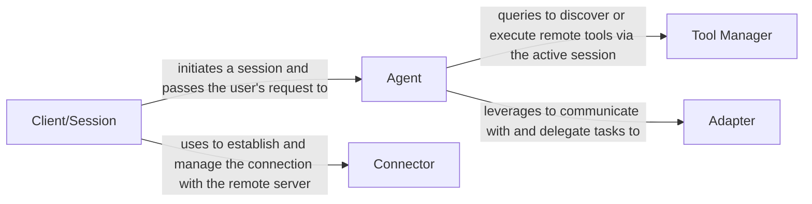

## Details

One paragraph explaining the functionality which is represented by this graph. What the main flow is and what is its purpose.

### Client/Session
The primary user-facing entry point. It is responsible for initializing the system, establishing and managing the server connection through a session, and providing a simplified interface to send requests to the Agent.

**Related Classes/Methods**:

- `mcp_use.client.MCPClient`
- `mcp_use.session.MCPSession`

### Agent [[Expand]](./Agent.md)
The core reasoning component of the framework. It processes user input, orchestrates tasks, and makes decisions. It interacts with the Tool Manager to access external capabilities and uses Adapters to integrate with underlying AI models or frameworks.

**Related Classes/Methods**:

- `mcp_use.agents.mcpagent.MCPAgent`

### Adapter
Acts as a translation layer that decouples the Agent from external AI frameworks. It implements the Adapter Pattern, converting the agent's internal data structures into the format required by systems like LangChain, enabling seamless integration.

**Related Classes/Methods**:

- `mcp_use.adapters.base.BaseAdapter`
- `mcp_use.adapters.langchain_adapter.LangChainAdapter`

### Tool Manager [[Expand]](./Tool_Manager.md)
A service layer that manages the discovery and execution of tools available on remote servers. It utilizes the connection established by the Client/Session to provide the Agent with a unified interface for searching and using tools.

**Related Classes/Methods**:

- <a href="https://github.com/mcp-use/mcp-use/blob/main/mcp_use/managers/server_manager.py#L16-L89" target="_blank" rel="noopener noreferrer">`mcp_use.managers.server_manager.ServerManager` (16:89)</a>
- <a href="https://github.com/mcp-use/mcp-use/blob/main/mcp_use/managers/tools/use_tool.py#L21-L153" target="_blank" rel="noopener noreferrer">`mcp_use.managers.tools.use_tool.UseToolFromServerTool` (21:153)</a>

### Connector [[Expand]](./Connector.md)
This component abstracts low-level communication, managing the details of the connection protocol. It is used by the Client/Session to handle the asynchronous data exchange with remote servers, effectively decoupling the application logic from the transport layer.

**Related Classes/Methods**:

- `mcp_use.connectors.base.BaseConnector`
- `mcp_use.connectors.http.HttpConnector`
- `mcp_use.connectors.websocket.WebSocketConnector`

### [FAQ](https://github.com/CodeBoarding/GeneratedOnBoardings/tree/main?tab=readme-ov-file#faq)