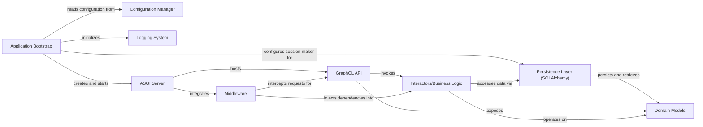

## Component Details

The graph describes the architecture of the MedConB application, detailing its core components and their interactions. The main flow starts with the Application Bootstrap component, which initializes the application by setting up logging, configuring the database persistence layer, and creating the ASGI Server. The ASGI Server then hosts the GraphQL API, which serves as the primary interface for client interactions. Requests to the GraphQL API are processed by Middleware components and then routed to Interactors/Business Logic for executing specific application use cases. These interactors operate on Domain Models and interact with the Persistence Layer (SQLAlchemy) to store and retrieve data. The Configuration Manager provides essential settings across the application. The purpose of this architecture is to provide a structured, maintainable, and scalable backend for the MedConB application, separating concerns into distinct components for clarity and efficient development.

### Application Bootstrap
This component is responsible for the initial setup and orchestration of the MedConB application. It initializes logging, configures the database session maker, creates the caching client, and ultimately creates the ASGI application server. It acts as the entry point for the application.

**Related Classes/Methods**:

- <a href="https://github.com/Bayer-Group/medconb/blob/master/backend/medconb/app.py#L20-L23" target="_blank" rel="noopener noreferrer">`medconb.app:create_app` (20:23)</a>
- <a href="https://github.com/Bayer-Group/medconb/blob/master/backend/medconb/app.py#L26-L39" target="_blank" rel="noopener noreferrer">`medconb.app:_create_sessionmaker` (26:39)</a>
- <a href="https://github.com/Bayer-Group/medconb/blob/master/backend/medconb/app.py#L42-L59" target="_blank" rel="noopener noreferrer">`medconb.app:_create_sqlalchemy_sessionmaker` (42:59)</a>
- <a href="https://github.com/Bayer-Group/medconb/blob/master/backend/medconb/app.py#L62-L65" target="_blank" rel="noopener noreferrer">`medconb.app:_create_cache_client` (62:65)</a>

### Configuration Manager
This component handles the loading and access of application-wide configuration settings, such as database URLs and caching parameters.

**Related Classes/Methods**:

- `medconb.config.config` (full file reference)

### Logging System
This component provides logging capabilities for the application, allowing different parts of the system to record events and debug information.

**Related Classes/Methods**:

- <a href="https://github.com/Bayer-Group/medconb/blob/master/backend/medconb/log.py#L23-L42" target="_blank" rel="noopener noreferrer">`medconb.log:setup_logging` (23:42)</a>
- <a href="https://github.com/Bayer-Group/medconb/blob/master/backend/medconb/log.py#L48-L86" target="_blank" rel="noopener noreferrer">`medconb.log:time_me` (48:86)</a>

### Persistence Layer (SQLAlchemy)
This component is responsible for managing the interaction with the relational database using SQLAlchemy, including session management, repositories, ORM mappings, and caching mechanisms. It also integrates with Redis for caching.

**Related Classes/Methods**:

- `medconb.persistence.sqlalchemy.create_sessionmaker` (full file reference)
- `medconb.persistence.sqlalchemy.session` (full file reference)
- `medconb.persistence.sqlalchemy.repositories` (full file reference)
- `medconb.persistence.sqlalchemy.orm` (full file reference)
- `medconb.persistence.sqlalchemy.cache` (full file reference)
- `redis.StrictRedis` (full file reference)

### ASGI Server
This component is responsible for creating and running the ASGI (Asynchronous Server Gateway Interface) application, which serves as the entry point for web requests.

**Related Classes/Methods**:

- <a href="https://github.com/Bayer-Group/medconb/blob/master/backend/medconb/server.py#L119-L162" target="_blank" rel="noopener noreferrer">`medconb.server.create_app` (119:162)</a>

### Domain Models
This component encapsulates the core business logic and data structures of the MedConB application. It defines entities like Codelist, Collection, Container, Ontology, Phenotype, and User.

**Related Classes/Methods**:

- `medconb.domain` (full file reference)
- `medconb.domain.base` (full file reference)
- `medconb.domain.codelist` (full file reference)
- `medconb.domain.collection` (full file reference)
- `medconb.domain.container` (full file reference)
- `medconb.domain.ontology` (full file reference)
- `medconb.domain.phenotype` (full file reference)
- `medconb.domain.user` (full file reference)
- `medconb.domain.importer` (full file reference)

### GraphQL API
This component provides the GraphQL interface for the application, defining queries, mutations, and object types to expose the domain models and interactors to clients.

**Related Classes/Methods**:

- `medconb.graphql.helper` (full file reference)
- `medconb.graphql.main` (full file reference)
- `medconb.graphql.mutation` (full file reference)
- `medconb.graphql.objects` (full file reference)
- `medconb.graphql.query` (full file reference)
- `medconb.graphql.types` (full file reference)

### Interactors/Business Logic
This component contains the application's use cases and business rules. It orchestrates interactions between the domain models and the persistence layer to fulfill specific application functionalities.

**Related Classes/Methods**:

- `medconb.interactors` (full file reference)
- `medconb.interactors.base` (full file reference)
- `medconb.interactors.codelist` (full file reference)
- `medconb.interactors.phenotype` (full file reference)
- `medconb.interactors.property` (full file reference)
- `medconb.interactors.query` (full file reference)
- `medconb.interactors.user` (full file reference)
- `medconb.interactors.workspace` (full file reference)

### Middleware
This component provides middleware functionalities for the ASGI application, potentially handling authentication, authorization, or request/response processing before reaching the core application logic.

**Related Classes/Methods**:

- `medconb.middleware` (full file reference)

### [FAQ](https://github.com/CodeBoarding/GeneratedOnBoardings/tree/main?tab=readme-ov-file#faq)