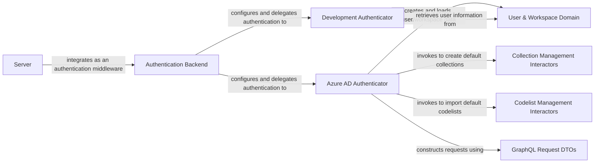

## Component Details

This graph illustrates the `Authentication & Middleware` subsystem, which is responsible for handling user authentication, supporting both Azure AD and development authenticators. It extracts claims, manages user loading and creation, and ensures secure access to the application by integrating various components for user management, collection, and codelist operations.

### Authentication Backend
This component is responsible for managing different authentication methods (Azure AD and Development). It acts as a central point for authenticating incoming requests by iterating through configured authenticators.

**Related Classes/Methods**:

- <a href="https://github.com/Bayer-Group/medconb/blob/master/backend/medconb/middleware.py#L66-L115" target="_blank" rel="noopener noreferrer">`medconb.backend.medconb.middleware.AuthBackend` (66:115)</a>

### Azure AD Authenticator
Handles authentication specifically for Azure Active Directory. It decodes and validates JWT tokens, extracts claims, and loads or creates user profiles based on these claims. It also initializes new users with default collections and codelists.

**Related Classes/Methods**:

- <a href="https://github.com/Bayer-Group/medconb/blob/master/backend/medconb/middleware.py#L175-L187" target="_blank" rel="noopener noreferrer">`medconb.backend.medconb.middleware.AzureADAuthenticator:__init__` (175:187)</a>
- <a href="https://github.com/Bayer-Group/medconb/blob/master/backend/medconb/middleware.py#L207-L223" target="_blank" rel="noopener noreferrer">`medconb.backend.medconb.middleware.AzureADAuthenticator:_configure_ad` (207:223)</a>
- <a href="https://github.com/Bayer-Group/medconb/blob/master/backend/medconb/middleware.py#L243-L261" target="_blank" rel="noopener noreferrer">`medconb.backend.medconb.middleware.AzureADAuthenticator:authenticate` (243:261)</a>
- <a href="https://github.com/Bayer-Group/medconb/blob/master/backend/medconb/middleware.py#L263-L289" target="_blank" rel="noopener noreferrer">`medconb.backend.medconb.middleware.AzureADAuthenticator:_extract_claims` (263:289)</a>
- <a href="https://github.com/Bayer-Group/medconb/blob/master/backend/medconb/middleware.py#L291-L332" target="_blank" rel="noopener noreferrer">`medconb.backend.medconb.middleware.AzureADAuthenticator:_load_user` (291:332)</a>
- <a href="https://github.com/Bayer-Group/medconb/blob/master/backend/medconb/middleware.py#L334-L354" target="_blank" rel="noopener noreferrer">`medconb.backend.medconb.middleware.AzureADAuthenticator:_create_new_user` (334:354)</a>
- <a href="https://github.com/Bayer-Group/medconb/blob/master/backend/medconb/middleware.py#L356-L530" target="_blank" rel="noopener noreferrer">`medconb.backend.medconb.middleware.AzureADAuthenticator:_init_new_user` (356:530)</a>

### Development Authenticator
Provides a simplified authentication mechanism for development environments. It authenticates users based on a pre-configured token and user ID.

**Related Classes/Methods**:

- <a href="https://github.com/Bayer-Group/medconb/blob/master/backend/medconb/middleware.py#L119-L123" target="_blank" rel="noopener noreferrer">`medconb.backend.medconb.middleware.DevAuthenticator:__init__` (119:123)</a>
- <a href="https://github.com/Bayer-Group/medconb/blob/master/backend/medconb/middleware.py#L125-L132" target="_blank" rel="noopener noreferrer">`medconb.backend.medconb.middleware.DevAuthenticator:_configure_develop` (125:132)</a>

### User & Workspace Domain
Defines the core domain models for users and their workspaces, including UserID, User, and Workspace. These models represent the fundamental entities within the system.

**Related Classes/Methods**:

- <a href="https://github.com/Bayer-Group/medconb/blob/master/backend/medconb/domain/base.py#L11-L11" target="_blank" rel="noopener noreferrer">`medconb.backend.medconb.domain.base.UserID` (11:11)</a>
- <a href="https://github.com/Bayer-Group/medconb/blob/master/backend/medconb/domain/user.py#L15-L57" target="_blank" rel="noopener noreferrer">`medconb.backend.medconb.domain.user.User` (15:57)</a>
- <a href="https://github.com/Bayer-Group/medconb/blob/master/backend/medconb/domain/user.py#L69-L107" target="_blank" rel="noopener noreferrer">`medconb.backend.medconb.domain.user.Workspace` (69:107)</a>

### Collection Management Interactors
Contains interactors responsible for managing collections, such as creating new collections.

**Related Classes/Methods**:

- <a href="https://github.com/Bayer-Group/medconb/blob/master/backend/medconb/interactors/workspace.py#L44-L70" target="_blank" rel="noopener noreferrer">`medconb.backend.medconb.interactors.workspace.CreateCollection` (44:70)</a>

### Codelist Management Interactors
Contains interactors responsible for managing codelists, such as importing codelists.

**Related Classes/Methods**:

- <a href="https://github.com/Bayer-Group/medconb/blob/master/backend/medconb/interactors/codelist.py#L214-L359" target="_blank" rel="noopener noreferrer">`medconb.backend.medconb.interactors.codelist.ImportCodelists` (214:359)</a>

### GraphQL Request DTOs
Defines data transfer objects (DTOs) used for GraphQL requests related to creating collections and importing codelists.

**Related Classes/Methods**:

- <a href="https://github.com/Bayer-Group/medconb/blob/master/backend/medconb/graphql/types.py#L148-L153" target="_blank" rel="noopener noreferrer">`medconb.backend.medconb.graphql.types.CreateCollectionRequestDto` (148:153)</a>
- <a href="https://github.com/Bayer-Group/medconb/blob/master/backend/medconb/graphql/types.py#L277-L280" target="_blank" rel="noopener noreferrer">`medconb.backend.medconb.graphql.types.ImportCodelistsRequestDto` (277:280)</a>
- <a href="https://github.com/Bayer-Group/medconb/blob/master/backend/medconb/graphql/types.py#L272-L274" target="_blank" rel="noopener noreferrer">`medconb.backend.medconb.graphql.types.CodelistInput` (272:274)</a>
- <a href="https://github.com/Bayer-Group/medconb/blob/master/backend/medconb/graphql/types.py#L267-L269" target="_blank" rel="noopener noreferrer">`medconb.backend.medconb.graphql.types.CodesetInput` (267:269)</a>

### [FAQ](https://github.com/CodeBoarding/GeneratedOnBoardings/tree/main?tab=readme-ov-file#faq)