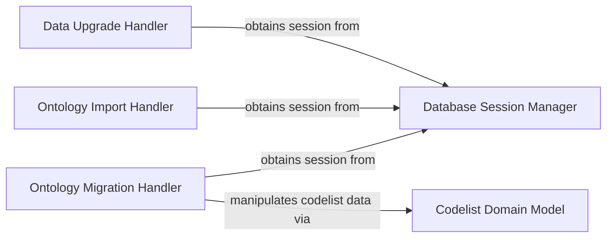

## Component Details

This subsystem provides essential functionalities for managing and transforming data within the `medconb` application, focusing on data upgrades, ontology imports, and migrations. It ensures data integrity and compatibility with evolving schema requirements by interacting with database session management and core domain models for codelists.

### Data Upgrade Handler
This component is responsible for validating and upgrading existing data in the `medconb` database to ensure compliance with version 14 requirements. It specifically checks for and sets required properties on `Collection` and `Phenotype` objects.

**Related Classes/Methods**:

- <a href="https://github.com/Bayer-Group/medconb/blob/master/backend/helper/data_upgrader_v14.py#L23-L26" target="_blank" rel="noopener noreferrer">`medconb.backend.helper.data_upgrader_v14:main` (23:26)</a>
- <a href="https://github.com/Bayer-Group/medconb/blob/master/backend/helper/data_upgrader_v14.py#L51-L84" target="_blank" rel="noopener noreferrer">`medconb.backend.helper.data_upgrader_v14:assert_required_properties_set_on_collections` (51:84)</a>
- <a href="https://github.com/Bayer-Group/medconb/blob/master/backend/helper/data_upgrader_v14.py#L87-L121" target="_blank" rel="noopener noreferrer">`medconb.backend.helper.data_upgrader_v14:assert_required_properties_set_on_phenotypes` (87:121)</a>
- <a href="https://github.com/Bayer-Group/medconb/blob/master/backend/helper/data_upgrader_v14.py#L124-L145" target="_blank" rel="noopener noreferrer">`medconb.backend.helper.data_upgrader_v14:sessionmaker` (124:145)</a>

### Ontology Import Handler
This component handles the initial import of new ontology data into the database. It reads from temporary `code_new` and `ontology_new` tables, reorders IDs using a Depth-First Search (DFS) algorithm, and populates the main `code` and `ontology` tables.

**Related Classes/Methods**:

- <a href="https://github.com/Bayer-Group/medconb/blob/master/backend/helper/import_ontologies.py#L79-L83" target="_blank" rel="noopener noreferrer">`medconb.backend.helper.import_ontologies:main` (79:83)</a>
- <a href="https://github.com/Bayer-Group/medconb/blob/master/backend/helper/import_ontologies.py#L86-L87" target="_blank" rel="noopener noreferrer">`medconb.backend.helper.import_ontologies:exec_text` (86:87)</a>
- <a href="https://github.com/Bayer-Group/medconb/blob/master/backend/helper/import_ontologies.py#L94-L234" target="_blank" rel="noopener noreferrer">`medconb.backend.helper.import_ontologies:_main` (94:234)</a>
- <a href="https://github.com/Bayer-Group/medconb/blob/master/backend/helper/import_ontologies.py#L237-L258" target="_blank" rel="noopener noreferrer">`medconb.backend.helper.import_ontologies:dfs` (237:258)</a>

### Ontology Migration Handler
This component is responsible for importing new ontology data and, crucially, migrating existing codelists to use the new ontology IDs. It includes logic for removing invalid codes and asserting the presence of referenced codes in the updated ontology tables.

**Related Classes/Methods**:

- <a href="https://github.com/Bayer-Group/medconb/blob/master/backend/helper/migrate_ontologies.py#L459-L463" target="_blank" rel="noopener noreferrer">`medconb.backend.helper.migrate_ontologies:main` (459:463)</a>
- <a href="https://github.com/Bayer-Group/medconb/blob/master/backend/helper/migrate_ontologies.py#L466-L467" target="_blank" rel="noopener noreferrer">`medconb.backend.helper.migrate_ontologies:exec_text` (466:467)</a>
- <a href="https://github.com/Bayer-Group/medconb/blob/master/backend/helper/migrate_ontologies.py#L474-L697" target="_blank" rel="noopener noreferrer">`medconb.backend.helper.migrate_ontologies:_main` (474:697)</a>
- <a href="https://github.com/Bayer-Group/medconb/blob/master/backend/helper/migrate_ontologies.py#L700-L731" target="_blank" rel="noopener noreferrer">`medconb.backend.helper.migrate_ontologies:remove_invalid_codes` (700:731)</a>
- <a href="https://github.com/Bayer-Group/medconb/blob/master/backend/helper/migrate_ontologies.py#L826-L849" target="_blank" rel="noopener noreferrer">`medconb.backend.helper.migrate_ontologies:dfs` (826:849)</a>

### Database Session Manager
This component provides the core functionality for creating and managing SQLAlchemy database sessions. It configures sessionmakers for both the `medconb` and `ontologies` databases and integrates custom session behavior, including repository access and integrity checks for domain objects.

**Related Classes/Methods**:

- <a href="https://github.com/Bayer-Group/medconb/blob/master/backend/medconb/persistence/sqlalchemy/session.py#L175-L203" target="_blank" rel="noopener noreferrer">`medconb.persistence.sqlalchemy.session.create_sessionmaker` (175:203)</a>
- <a href="https://github.com/Bayer-Group/medconb/blob/master/backend/medconb/persistence/sqlalchemy/session.py#L24-L172" target="_blank" rel="noopener noreferrer">`medconb.persistence.sqlalchemy.session.Session` (24:172)</a>

### Codelist Domain Model
This component defines the core domain models for codelists, including `SetOfCodeIds`, `Changeset`, `Commit`, and `Codelist`. It encapsulates the business logic for managing code IDs within codelists and tracking changes.

**Related Classes/Methods**:

- <a href="https://github.com/Bayer-Group/medconb/blob/master/backend/medconb/domain/codelist.py#L22-L83" target="_blank" rel="noopener noreferrer">`medconb.domain.codelist.SetOfCodeIds` (22:83)</a>
- <a href="https://github.com/Bayer-Group/medconb/blob/master/backend/medconb/domain/codelist.py#L88-L113" target="_blank" rel="noopener noreferrer">`medconb.domain.codelist.Changeset` (88:113)</a>
- <a href="https://github.com/Bayer-Group/medconb/blob/master/backend/medconb/domain/codelist.py#L129-L149" target="_blank" rel="noopener noreferrer">`medconb.domain.codelist.Commit` (129:149)</a>
- <a href="https://github.com/Bayer-Group/medconb/blob/master/backend/medconb/domain/codelist.py#L153-L173" target="_blank" rel="noopener noreferrer">`medconb.domain.codelist.Codeset` (153:173)</a>
- <a href="https://github.com/Bayer-Group/medconb/blob/master/backend/medconb/domain/codelist.py#L176-L219" target="_blank" rel="noopener noreferrer">`medconb.domain.codelist.Codesets` (176:219)</a>
- <a href="https://github.com/Bayer-Group/medconb/blob/master/backend/medconb/domain/codelist.py#L223-L265" target="_blank" rel="noopener noreferrer">`medconb.domain.codelist.Codelist` (223:265)</a>

### [FAQ](https://github.com/CodeBoarding/GeneratedOnBoardings/tree/main?tab=readme-ov-file#faq)