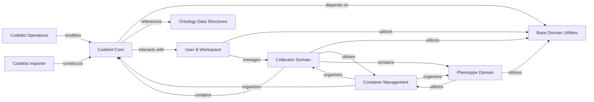

## Component Details

The Domain Models subsystem defines the core business entities and their behaviors within the `medconb.backend.medconb.domain` package. It encompasses the fundamental structures for managing medical codelists, ontologies, user workspaces, and generic container mechanisms. The main flow involves the creation, modification, and organization of codelists and other domain objects, supporting operations like importing, versioning, and user-specific data management. Its purpose is to provide a robust and consistent representation of the application's business logic and data.

### Codelist Core
This component defines the fundamental building blocks for managing medical codelists. It includes data structures for representing sets of code IDs, tracking changes to ontologies (Changeset), encapsulating modifications (Commit), and organizing codes from a specific ontology (Codeset). It also provides the aggregate view of all codesets within a codelist version (Codesets) and the main Codelist entity itself, which aggregates commits and provides access to its current state.

**Related Classes/Methods**:

- <a href="https://github.com/Bayer-Group/medconb/blob/master/backend/medconb/domain/codelist.py#L22-L83" target="_blank" rel="noopener noreferrer">`medconb.backend.medconb.domain.codelist.SetOfCodeIds` (22:83)</a>
- <a href="https://github.com/Bayer-Group/medconb/blob/master/backend/medconb/domain/codelist.py#L88-L113" target="_blank" rel="noopener noreferrer">`medconb.backend.medconb.domain.codelist.Changeset` (88:113)</a>
- <a href="https://github.com/Bayer-Group/medconb/blob/master/backend/medconb/domain/codelist.py#L117-L125" target="_blank" rel="noopener noreferrer">`medconb.backend.medconb.domain.codelist.Author` (117:125)</a>
- <a href="https://github.com/Bayer-Group/medconb/blob/master/backend/medconb/domain/codelist.py#L129-L149" target="_blank" rel="noopener noreferrer">`medconb.backend.medconb.domain.codelist.Commit` (129:149)</a>
- <a href="https://github.com/Bayer-Group/medconb/blob/master/backend/medconb/domain/codelist.py#L153-L173" target="_blank" rel="noopener noreferrer">`medconb.backend.medconb.domain.codelist.Codeset` (153:173)</a>
- <a href="https://github.com/Bayer-Group/medconb/blob/master/backend/medconb/domain/codelist.py#L176-L219" target="_blank" rel="noopener noreferrer">`medconb.backend.medconb.domain.codelist.Codesets` (176:219)</a>
- <a href="https://github.com/Bayer-Group/medconb/blob/master/backend/medconb/domain/codelist.py#L223-L265" target="_blank" rel="noopener noreferrer">`medconb.backend.medconb.domain.codelist.Codelist` (223:265)</a>
- <a href="https://github.com/Bayer-Group/medconb/blob/master/backend/medconb/domain/codelist.py#L35-L38" target="_blank" rel="noopener noreferrer">`medconb.backend.medconb.domain.codelist.SetOfCodeIds:__or__` (35:38)</a>
- <a href="https://github.com/Bayer-Group/medconb/blob/master/backend/medconb/domain/codelist.py#L48-L51" target="_blank" rel="noopener noreferrer">`medconb.backend.medconb.domain.codelist.SetOfCodeIds:__sub__` (48:51)</a>
- <a href="https://github.com/Bayer-Group/medconb/blob/master/backend/medconb/domain/codelist.py#L98-L106" target="_blank" rel="noopener noreferrer">`medconb.backend.medconb.domain.codelist.Changeset:__init__` (98:106)</a>
- <a href="https://github.com/Bayer-Group/medconb/blob/master/backend/medconb/domain/codelist.py#L108-L113" target="_blank" rel="noopener noreferrer">`medconb.backend.medconb.domain.codelist.Changeset:__deepcopy__` (108:113)</a>
- <a href="https://github.com/Bayer-Group/medconb/blob/master/backend/medconb/domain/codelist.py#L119-L125" target="_blank" rel="noopener noreferrer">`medconb.backend.medconb.domain.codelist.Author:from_user` (119:125)</a>
- <a href="https://github.com/Bayer-Group/medconb/blob/master/backend/medconb/domain/codelist.py#L143-L149" target="_blank" rel="noopener noreferrer">`medconb.backend.medconb.domain.codelist.Commit:__deepcopy__` (143:149)</a>
- <a href="https://github.com/Bayer-Group/medconb/blob/master/backend/medconb/domain/codelist.py#L168-L173" target="_blank" rel="noopener noreferrer">`medconb.backend.medconb.domain.codelist.Codeset:to_changeset` (168:173)</a>
- <a href="https://github.com/Bayer-Group/medconb/blob/master/backend/medconb/domain/codelist.py#L188-L215" target="_blank" rel="noopener noreferrer">`medconb.backend.medconb.domain.codelist.Codesets:__add__` (188:215)</a>
- <a href="https://github.com/Bayer-Group/medconb/blob/master/backend/medconb/domain/codelist.py#L240-L243" target="_blank" rel="noopener noreferrer">`medconb.backend.medconb.domain.codelist.Codelist:codesets` (240:243)</a>

### Codelist Operations
This component provides higher-level operations that can be performed on Codelist entities. This includes squashing multiple commits into a single one to simplify the history, generating unique names for cloned codelists to avoid conflicts, and handling the deletion of codelists from their containers while managing references.

**Related Classes/Methods**:

- <a href="https://github.com/Bayer-Group/medconb/blob/master/backend/medconb/domain/codelist.py#L280-L318" target="_blank" rel="noopener noreferrer">`medconb.backend.medconb.domain.codelist:squash_codelist` (280:318)</a>
- <a href="https://github.com/Bayer-Group/medconb/blob/master/backend/medconb/domain/codelist.py#L268-L277" target="_blank" rel="noopener noreferrer">`medconb.backend.medconb.domain.codelist.create_cloned_codelist_name` (268:277)</a>
- <a href="https://github.com/Bayer-Group/medconb/blob/master/backend/medconb/domain/codelist.py#L321-L336" target="_blank" rel="noopener noreferrer">`medconb.backend.medconb.domain.codelist.delete_codelist` (321:336)</a>

### User & Workspace
This component manages user identities and their associated workspaces. It defines the User entity with properties like ID, external ID, and name, and provides mechanisms for authentication. The Workspace entity allows users to organize and manage collections, including adding, removing, and reordering them. It also defines an exception for when a collection is not found within a workspace.

**Related Classes/Methods**:

- <a href="https://github.com/Bayer-Group/medconb/blob/master/backend/medconb/domain/user.py#L15-L57" target="_blank" rel="noopener noreferrer">`medconb.backend.medconb.domain.user.User` (15:57)</a>
- <a href="https://github.com/Bayer-Group/medconb/blob/master/backend/medconb/domain/user.py#L69-L107" target="_blank" rel="noopener noreferrer">`medconb.backend.medconb.domain.user.Workspace` (69:107)</a>
- <a href="https://github.com/Bayer-Group/medconb/blob/master/backend/medconb/domain/user.py#L61-L65" target="_blank" rel="noopener noreferrer">`medconb.backend.medconb.domain.user.CollectionNotInWorkspaceException` (61:65)</a>
- <a href="https://github.com/Bayer-Group/medconb/blob/master/backend/medconb/domain/user.py#L76-L78" target="_blank" rel="noopener noreferrer">`medconb.backend.medconb.domain.user.Workspace:add_collection` (76:78)</a>
- <a href="https://github.com/Bayer-Group/medconb/blob/master/backend/medconb/domain/user.py#L83-L87" target="_blank" rel="noopener noreferrer">`medconb.backend.medconb.domain.user.Workspace:remove_collection` (83:87)</a>
- <a href="https://github.com/Bayer-Group/medconb/blob/master/backend/medconb/domain/user.py#L89-L104" target="_blank" rel="noopener noreferrer">`medconb.backend.medconb.domain.user.Workspace:move_collection_after` (89:104)</a>

### Codelist Importer
This component is responsible for importing codelists from external data sources. It takes validated codeset data and other metadata to construct a new Codelist object, generating an initial commit. It also handles the creation of import reports, detailing any partial imports or skipped ontologies, and generates descriptive messages for the commit and codelist.

**Related Classes/Methods**:

- <a href="https://github.com/Bayer-Group/medconb/blob/master/backend/medconb/domain/importer.py#L30-L87" target="_blank" rel="noopener noreferrer">`medconb.backend.medconb.domain.importer.import_codelist` (30:87)</a>
- <a href="https://github.com/Bayer-Group/medconb/blob/master/backend/medconb/domain/importer.py#L90-L130" target="_blank" rel="noopener noreferrer">`medconb.backend.medconb.domain.importer._create_import_messages` (90:130)</a>
- <a href="https://github.com/Bayer-Group/medconb/blob/master/backend/medconb/domain/importer.py#L25-L27" target="_blank" rel="noopener noreferrer">`medconb.backend.medconb.domain.importer.ImportReport` (25:27)</a>
- <a href="https://github.com/Bayer-Group/medconb/blob/master/backend/medconb/domain/importer.py#L18-L21" target="_blank" rel="noopener noreferrer">`medconb.backend.medconb.domain.importer.ValidatedCodeset` (18:21)</a>

### Container Management
This component provides a generic framework for managing ordered collections of items, such as codelists or phenotypes, within a container. It defines the structure of a container specification and item types. The `OrderedContainer` class allows for adding, moving, and removing items while maintaining their order, ensuring that items are correctly associated with their respective containers.

**Related Classes/Methods**:

- <a href="https://github.com/Bayer-Group/medconb/blob/master/backend/medconb/domain/container.py#L63-L171" target="_blank" rel="noopener noreferrer">`medconb.backend.medconb.domain.container.OrderedContainer` (63:171)</a>
- <a href="https://github.com/Bayer-Group/medconb/blob/master/backend/medconb/domain/container.py#L41-L43" target="_blank" rel="noopener noreferrer">`medconb.backend.medconb.domain.container.ContainerSpec` (41:43)</a>
- <a href="https://github.com/Bayer-Group/medconb/blob/master/backend/medconb/domain/container.py#L30-L32" target="_blank" rel="noopener noreferrer">`medconb.backend.medconb.domain.container.ContainerType` (30:32)</a>
- <a href="https://github.com/Bayer-Group/medconb/blob/master/backend/medconb/domain/container.py#L35-L37" target="_blank" rel="noopener noreferrer">`medconb.backend.medconb.domain.container.ItemType` (35:37)</a>
- <a href="https://github.com/Bayer-Group/medconb/blob/master/backend/medconb/domain/container.py#L47-L55" target="_blank" rel="noopener noreferrer">`medconb.backend.medconb.domain.container.ContainerItem` (47:55)</a>
- <a href="https://github.com/Bayer-Group/medconb/blob/master/backend/medconb/domain/container.py#L174-L217" target="_blank" rel="noopener noreferrer">`medconb.backend.medconb.domain.container.add_or_move_item` (174:217)</a>
- <a href="https://github.com/Bayer-Group/medconb/blob/master/backend/medconb/domain/container.py#L70-L71" target="_blank" rel="noopener noreferrer">`medconb.backend.medconb.domain.container.OrderedContainer:to_spec` (70:71)</a>
- <a href="https://github.com/Bayer-Group/medconb/blob/master/backend/medconb/domain/container.py#L74-L74" target="_blank" rel="noopener noreferrer">`medconb.backend.medconb.domain.container.OrderedContainer:__contains__` (74:74)</a>
- <a href="https://github.com/Bayer-Group/medconb/blob/master/backend/medconb/domain/container.py#L95-L99" target="_blank" rel="noopener noreferrer">`medconb.backend.medconb.domain.container.OrderedContainer:add_or_move_item_after` (95:99)</a>
- <a href="https://github.com/Bayer-Group/medconb/blob/master/backend/medconb/domain/container.py#L151-L151" target="_blank" rel="noopener noreferrer">`medconb.backend.medconb.domain.container.OrderedContainer:remove_item` (151:151)</a>

### Base Domain Utilities
This component provides fundamental utilities and base classes for various domain objects. It includes definitions for common identifiers like UserID and WorkspaceID, and a flexible PropertyBag mechanism for attaching arbitrary properties to domain entities. It also offers functions for initializing and updating property bags, ensuring data consistency and handling auto-generated properties.

**Related Classes/Methods**:

- <a href="https://github.com/Bayer-Group/medconb/blob/master/backend/medconb/domain/base.py#L50-L56" target="_blank" rel="noopener noreferrer">`medconb.backend.medconb.domain.base.PropertyBag` (50:56)</a>
- <a href="https://github.com/Bayer-Group/medconb/blob/master/backend/medconb/domain/base.py#L91-L158" target="_blank" rel="noopener noreferrer">`medconb.backend.medconb.domain.base.update_property_bag` (91:158)</a>
- <a href="https://github.com/Bayer-Group/medconb/blob/master/backend/medconb/domain/base.py#L70-L88" target="_blank" rel="noopener noreferrer">`medconb.backend.medconb.domain.base.init_property_bag` (70:88)</a>
- <a href="https://github.com/Bayer-Group/medconb/blob/master/backend/medconb/domain/base.py#L161-L199" target="_blank" rel="noopener noreferrer">`medconb.backend.medconb.domain.base._sanitize_property_input` (161:199)</a>
- <a href="https://github.com/Bayer-Group/medconb/blob/master/backend/medconb/domain/base.py#L202-L207" target="_blank" rel="noopener noreferrer">`medconb.backend.medconb.domain.base._assert_property_is_editable` (202:207)</a>
- <a href="https://github.com/Bayer-Group/medconb/blob/master/backend/medconb/domain/base.py#L210-L222" target="_blank" rel="noopener noreferrer">`medconb.backend.medconb.domain.base.set_auto_generated_props` (210:222)</a>
- <a href="https://github.com/Bayer-Group/medconb/blob/master/backend/medconb/domain/base.py#L11-L11" target="_blank" rel="noopener noreferrer">`medconb.backend.medconb.domain.base.UserID` (11:11)</a>
- <a href="https://github.com/Bayer-Group/medconb/blob/master/backend/medconb/domain/base.py#L14-L14" target="_blank" rel="noopener noreferrer">`medconb.backend.medconb.domain.base.WorkspaceID` (14:14)</a>
- <a href="https://github.com/Bayer-Group/medconb/blob/master/backend/medconb/domain/base.py#L38-L46" target="_blank" rel="noopener noreferrer">`medconb.backend.medconb.domain.base.Property` (38:46)</a>
- <a href="https://github.com/Bayer-Group/medconb/blob/master/backend/medconb/domain/base.py#L21-L21" target="_blank" rel="noopener noreferrer">`medconb.backend.medconb.domain.base.PropertyID` (21:21)</a>
- <a href="https://github.com/Bayer-Group/medconb/blob/master/backend/medconb/domain/base.py#L24-L26" target="_blank" rel="noopener noreferrer">`medconb.backend.medconb.domain.base.PropertyClass` (24:26)</a>
- <a href="https://github.com/Bayer-Group/medconb/blob/master/backend/medconb/domain/base.py#L29-L34" target="_blank" rel="noopener noreferrer">`medconb.backend.medconb.domain.base.PropertyDtype` (29:34)</a>

### Ontology Data Structures
This component defines the core data models for representing medical ontologies and individual codes within those ontologies. It includes the `Ontology` class to represent a coding system and the `Code` class to detail individual codes with their hierarchical relationships and metadata. It also provides utilities for serializing and deserializing code objects and defines parameters for code searching.

**Related Classes/Methods**:

- <a href="https://github.com/Bayer-Group/medconb/blob/master/backend/medconb/domain/ontology.py#L18-L38" target="_blank" rel="noopener noreferrer">`medconb.backend.medconb.domain.ontology.Code` (18:38)</a>
- <a href="https://github.com/Bayer-Group/medconb/blob/master/backend/medconb/domain/ontology.py#L8-L14" target="_blank" rel="noopener noreferrer">`medconb.backend.medconb.domain.ontology.Ontology` (8:14)</a>
- <a href="https://github.com/Bayer-Group/medconb/blob/master/backend/medconb/domain/ontology.py#L41-L43" target="_blank" rel="noopener noreferrer">`medconb.backend.medconb.domain.ontology.CodeSearchParamType` (41:43)</a>
- <a href="https://github.com/Bayer-Group/medconb/blob/master/backend/medconb/domain/ontology.py#L47-L52" target="_blank" rel="noopener noreferrer">`medconb.backend.medconb.domain.ontology.CodeSearchParam` (47:52)</a>
- <a href="https://github.com/Bayer-Group/medconb/blob/master/backend/medconb/domain/ontology.py#L55-L60" target="_blank" rel="noopener noreferrer">`medconb.backend.medconb.domain.ontology.QueryData` (55:60)</a>
- <a href="https://github.com/Bayer-Group/medconb/blob/master/backend/medconb/domain/ontology.py#L37-L38" target="_blank" rel="noopener noreferrer">`medconb.backend.medconb.domain.ontology.Code:deserialize` (37:38)</a>

### Collection Domain
Defines the core domain model for collections, which are ordered groups of items like codelists or phenotypes. It leverages `PropertyBag` for flexible properties and `OrderedContainer` for managing its items.

**Related Classes/Methods**:

- <a href="https://github.com/Bayer-Group/medconb/blob/master/backend/medconb/domain/collection.py#L33-L58" target="_blank" rel="noopener noreferrer">`medconb.backend.medconb.domain.collection.Collection` (33:58)</a>
- <a href="https://github.com/Bayer-Group/medconb/blob/master/backend/medconb/domain/collection.py#L16-L16" target="_blank" rel="noopener noreferrer">`medconb.backend.medconb.domain.collection.CollectionID` (16:16)</a>
- `medconb.backend.medconb.domain.collection.CollectionNotInWorkspaceException` (full file reference)

### Phenotype Domain
Defines the core domain model for phenotypes, which are specific medical characteristics or conditions. It utilizes `PropertyBag` for properties and `OrderedContainer` for managing associated items.

**Related Classes/Methods**:

- <a href="https://github.com/Bayer-Group/medconb/blob/master/backend/medconb/domain/phenotype.py#L13-L34" target="_blank" rel="noopener noreferrer">`medconb.backend.medconb.domain.phenotype.Phenotype` (13:34)</a>
- <a href="https://github.com/Bayer-Group/medconb/blob/master/backend/medconb/domain/phenotype.py#L9-L9" target="_blank" rel="noopener noreferrer">`medconb.backend.medconb.domain.phenotype.PhenotypeID` (9:9)</a>

### [FAQ](https://github.com/CodeBoarding/GeneratedOnBoardings/tree/main?tab=readme-ov-file#faq)