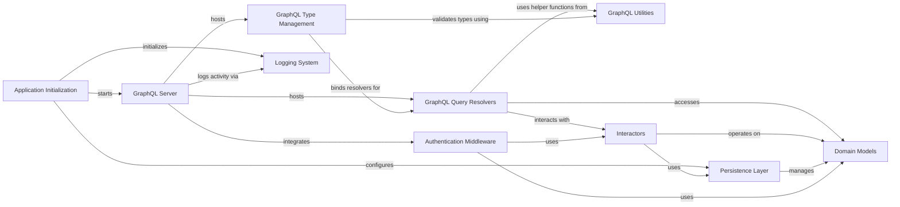

## Component Details

This architecture overview details the core components of the medconb application, focusing on the GraphQL server's role in handling client requests. The application initializes by setting up logging and database sessions, then starts the GraphQL server. The GraphQL server integrates with authentication middleware, hosts GraphQL query resolvers and type management, and logs its activities. GraphQL query resolvers interact with interactors and domain models, utilizing GraphQL utilities for helper functions. GraphQL type management binds resolvers and validates types using GraphQL utilities. Interactors operate on domain models and leverage the persistence layer for data access. The persistence layer, in turn, manages domain models, while the authentication middleware also interacts with domain models and interactors.

### GraphQL Server
Provides the GraphQL interface for the application, handling HTTP and WebSocket requests. It integrates with the authentication backend and uses various resolvers to process queries and mutations. This component also handles the creation and configuration of the ASGI server, including middleware, status endpoints, and various GraphQL HTTP and WebSocket handlers, as well as static file handlers. It specifically manages the HTTP and WebSocket handling for GraphQL requests, often incorporating logging for performance monitoring.

**Related Classes/Methods**:

- <a href="https://github.com/Bayer-Group/medconb/blob/master/backend/medconb/server.py#L64-L65" target="_blank" rel="noopener noreferrer">`medconb.backend.medconb.server.SecureGraphQLHTTPHandler:graphql_http_server` (64:65)</a>
- <a href="https://github.com/Bayer-Group/medconb/blob/master/backend/medconb/server.py#L119-L162" target="_blank" rel="noopener noreferrer">`medconb.backend.medconb.server:create_app` (119:162)</a>
- <a href="https://github.com/Bayer-Group/medconb/blob/master/backend/medconb/server.py#L68-L76" target="_blank" rel="noopener noreferrer">`medconb.backend.medconb.server.SecureGraphQLWSHandler` (68:76)</a>
- <a href="https://github.com/Bayer-Group/medconb/blob/master/backend/medconb/server.py#L79-L96" target="_blank" rel="noopener noreferrer">`medconb.backend.medconb.server.SecureStaticFiles` (79:96)</a>
- <a href="https://github.com/Bayer-Group/medconb/blob/master/backend/medconb/server.py#L103-L116" target="_blank" rel="noopener noreferrer">`medconb.backend.medconb.server.create_CORSMiddleware` (103:116)</a>
- <a href="https://github.com/Bayer-Group/medconb/blob/master/backend/medconb/server.py#L31-L52" target="_blank" rel="noopener noreferrer">`medconb.backend.medconb.server.status` (31:52)</a>
- <a href="https://github.com/Bayer-Group/medconb/blob/master/backend/medconb/server.py#L55-L65" target="_blank" rel="noopener noreferrer">`medconb.backend.medconb.server.SecureGraphQLHTTPHandler` (55:65)</a>

### Application Initialization
This component is responsible for the initial setup and configuration of the medconb application, including logging and database session management.

**Related Classes/Methods**:

- <a href="https://github.com/Bayer-Group/medconb/blob/master/backend/medconb/app.py#L20-L23" target="_blank" rel="noopener noreferrer">`medconb.backend.medconb.app:create_app` (20:23)</a>
- <a href="https://github.com/Bayer-Group/medconb/blob/master/backend/medconb/app.py#L26-L39" target="_blank" rel="noopener noreferrer">`medconb.backend.medconb.app._create_sessionmaker` (26:39)</a>

### GraphQL Query Resolvers
This component contains the business logic for resolving specific GraphQL queries, such as fetching paged codes or commit authors, often interacting with domain models and the Interactors component.

**Related Classes/Methods**:

- <a href="https://github.com/Bayer-Group/medconb/blob/master/backend/medconb/graphql/query.py#L160-L190" target="_blank" rel="noopener noreferrer">`medconb.backend.medconb.graphql.query:resolve_paged_codes` (160:190)</a>
- <a href="https://github.com/Bayer-Group/medconb/blob/master/backend/medconb/graphql/query.py#L197-L225" target="_blank" rel="noopener noreferrer">`medconb.backend.medconb.graphql.query:resolve_codes` (197:225)</a>
- <a href="https://github.com/Bayer-Group/medconb/blob/master/backend/medconb/graphql/query.py#L229-L241" target="_blank" rel="noopener noreferrer">`medconb.backend.medconb.graphql.query:resolve_commit_author` (229:241)</a>

### GraphQL Type Management
This component is responsible for defining and managing GraphQL object types, including binding resolvers, type checking, and argument validation. It also handles the definition of Query and Mutation types.

**Related Classes/Methods**:

- <a href="https://github.com/Bayer-Group/medconb/blob/master/backend/medconb/graphql/objects.py#L65-L91" target="_blank" rel="noopener noreferrer">`medconb.backend.medconb.graphql.objects.ObjectType:bind_resolvers_to_graphql_type` (65:91)</a>
- <a href="https://github.com/Bayer-Group/medconb/blob/master/backend/medconb/graphql/objects.py#L93-L127" target="_blank" rel="noopener noreferrer">`medconb.backend.medconb.graphql.objects.ObjectType:_convert_resolver_to_InteractorResolver` (93:127)</a>
- <a href="https://github.com/Bayer-Group/medconb/blob/master/backend/medconb/graphql/objects.py#L129-L185" target="_blank" rel="noopener noreferrer">`medconb.backend.medconb.graphql.objects.ObjectType:_typecheck_parent` (129:185)</a>
- <a href="https://github.com/Bayer-Group/medconb/blob/master/backend/medconb/graphql/objects.py#L195-L237" target="_blank" rel="noopener noreferrer">`medconb.backend.medconb.graphql.objects.ObjectType.validate_graphql_args` (195:237)</a>
- <a href="https://github.com/Bayer-Group/medconb/blob/master/backend/medconb/graphql/objects.py#L187-L193" target="_blank" rel="noopener noreferrer">`medconb.backend.medconb.graphql.objects.ObjectType._wrap_resolver_with_kwargs` (187:193)</a>
- <a href="https://github.com/Bayer-Group/medconb/blob/master/backend/medconb/graphql/objects.py#L243-L244" target="_blank" rel="noopener noreferrer">`medconb.backend.medconb.graphql.objects.QueryType:__init__` (243:244)</a>
- <a href="https://github.com/Bayer-Group/medconb/blob/master/backend/medconb/graphql/objects.py#L250-L251" target="_blank" rel="noopener noreferrer">`medconb.backend.medconb.graphql.objects.MutationType:__init__` (250:251)</a>

### GraphQL Utilities
This component provides helper functions and data transfer objects (DTOs) used across the GraphQL layer, such as extracting sub-fields from queries and defining various GraphQL input and output types.

**Related Classes/Methods**:

- <a href="https://github.com/Bayer-Group/medconb/blob/master/backend/medconb/graphql/helper.py#L90-L103" target="_blank" rel="noopener noreferrer">`medconb.backend.medconb.graphql.helper.get_sub_fields` (90:103)</a>
- <a href="https://github.com/Bayer-Group/medconb/blob/master/backend/medconb/graphql/helper.py#L86-L87" target="_blank" rel="noopener noreferrer">`medconb.backend.medconb.graphql.helper._get_field_nodes` (86:87)</a>
- <a href="https://github.com/Bayer-Group/medconb/blob/master/backend/medconb/graphql/types.py#L44-L46" target="_blank" rel="noopener noreferrer">`medconb.backend.medconb.graphql.types.PagedCodesDto` (44:46)</a>
- <a href="https://github.com/Bayer-Group/medconb/blob/master/backend/medconb/graphql/helper.py#L35-L36" target="_blank" rel="noopener noreferrer">`medconb.graphql.helper.DTOInteractor` (35:36)</a>
- <a href="https://github.com/Bayer-Group/medconb/blob/master/backend/medconb/graphql/helper.py#L40-L41" target="_blank" rel="noopener noreferrer">`medconb.graphql.helper.DTOLessInteractor` (40:41)</a>
- <a href="https://github.com/Bayer-Group/medconb/blob/master/backend/medconb/graphql/types.py#L148-L153" target="_blank" rel="noopener noreferrer">`medconb.graphql.types.CreateCollectionRequestDto` (148:153)</a>
- <a href="https://github.com/Bayer-Group/medconb/blob/master/backend/medconb/graphql/types.py#L180-L186" target="_blank" rel="noopener noreferrer">`medconb.graphql.types.CreatePhenotypeRequestDto` (180:186)</a>
- <a href="https://github.com/Bayer-Group/medconb/blob/master/backend/medconb/graphql/types.py#L160-L167" target="_blank" rel="noopener noreferrer">`medconb.graphql.types.UpdateCollectionRequestDto` (160:167)</a>
- <a href="https://github.com/Bayer-Group/medconb/blob/master/backend/medconb/graphql/types.py#L193-L200" target="_blank" rel="noopener noreferrer">`medconb.graphql.types.UpdatePhenotypeRequestDto` (193:200)</a>
- <a href="https://github.com/Bayer-Group/medconb/blob/master/backend/medconb/graphql/types.py#L248-L250" target="_blank" rel="noopener noreferrer">`medconb.graphql.types.CommitInput` (248:250)</a>
- <a href="https://github.com/Bayer-Group/medconb/blob/master/backend/medconb/graphql/types.py#L284-L287" target="_blank" rel="noopener noreferrer">`medconb.graphql.types.ImportStats` (284:287)</a>
- <a href="https://github.com/Bayer-Group/medconb/blob/master/backend/medconb/graphql/types.py#L63-L71" target="_blank" rel="noopener noreferrer">`medconb.graphql.types.QueryData` (63:71)</a>
- <a href="https://github.com/Bayer-Group/medconb/blob/master/backend/medconb/graphql/types.py#L27-L29" target="_blank" rel="noopener noreferrer">`medconb.graphql.types.ReferencePosition` (27:29)</a>
- <a href="https://github.com/Bayer-Group/medconb/blob/master/backend/medconb/domain/ontology.py#L41-L43" target="_blank" rel="noopener noreferrer">`medconb.domain.ontology.CodeSearchParamType` (41:43)</a>

### Domain Models
This component encapsulates the core business entities and their associated logic, such as Author and Workspace objects.

**Related Classes/Methods**:

- <a href="https://github.com/Bayer-Group/medconb/blob/master/backend/medconb/domain/codelist.py#L117-L125" target="_blank" rel="noopener noreferrer">`medconb.domain.codelist.Author` (117:125)</a>
- <a href="https://github.com/Bayer-Group/medconb/blob/master/backend/medconb/domain/user.py#L69-L107" target="_blank" rel="noopener noreferrer">`medconb.domain.user.Workspace` (69:107)</a>
- <a href="https://github.com/Bayer-Group/medconb/blob/master/backend/medconb/domain/base.py#L14-L14" target="_blank" rel="noopener noreferrer">`medconb.domain.base.WorkspaceID` (14:14)</a>
- <a href="https://github.com/Bayer-Group/medconb/blob/master/backend/medconb/domain/codelist.py#L119-L125" target="_blank" rel="noopener noreferrer">`medconb.domain.codelist.Author.from_user` (119:125)</a>
- <a href="https://github.com/Bayer-Group/medconb/blob/master/backend/medconb/domain/collection.py#L33-L58" target="_blank" rel="noopener noreferrer">`medconb.domain.collection.Collection` (33:58)</a>
- <a href="https://github.com/Bayer-Group/medconb/blob/master/backend/medconb/domain/importer.py#L18-L21" target="_blank" rel="noopener noreferrer">`medconb.domain.importer.ValidatedCodeset` (18:21)</a>
- <a href="https://github.com/Bayer-Group/medconb/blob/master/backend/medconb/domain/phenotype.py#L13-L34" target="_blank" rel="noopener noreferrer">`medconb.domain.phenotype.Phenotype` (13:34)</a>
- <a href="https://github.com/Bayer-Group/medconb/blob/master/backend/medconb/domain/user.py#L15-L57" target="_blank" rel="noopener noreferrer">`medconb.domain.user.User` (15:57)</a>
- <a href="https://github.com/Bayer-Group/medconb/blob/master/backend/medconb/domain/base.py#L24-L26" target="_blank" rel="noopener noreferrer">`medconb.domain.base.PropertyClass` (24:26)</a>
- <a href="https://github.com/Bayer-Group/medconb/blob/master/backend/medconb/domain/base.py#L29-L34" target="_blank" rel="noopener noreferrer">`medconb.domain.base.PropertyDtype` (29:34)</a>
- <a href="https://github.com/Bayer-Group/medconb/blob/master/backend/medconb/domain/base.py#L21-L21" target="_blank" rel="noopener noreferrer">`medconb.domain.base.PropertyID` (21:21)</a>
- <a href="https://github.com/Bayer-Group/medconb/blob/master/backend/medconb/domain/base.py#L11-L11" target="_blank" rel="noopener noreferrer">`medconb.domain.base.UserID` (11:11)</a>
- <a href="https://github.com/Bayer-Group/medconb/blob/master/backend/medconb/domain/codelist.py#L19-L19" target="_blank" rel="noopener noreferrer">`medconb.domain.codelist.CodelistID` (19:19)</a>
- <a href="https://github.com/Bayer-Group/medconb/blob/master/backend/medconb/domain/codelist.py#L22-L83" target="_blank" rel="noopener noreferrer">`medconb.domain.codelist.SetOfCodeIds` (22:83)</a>
- <a href="https://github.com/Bayer-Group/medconb/blob/master/backend/medconb/domain/collection.py#L16-L16" target="_blank" rel="noopener noreferrer">`medconb.domain.collection.CollectionID` (16:16)</a>
- <a href="https://github.com/Bayer-Group/medconb/blob/master/backend/medconb/domain/container.py#L41-L43" target="_blank" rel="noopener noreferrer">`medconb.domain.container.ContainerSpec` (41:43)</a>
- <a href="https://github.com/Bayer-Group/medconb/blob/master/backend/medconb/domain/container.py#L30-L32" target="_blank" rel="noopener noreferrer">`medconb.domain.container.ContainerType` (30:32)</a>
- <a href="https://github.com/Bayer-Group/medconb/blob/master/backend/medconb/domain/container.py#L35-L37" target="_blank" rel="noopener noreferrer">`medconb.domain.container.ItemType` (35:37)</a>
- <a href="https://github.com/Bayer-Group/medconb/blob/master/backend/medconb/domain/phenotype.py#L9-L9" target="_blank" rel="noopener noreferrer">`medconb.domain.phenotype.PhenotypeID` (9:9)</a>
- <a href="https://github.com/Bayer-Group/medconb/blob/master/backend/medconb/domain/base.py#L38-L46" target="_blank" rel="noopener noreferrer">`medconb.domain.base.Property` (38:46)</a>
- <a href="https://github.com/Bayer-Group/medconb/blob/master/backend/medconb/domain/base.py#L50-L56" target="_blank" rel="noopener noreferrer">`medconb.domain.base.PropertyBag` (50:56)</a>

### Authentication Middleware
This component is responsible for handling authentication and authorization concerns within the application's request processing pipeline.

**Related Classes/Methods**:

- <a href="https://github.com/Bayer-Group/medconb/blob/master/backend/medconb/middleware.py#L66-L115" target="_blank" rel="noopener noreferrer">`medconb.backend.medconb.middleware.AuthBackend` (66:115)</a>
- <a href="https://github.com/Bayer-Group/medconb/blob/master/backend/medconb/middleware.py#L169-L530" target="_blank" rel="noopener noreferrer">`medconb.middleware.AzureADAuthenticator` (169:530)</a>
- <a href="https://github.com/Bayer-Group/medconb/blob/master/backend/medconb/middleware.py#L118-L166" target="_blank" rel="noopener noreferrer">`medconb.middleware.DevAuthenticator` (118:166)</a>

### Logging System
This component provides functionalities for logging application events and performance metrics.

**Related Classes/Methods**:

- <a href="https://github.com/Bayer-Group/medconb/blob/master/backend/medconb/log.py#L23-L42" target="_blank" rel="noopener noreferrer">`medconb.backend.medconb.log.setup_logging` (23:42)</a>
- <a href="https://github.com/Bayer-Group/medconb/blob/master/backend/medconb/log.py#L48-L86" target="_blank" rel="noopener noreferrer">`medconb.backend.medconb.log.time_me` (48:86)</a>

### Persistence Layer
This component manages the creation of database session makers and provides repositories for interacting with the underlying data stores.

**Related Classes/Methods**:

- `medconb.backend.medconb.persistence.sqlalchemy.create_sessionmaker` (full file reference)
- `medconb.backend.medconb.persistence.sqlalchemy.session` (full file reference)
- `medconb.backend.medconb.persistence.sqlalchemy.cache` (full file reference)
- `medconb.backend.medconb.persistence.sqlalchemy.ontology_orm` (full file reference)
- `medconb.backend.medconb.persistence.sqlalchemy.orm` (full file reference)
- `medconb.backend.medconb.persistence.sqlalchemy.repositories` (full file reference)
- <a href="https://github.com/Bayer-Group/medconb/blob/master/backend/medconb/persistence/sqlalchemy/orm.py#L259-L276" target="_blank" rel="noopener noreferrer">`medconb.persistence.sqlalchemy.orm.MutableSetOfCodeIds` (259:276)</a>
- <a href="https://github.com/Bayer-Group/medconb/blob/master/backend/medconb/persistence/sqlalchemy/repositories.py#L520-L584" target="_blank" rel="noopener noreferrer">`medconb.persistence.sqlalchemy.repositories.CodelistRepository` (520:584)</a>
- <a href="https://github.com/Bayer-Group/medconb/blob/master/backend/medconb/persistence/sqlalchemy/repositories.py#L375-L437" target="_blank" rel="noopener noreferrer">`medconb.persistence.sqlalchemy.repositories.CollectionRepository` (375:437)</a>
- <a href="https://github.com/Bayer-Group/medconb/blob/master/backend/medconb/persistence/sqlalchemy/repositories.py#L440-L500" target="_blank" rel="noopener noreferrer">`medconb.persistence.sqlalchemy.repositories.PhenotypeRepository` (440:500)</a>

### Interactors
This component encapsulates the application's business logic and use cases, acting as an intermediary between the GraphQL layer and the domain models/persistence layer.

**Related Classes/Methods**:

- <a href="https://github.com/Bayer-Group/medconb/blob/master/backend/medconb/interactors/base.py#L276-L283" target="_blank" rel="noopener noreferrer">`medconb.interactors.base.CodelistNotExistsException` (276:283)</a>
- <a href="https://github.com/Bayer-Group/medconb/blob/master/backend/medconb/interactors/codelist.py#L38-L72" target="_blank" rel="noopener noreferrer">`medconb.interactors.codelist.CreateCodelist` (38:72)</a>
- <a href="https://github.com/Bayer-Group/medconb/blob/master/backend/medconb/interactors/phenotype.py#L41-L80" target="_blank" rel="noopener noreferrer">`medconb.interactors.phenotype.CreatePhenotype` (41:80)</a>
- <a href="https://github.com/Bayer-Group/medconb/blob/master/backend/medconb/interactors/query.py#L23-L25" target="_blank" rel="noopener noreferrer">`medconb.interactors.query.Code` (23:25)</a>
- <a href="https://github.com/Bayer-Group/medconb/blob/master/backend/medconb/interactors/workspace.py#L44-L70" target="_blank" rel="noopener noreferrer">`medconb.interactors.workspace.CreateCollection` (44:70)</a>

### [FAQ](https://github.com/CodeBoarding/GeneratedOnBoardings/tree/main?tab=readme-ov-file#faq)