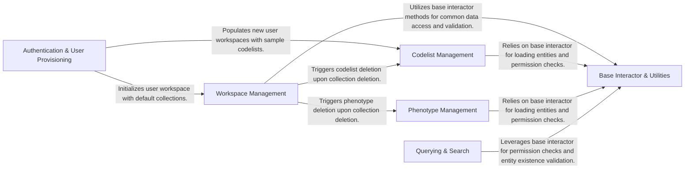

## Component Details

Consolidates all business logic interactors, including those for workspace, queries, codelists, and phenotypes. It handles operations like creating, updating, deleting, and querying various entities, ensuring proper permissions and data integrity.

### Authentication & User Provisioning
This component is responsible for authenticating users, primarily through Azure AD, and for provisioning new user accounts. It handles the initial setup of a user's workspace, including the creation of default collections and the import of sample codelists to provide a starting environment.

**Related Classes/Methods**:

- <a href="https://github.com/Bayer-Group/medconb/blob/master/backend/medconb/middleware.py#L169-L530" target="_blank" rel="noopener noreferrer">`medconb.backend.medconb.middleware.AzureADAuthenticator` (169:530)</a>
- <a href="https://github.com/Bayer-Group/medconb/blob/master/backend/medconb/middleware.py#L356-L530" target="_blank" rel="noopener noreferrer">`medconb.backend.medconb.middleware.AzureADAuthenticator:_init_new_user` (356:530)</a>

### Workspace Management
This component provides a suite of interactors for managing user workspaces and collections. It encompasses functionalities such as creating, moving, updating, and deleting collections, setting collection permissions, and resolving hierarchical relationships and ownership details of items within containers. It leverages the `Base Interactor & Utilities` for common operations and interacts with `Codelist Management` and `Phenotype Management` for cascading deletions.

**Related Classes/Methods**:

- <a href="https://github.com/Bayer-Group/medconb/blob/master/backend/medconb/interactors/workspace.py#L30-L41" target="_blank" rel="noopener noreferrer">`medconb.backend.medconb.interactors.workspace.MoveCollection:__call__` (30:41)</a>
- <a href="https://github.com/Bayer-Group/medconb/blob/master/backend/medconb/interactors/workspace.py#L45-L70" target="_blank" rel="noopener noreferrer">`medconb.backend.medconb.interactors.workspace.CreateCollection:__call__` (45:70)</a>
- <a href="https://github.com/Bayer-Group/medconb/blob/master/backend/medconb/interactors/workspace.py#L74-L124" target="_blank" rel="noopener noreferrer">`medconb.backend.medconb.interactors.workspace.UpdateCollection:__call__` (74:124)</a>
- <a href="https://github.com/Bayer-Group/medconb/blob/master/backend/medconb/interactors/workspace.py#L128-L159" target="_blank" rel="noopener noreferrer">`medconb.backend.medconb.interactors.workspace.DeleteCollection:__call__` (128:159)</a>
- <a href="https://github.com/Bayer-Group/medconb/blob/master/backend/medconb/interactors/workspace.py#L167-L177" target="_blank" rel="noopener noreferrer">`medconb.backend.medconb.interactors.workspace.SetCollectionPermissions:__call__` (167:177)</a>
- <a href="https://github.com/Bayer-Group/medconb/blob/master/backend/medconb/interactors/workspace.py#L184-L185" target="_blank" rel="noopener noreferrer">`medconb.backend.medconb.interactors.workspace.ResolveContainerItemContainerHierarchy:__call__` (184:185)</a>
- <a href="https://github.com/Bayer-Group/medconb/blob/master/backend/medconb/interactors/workspace.py#L187-L202" target="_blank" rel="noopener noreferrer">`medconb.backend.medconb.interactors.workspace.ResolveContainerItemContainerHierarchy:build_hierarchy` (187:202)</a>
- <a href="https://github.com/Bayer-Group/medconb/blob/master/backend/medconb/interactors/workspace.py#L209-L211" target="_blank" rel="noopener noreferrer">`medconb.backend.medconb.interactors.workspace.ResolveContainerItemOwnerID:__call__` (209:211)</a>
- <a href="https://github.com/Bayer-Group/medconb/blob/master/backend/medconb/interactors/workspace.py#L218-L221" target="_blank" rel="noopener noreferrer">`medconb.backend.medconb.interactors.workspace.ResolveContainerSpecName:__call__` (218:221)</a>
- <a href="https://github.com/Bayer-Group/medconb/blob/master/backend/medconb/interactors/workspace.py#L228-L233" target="_blank" rel="noopener noreferrer">`medconb.backend.medconb.interactors.workspace.ResolveContainerSpecLocked:__call__` (228:233)</a>
- <a href="https://github.com/Bayer-Group/medconb/blob/master/backend/medconb/interactors/workspace.py#L248-L267" target="_blank" rel="noopener noreferrer">`medconb.backend.medconb.interactors.workspace.ResolveContainerSpecVisibility:__call__` (248:267)</a>

### Codelist Management
This component is dedicated to managing codelists, which are structured lists of codes used for various purposes. It provides operations for creating, updating, deleting, cloning, moving, and importing codelists, as well as managing transient and committed changes to these lists. It relies on `Base Interactor & Utilities` for common operations.

**Related Classes/Methods**:

- <a href="https://github.com/Bayer-Group/medconb/blob/master/backend/medconb/interactors/codelist.py#L19-L35" target="_blank" rel="noopener noreferrer">`medconb.backend.medconb.interactors.codelist.BaseCodelistInteractor:_load_codelist` (19:35)</a>
- <a href="https://github.com/Bayer-Group/medconb/blob/master/backend/medconb/interactors/codelist.py#L43-L72" target="_blank" rel="noopener noreferrer">`medconb.backend.medconb.interactors.codelist.CreateCodelist:__call__` (43:72)</a>
- <a href="https://github.com/Bayer-Group/medconb/blob/master/backend/medconb/interactors/codelist.py#L80-L99" target="_blank" rel="noopener noreferrer">`medconb.backend.medconb.interactors.codelist.UpdateCodelist:__call__` (80:99)</a>
- <a href="https://github.com/Bayer-Group/medconb/blob/master/backend/medconb/interactors/codelist.py#L103-L126" target="_blank" rel="noopener noreferrer">`medconb.backend.medconb.interactors.codelist.DeleteCodelist:__call__` (103:126)</a>
- <a href="https://github.com/Bayer-Group/medconb/blob/master/backend/medconb/interactors/codelist.py#L130-L177" target="_blank" rel="noopener noreferrer">`medconb.backend.medconb.interactors.codelist.CloneCodelist:__call__` (130:177)</a>
- <a href="https://github.com/Bayer-Group/medconb/blob/master/backend/medconb/interactors/codelist.py#L181-L211" target="_blank" rel="noopener noreferrer">`medconb.backend.medconb.interactors.codelist.MoveCodelist:__call__` (181:211)</a>
- <a href="https://github.com/Bayer-Group/medconb/blob/master/backend/medconb/interactors/codelist.py#L215-L297" target="_blank" rel="noopener noreferrer">`medconb.backend.medconb.interactors.codelist.ImportCodelists:__call__` (215:297)</a>
- <a href="https://github.com/Bayer-Group/medconb/blob/master/backend/medconb/interactors/codelist.py#L299-L329" target="_blank" rel="noopener noreferrer">`medconb.backend.medconb.interactors.codelist.ImportCodelists:_validate_input` (299:329)</a>
- <a href="https://github.com/Bayer-Group/medconb/blob/master/backend/medconb/interactors/codelist.py#L331-L359" target="_blank" rel="noopener noreferrer">`medconb.backend.medconb.interactors.codelist.ImportCodelists:_validate_codesets` (331:359)</a>
- <a href="https://github.com/Bayer-Group/medconb/blob/master/backend/medconb/interactors/codelist.py#L363-L397" target="_blank" rel="noopener noreferrer">`medconb.backend.medconb.interactors.codelist.CommitChanges:__call__` (363:397)</a>
- <a href="https://github.com/Bayer-Group/medconb/blob/master/backend/medconb/interactors/codelist.py#L401-L435" target="_blank" rel="noopener noreferrer">`medconb.backend.medconb.interactors.codelist.StoreTransientChanges:__call__` (401:435)</a>
- <a href="https://github.com/Bayer-Group/medconb/blob/master/backend/medconb/interactors/codelist.py#L439-L454" target="_blank" rel="noopener noreferrer">`medconb.backend.medconb.interactors.codelist.DiscardTransientChanges:__call__` (439:454)</a>

### Phenotype Management
This component focuses on the management of phenotypes, which represent observable characteristics of an organism. It offers functionalities for creating, updating, deleting, and cloning phenotypes, ensuring their proper lifecycle within the system. It relies on `Base Interactor & Utilities` for common operations.

**Related Classes/Methods**:

- <a href="https://github.com/Bayer-Group/medconb/blob/master/backend/medconb/interactors/phenotype.py#L15-L38" target="_blank" rel="noopener noreferrer">`medconb.backend.medconb.interactors.phenotype.PhenotypeInteractor:_must_load_phenotype` (15:38)</a>
- <a href="https://github.com/Bayer-Group/medconb/blob/master/backend/medconb/interactors/phenotype.py#L42-L80" target="_blank" rel="noopener noreferrer">`medconb.backend.medconb.interactors.phenotype.CreatePhenotype:__call__` (42:80)</a>
- <a href="https://github.com/Bayer-Group/medconb/blob/master/backend/medconb/interactors/phenotype.py#L84-L146" target="_blank" rel="noopener noreferrer">`medconb.backend.medconb.interactors.phenotype.UpdatePhenotype:__call__` (84:146)</a>
- <a href="https://github.com/Bayer-Group/medconb/blob/master/backend/medconb/interactors/phenotype.py#L150-L178" target="_blank" rel="noopener noreferrer">`medconb.backend.medconb.interactors.phenotype.DeletePhenotype:__call__` (150:178)</a>
- <a href="https://github.com/Bayer-Group/medconb/blob/master/backend/medconb/interactors/phenotype.py#L182-L237" target="_blank" rel="noopener noreferrer">`medconb.backend.medconb.interactors.phenotype.ClonePhenotype:__call__` (182:237)</a>

### Querying & Search
This component provides the capability to search and retrieve various entities within the system, including collections, phenotypes, codelists, and users. It acts as the interface for querying stored data and leverages `Base Interactor & Utilities` for permission checks and entity existence validation.

**Related Classes/Methods**:

- <a href="https://github.com/Bayer-Group/medconb/blob/master/backend/medconb/interactors/query.py#L41-L79" target="_blank" rel="noopener noreferrer">`medconb.backend.medconb.interactors.query.SearchEntities:__call__` (41:79)</a>
- <a href="https://github.com/Bayer-Group/medconb/blob/master/backend/medconb/interactors/query.py#L88-L94" target="_blank" rel="noopener noreferrer">`medconb.backend.medconb.interactors.query.Collection:__call__` (88:94)</a>
- <a href="https://github.com/Bayer-Group/medconb/blob/master/backend/medconb/interactors/query.py#L98-L104" target="_blank" rel="noopener noreferrer">`medconb.backend.medconb.interactors.query.Phenotype:__call__` (98:104)</a>
- <a href="https://github.com/Bayer-Group/medconb/blob/master/backend/medconb/interactors/query.py#L108-L114" target="_blank" rel="noopener noreferrer">`medconb.backend.medconb.interactors.query.Codelist:__call__` (108:114)</a>
- <a href="https://github.com/Bayer-Group/medconb/blob/master/backend/medconb/interactors/query.py#L118-L127" target="_blank" rel="noopener noreferrer">`medconb.backend.medconb.interactors.query.Users:__call__` (118:127)</a>

### Base Interactor & Utilities
This foundational component provides common utility methods and exception handling mechanisms used across various interactors. It includes functionalities for loading containers, checking user permissions (read/write), identifying references, and handling exceptions related to non-existent entities. It is a core dependency for all other interactor components.

**Related Classes/Methods**:

- <a href="https://github.com/Bayer-Group/medconb/blob/master/backend/medconb/interactors/base.py#L34-L44" target="_blank" rel="noopener noreferrer">`medconb.backend.medconb.interactors.base.BaseInteractor:is_readable_by_current_user` (34:44)</a>
- <a href="https://github.com/Bayer-Group/medconb/blob/master/backend/medconb/interactors/base.py#L46-L56" target="_blank" rel="noopener noreferrer">`medconb.backend.medconb.interactors.base.BaseInteractor:is_writable_by_current_user` (46:56)</a>
- <a href="https://github.com/Bayer-Group/medconb/blob/master/backend/medconb/interactors/base.py#L58-L75" target="_blank" rel="noopener noreferrer">`medconb.backend.medconb.interactors.base.BaseInteractor:_must_get_collection_from_current_workspace` (58:75)</a>
- <a href="https://github.com/Bayer-Group/medconb/blob/master/backend/medconb/interactors/base.py#L78-L80" target="_blank" rel="noopener noreferrer">`medconb.backend.medconb.interactors.base.BaseInteractor:_must_load_container` (78:80)</a>
- <a href="https://github.com/Bayer-Group/medconb/blob/master/backend/medconb/interactors/base.py#L149-L174" target="_blank" rel="noopener noreferrer">`medconb.backend.medconb.interactors.base.BaseInteractor:_must_load_container_item` (149:174)</a>
- <a href="https://github.com/Bayer-Group/medconb/blob/master/backend/medconb/interactors/base.py#L176-L212" target="_blank" rel="noopener noreferrer">`medconb.backend.medconb.interactors.base.BaseInteractor:_identify_ref` (176:212)</a>
- <a href="https://github.com/Bayer-Group/medconb/blob/master/backend/medconb/interactors/base.py#L214-L222" target="_blank" rel="noopener noreferrer">`medconb.backend.medconb.interactors.base.BaseInteractor:_must_load_root_collection_of` (214:222)</a>
- <a href="https://github.com/Bayer-Group/medconb/blob/master/backend/medconb/interactors/base.py#L240-L247" target="_blank" rel="noopener noreferrer">`medconb.backend.medconb.interactors.base.CollectionNotExistsException` (240:247)</a>
- <a href="https://github.com/Bayer-Group/medconb/blob/master/backend/medconb/interactors/base.py#L276-L283" target="_blank" rel="noopener noreferrer">`medconb.backend.medconb.interactors.base.CodelistNotExistsException` (276:283)</a>
- <a href="https://github.com/Bayer-Group/medconb/blob/master/backend/medconb/interactors/base.py#L287-L294" target="_blank" rel="noopener noreferrer">`medconb.backend.medconb.interactors.base.PhenotypeNotExistsException` (287:294)</a>
- <a href="https://github.com/Bayer-Group/medconb/blob/master/backend/medconb/interactors/base.py#L251-L260" target="_blank" rel="noopener noreferrer">`medconb.backend.medconb.interactors.base.ContainerNotExistsException` (251:260)</a>
- <a href="https://github.com/Bayer-Group/medconb/blob/master/backend/medconb/interactors/base.py#L264-L272" target="_blank" rel="noopener noreferrer">`medconb.backend.medconb.interactors.base.ItemNotExistsException` (264:272)</a>
- <a href="https://github.com/Bayer-Group/medconb/blob/master/backend/medconb/interactors/property.py#L18-L26" target="_blank" rel="noopener noreferrer">`medconb.backend.medconb.interactors.property.ResolveProperties` (18:26)</a>

### [FAQ](https://github.com/CodeBoarding/GeneratedOnBoardings/tree/main?tab=readme-ov-file#faq)