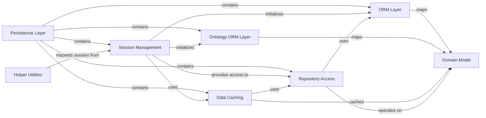

## Component Details

The Persistence Layer subsystem is responsible for managing data persistence within the medconb application. It leverages SQLAlchemy for ORM capabilities, session management, and database interactions. The main flow involves establishing database sessions, mapping domain objects to relational tables, caching frequently accessed data for performance, and providing repository interfaces for structured data access. Its purpose is to abstract database operations, ensure data integrity, and optimize data retrieval for the application's various components.

### Persistence Layer
Handles the persistence of data using SQLAlchemy, including session management, ORM mapping, and caching mechanisms for properties and codes. It provides the interface for interacting with the database.

**Related Classes/Methods**:

- `medconb.backend.medconb.persistence.sqlalchemy.session` (full file reference)
- `medconb.backend.medconb.persistence.sqlalchemy.orm` (full file reference)
- `medconb.backend.medconb.persistence.sqlalchemy.ontology_orm` (full file reference)
- `medconb.backend.medconb.persistence.sqlalchemy.cache` (full file reference)
- `medconb.backend.medconb.persistence.sqlalchemy.repositories` (full file reference)

### Session Management
This component is responsible for initializing and providing SQLAlchemy sessions, including custom session behaviors like handling domain container item integrity and providing access to various data repositories. It acts as the entry point for database interactions.

**Related Classes/Methods**:

- <a href="https://github.com/Bayer-Group/medconb/blob/master/backend/medconb/app.py#L42-L59" target="_blank" rel="noopener noreferrer">`medconb.backend.medconb.app:_create_sqlalchemy_sessionmaker` (42:59)</a>
- <a href="https://github.com/Bayer-Group/medconb/blob/master/backend/medconb/persistence/sqlalchemy/session.py#L175-L203" target="_blank" rel="noopener noreferrer">`medconb.backend.medconb.persistence.sqlalchemy.session:create_sessionmaker` (175:203)</a>
- <a href="https://github.com/Bayer-Group/medconb/blob/master/backend/medconb/persistence/sqlalchemy/session.py#L24-L172" target="_blank" rel="noopener noreferrer">`medconb.backend.medconb.persistence.sqlalchemy.session.Session` (24:172)</a>
- <a href="https://github.com/Bayer-Group/medconb/blob/master/backend/medconb/persistence/sqlalchemy/session.py#L98-L120" target="_blank" rel="noopener noreferrer">`medconb.backend.medconb.persistence.sqlalchemy.session.Session:handle_domain_container_item_init` (98:120)</a>
- <a href="https://github.com/Bayer-Group/medconb/blob/master/backend/medconb/persistence/sqlalchemy/session.py#L123-L144" target="_blank" rel="noopener noreferrer">`medconb.backend.medconb.persistence.sqlalchemy.session.Session:handle_before_attach` (123:144)</a>
- `medconb.backend.medconb.persistence.sqlalchemy.session.Session:user_` (full file reference)
- `medconb.backend.medconb.persistence.sqlalchemy.session.Session:collection_` (full file reference)
- `medconb.backend.medconb.persistence.sqlalchemy.session.Session:phenotype_` (full file reference)
- `medconb.backend.medconb.persistence.sqlalchemy.session.Session:codelist_` (full file reference)
- `medconb.backend.medconb.persistence.sqlalchemy.session.Session:ontology_` (full file reference)
- <a href="https://github.com/Bayer-Group/medconb/blob/master/backend/medconb/persistence/sqlalchemy/session.py#L167-L168" target="_blank" rel="noopener noreferrer">`medconb.backend.medconb.persistence.sqlalchemy.session.Session:code_repository` (167:168)</a>
- <a href="https://github.com/Bayer-Group/medconb/blob/master/backend/medconb/persistence/sqlalchemy/session.py#L171-L172" target="_blank" rel="noopener noreferrer">`medconb.backend.medconb.persistence.sqlalchemy.session.Session:property_repository` (171:172)</a>

### ORM Layer
This component defines the Object-Relational Mapping for the medconb domain model. It includes the SQLAlchemy table definitions, imperative mappings of domain objects to these tables, and custom types and association proxies to manage complex relationships like container items.

**Related Classes/Methods**:

- <a href="https://github.com/Bayer-Group/medconb/blob/master/backend/medconb/persistence/sqlalchemy/orm.py#L296-L433" target="_blank" rel="noopener noreferrer">`medconb.backend.medconb.persistence.sqlalchemy.orm.start_mappers` (296:433)</a>
- <a href="https://github.com/Bayer-Group/medconb/blob/master/backend/medconb/persistence/sqlalchemy/orm.py#L73-L77" target="_blank" rel="noopener noreferrer">`medconb.backend.medconb.persistence.sqlalchemy.orm.ContainerItem` (73:77)</a>
- <a href="https://github.com/Bayer-Group/medconb/blob/master/backend/medconb/persistence/sqlalchemy/orm.py#L51-L69" target="_blank" rel="noopener noreferrer">`medconb.backend.medconb.persistence.sqlalchemy.orm.PropertyBagType` (51:69)</a>
- <a href="https://github.com/Bayer-Group/medconb/blob/master/backend/medconb/persistence/sqlalchemy/orm.py#L80-L164" target="_blank" rel="noopener noreferrer">`medconb.backend.medconb.persistence.sqlalchemy.orm._ContainerItemAssociationList` (80:164)</a>
- <a href="https://github.com/Bayer-Group/medconb/blob/master/backend/medconb/persistence/sqlalchemy/orm.py#L259-L276" target="_blank" rel="noopener noreferrer">`medconb.backend.medconb.persistence.sqlalchemy.orm.MutableSetOfCodeIds` (259:276)</a>
- <a href="https://github.com/Bayer-Group/medconb/blob/master/backend/medconb/persistence/sqlalchemy/orm.py#L62-L69" target="_blank" rel="noopener noreferrer">`medconb.backend.medconb.persistence.sqlalchemy.orm.PropertyBagType:process_result_value` (62:69)</a>
- <a href="https://github.com/Bayer-Group/medconb/blob/master/backend/medconb/persistence/sqlalchemy/orm.py#L107-L133" target="_blank" rel="noopener noreferrer">`medconb.backend.medconb.persistence.sqlalchemy.orm._ContainerItemAssociationList:_create` (107:133)</a>
- <a href="https://github.com/Bayer-Group/medconb/blob/master/backend/medconb/persistence/sqlalchemy/orm.py#L269-L276" target="_blank" rel="noopener noreferrer">`medconb.backend.medconb.persistence.sqlalchemy.orm.MutableSetOfCodeIds:coerce` (269:276)</a>
- `medconb.backend.medconb.persistence.sqlalchemy.orm.user` (full file reference)
- `medconb.backend.medconb.persistence.sqlalchemy.orm.workspace` (full file reference)
- `medconb.backend.medconb.persistence.sqlalchemy.orm.container_item` (full file reference)
- `medconb.backend.medconb.persistence.sqlalchemy.orm.collection` (full file reference)
- `medconb.backend.medconb.persistence.sqlalchemy.orm.phenotype` (full file reference)
- `medconb.backend.medconb.persistence.sqlalchemy.orm.share` (full file reference)
- `medconb.backend.medconb.persistence.sqlalchemy.orm.codelist` (full file reference)
- `medconb.backend.medconb.persistence.sqlalchemy.orm.commit` (full file reference)
- `medconb.backend.medconb.persistence.sqlalchemy.orm.property_` (full file reference)
- `medconb.backend.medconb.persistence.sqlalchemy.orm.changeset` (full file reference)

### Ontology ORM Layer
This component specifically handles the Object-Relational Mapping for ontology-related domain objects, separate from the main ORM for clarity and potential independent evolution.

**Related Classes/Methods**:

- <a href="https://github.com/Bayer-Group/medconb/blob/master/backend/medconb/persistence/sqlalchemy/ontology_orm.py#L34-L45" target="_blank" rel="noopener noreferrer">`medconb.backend.medconb.persistence.sqlalchemy.ontology_orm.start_mappers` (34:45)</a>

### Data Caching
This component provides caching mechanisms to improve performance for frequently accessed data, specifically for codes and properties. It includes logic for warming up and refreshing caches.

**Related Classes/Methods**:

- <a href="https://github.com/Bayer-Group/medconb/blob/master/backend/medconb/persistence/sqlalchemy/cache.py#L17-L115" target="_blank" rel="noopener noreferrer">`medconb.backend.medconb.persistence.sqlalchemy.cache.CachedCodeRepository` (17:115)</a>
- <a href="https://github.com/Bayer-Group/medconb/blob/master/backend/medconb/persistence/sqlalchemy/cache.py#L46-L62" target="_blank" rel="noopener noreferrer">`medconb.backend.medconb.persistence.sqlalchemy.cache.CachedCodeRepository:warmup` (46:62)</a>
- <a href="https://github.com/Bayer-Group/medconb/blob/master/backend/medconb/persistence/sqlalchemy/cache.py#L92-L94" target="_blank" rel="noopener noreferrer">`medconb.backend.medconb.persistence.sqlalchemy.cache.CachedCodeRepository:get` (92:94)</a>
- <a href="https://github.com/Bayer-Group/medconb/blob/master/backend/medconb/persistence/sqlalchemy/cache.py#L113-L115" target="_blank" rel="noopener noreferrer">`medconb.backend.medconb.persistence.sqlalchemy.cache.CachedCodeRepository:search_codes` (113:115)</a>
- <a href="https://github.com/Bayer-Group/medconb/blob/master/backend/medconb/persistence/sqlalchemy/cache.py#L118-L180" target="_blank" rel="noopener noreferrer">`medconb.backend.medconb.persistence.sqlalchemy.cache.CachedPropertyRepository` (118:180)</a>
- <a href="https://github.com/Bayer-Group/medconb/blob/master/backend/medconb/persistence/sqlalchemy/cache.py#L119-L128" target="_blank" rel="noopener noreferrer">`medconb.backend.medconb.persistence.sqlalchemy.cache.CachedPropertyRepository:__init__` (119:128)</a>
- <a href="https://github.com/Bayer-Group/medconb/blob/master/backend/medconb/persistence/sqlalchemy/cache.py#L138-L160" target="_blank" rel="noopener noreferrer">`medconb.backend.medconb.persistence.sqlalchemy.cache.CachedPropertyRepository:_refresh_cache` (138:160)</a>
- <a href="https://github.com/Bayer-Group/medconb/blob/master/backend/medconb/persistence/sqlalchemy/cache.py#L165-L171" target="_blank" rel="noopener noreferrer">`medconb.backend.medconb.persistence.sqlalchemy.cache.CachedPropertyRepository:get` (165:171)</a>
- <a href="https://github.com/Bayer-Group/medconb/blob/master/backend/medconb/persistence/sqlalchemy/cache.py#L173-L180" target="_blank" rel="noopener noreferrer">`medconb.backend.medconb.persistence.sqlalchemy.cache.CachedPropertyRepository:get_all` (173:180)</a>

### Domain Model
This component represents the core business entities and their relationships, defining the structure and behavior of data within the medconb system. The persistence layer maps to and from these domain objects.

**Related Classes/Methods**:

- <a href="https://github.com/Bayer-Group/medconb/blob/master/backend/medconb/domain/base.py#L21-L21" target="_blank" rel="noopener noreferrer">`medconb.domain.base.PropertyID` (21:21)</a>
- <a href="https://github.com/Bayer-Group/medconb/blob/master/backend/medconb/domain/base.py#L38-L46" target="_blank" rel="noopener noreferrer">`medconb.domain.base.Property` (38:46)</a>
- <a href="https://github.com/Bayer-Group/medconb/blob/master/backend/medconb/domain/ontology.py#L18-L38" target="_blank" rel="noopener noreferrer">`medconb.domain.ontology.Code` (18:38)</a>
- <a href="https://github.com/Bayer-Group/medconb/blob/master/backend/medconb/domain/ontology.py#L37-L38" target="_blank" rel="noopener noreferrer">`medconb.domain.ontology.Code.deserialize` (37:38)</a>
- <a href="https://github.com/Bayer-Group/medconb/blob/master/backend/medconb/domain/collection.py#L16-L16" target="_blank" rel="noopener noreferrer">`medconb.domain.collection.CollectionID` (16:16)</a>
- <a href="https://github.com/Bayer-Group/medconb/blob/master/backend/medconb/domain/phenotype.py#L9-L9" target="_blank" rel="noopener noreferrer">`medconb.domain.phenotype.PhenotypeID` (9:9)</a>
- <a href="https://github.com/Bayer-Group/medconb/blob/master/backend/medconb/domain/codelist.py#L19-L19" target="_blank" rel="noopener noreferrer">`medconb.domain.codelist.CodelistID` (19:19)</a>
- <a href="https://github.com/Bayer-Group/medconb/blob/master/backend/medconb/domain/base.py#L11-L11" target="_blank" rel="noopener noreferrer">`medconb.domain.base.UserID` (11:11)</a>
- <a href="https://github.com/Bayer-Group/medconb/blob/master/backend/medconb/domain/base.py#L14-L14" target="_blank" rel="noopener noreferrer">`medconb.domain.base.WorkspaceID` (14:14)</a>
- <a href="https://github.com/Bayer-Group/medconb/blob/master/backend/medconb/domain/codelist.py#L223-L265" target="_blank" rel="noopener noreferrer">`medconb.domain.Codelist` (223:265)</a>
- <a href="https://github.com/Bayer-Group/medconb/blob/master/backend/medconb/domain/phenotype.py#L13-L34" target="_blank" rel="noopener noreferrer">`medconb.domain.Phenotype` (13:34)</a>
- <a href="https://github.com/Bayer-Group/medconb/blob/master/backend/medconb/domain/collection.py#L33-L58" target="_blank" rel="noopener noreferrer">`medconb.domain.Collection` (33:58)</a>
- `medconb.domain.Commit` (full file reference)
- `medconb.domain.Changeset` (full file reference)
- <a href="https://github.com/Bayer-Group/medconb/blob/master/backend/medconb/domain/user.py#L15-L57" target="_blank" rel="noopener noreferrer">`medconb.domain.User` (15:57)</a>
- `medconb.domain.Workspace` (full file reference)
- <a href="https://github.com/Bayer-Group/medconb/blob/master/backend/medconb/domain/codelist.py#L22-L83" target="_blank" rel="noopener noreferrer">`medconb.domain.codelist.SetOfCodeIds` (22:83)</a>
- <a href="https://github.com/Bayer-Group/medconb/blob/master/backend/medconb/domain/container.py#L41-L43" target="_blank" rel="noopener noreferrer">`medconb.domain.container.ContainerSpec` (41:43)</a>
- <a href="https://github.com/Bayer-Group/medconb/blob/master/backend/medconb/domain/container.py#L30-L32" target="_blank" rel="noopener noreferrer">`medconb.domain.container.ContainerType` (30:32)</a>
- <a href="https://github.com/Bayer-Group/medconb/blob/master/backend/medconb/domain/container.py#L35-L37" target="_blank" rel="noopener noreferrer">`medconb.domain.container.ItemType` (35:37)</a>

### Repository Access
This component provides an abstract interface for interacting with specific domain entities through the SQLAlchemy session, encapsulating the underlying persistence logic and query building.

**Related Classes/Methods**:

- <a href="https://github.com/Bayer-Group/medconb/blob/master/backend/medconb/persistence/sqlalchemy/repositories.py#L520-L584" target="_blank" rel="noopener noreferrer">`medconb.backend.medconb.persistence.sqlalchemy.repositories.CodelistRepository` (520:584)</a>
- <a href="https://github.com/Bayer-Group/medconb/blob/master/backend/medconb/persistence/sqlalchemy/repositories.py#L375-L437" target="_blank" rel="noopener noreferrer">`medconb.backend.medconb.persistence.sqlalchemy.repositories.CollectionRepository` (375:437)</a>
- <a href="https://github.com/Bayer-Group/medconb/blob/master/backend/medconb/persistence/sqlalchemy/repositories.py#L440-L500" target="_blank" rel="noopener noreferrer">`medconb.backend.medconb.persistence.sqlalchemy.repositories.PhenotypeRepository` (440:500)</a>
- <a href="https://github.com/Bayer-Group/medconb/blob/master/backend/medconb/persistence/sqlalchemy/repositories.py#L91-L372" target="_blank" rel="noopener noreferrer">`medconb.backend.medconb.persistence.sqlalchemy.repositories.SearchQueryBuilderMixin` (91:372)</a>

### Helper Utilities
This component includes various utility functions and scripts primarily used for database upgrades, and importing/migrating ontology data, interacting with the persistence layer for these specific tasks.

**Related Classes/Methods**:

- <a href="https://github.com/Bayer-Group/medconb/blob/master/backend/helper/data_upgrader_v14.py#L124-L145" target="_blank" rel="noopener noreferrer">`medconb.backend.helper.data_upgrader_v14:sessionmaker` (124:145)</a>
- <a href="https://github.com/Bayer-Group/medconb/blob/master/backend/helper/import_ontologies.py#L79-L83" target="_blank" rel="noopener noreferrer">`medconb.backend.helper.import_ontologies:main` (79:83)</a>
- <a href="https://github.com/Bayer-Group/medconb/blob/master/backend/helper/migrate_ontologies.py#L459-L463" target="_blank" rel="noopener noreferrer">`medconb.backend.helper.migrate_ontologies:main` (459:463)</a>

### [FAQ](https://github.com/CodeBoarding/GeneratedOnBoardings/tree/main?tab=readme-ov-file#faq)