```mermaid
graph LR
    Application_Core["Application Core"]
    Authentication_Middleware["Authentication & Middleware"]
    GraphQL_Server["GraphQL Server"]
    Interactors_Business_Logic_["Interactors (Business Logic)"]
    Persistence_Layer["Persistence Layer"]
    Domain_Models["Domain Models"]
    Data_Migration_Utilities["Data Migration & Utilities"]
    Application_Core -- "initializes" --> Authentication_Middleware
    Application_Core -- "configures" --> Persistence_Layer
    Application_Core -- "serves" --> GraphQL_Server
    Authentication_Middleware -- "uses" --> Domain_Models
    Authentication_Middleware -- "authenticates requests for" --> GraphQL_Server
    GraphQL_Server -- "invokes" --> Interactors_Business_Logic_
    Interactors_Business_Logic_ -- "manipulates" --> Domain_Models
    Interactors_Business_Logic_ -- "accesses data via" --> Persistence_Layer
    Persistence_Layer -- "manages" --> Domain_Models
    Data_Migration_Utilities -- "migrates" --> Persistence_Layer
    Data_Migration_Utilities -- "transforms" --> Domain_Models
    click Application_Core href "https://github.com/CodeBoarding/GeneratedOnBoardings/blob/main/medconb/Application Core.md" "Details"
    click Authentication_Middleware href "https://github.com/CodeBoarding/GeneratedOnBoardings/blob/main/medconb/Authentication & Middleware.md" "Details"
    click GraphQL_Server href "https://github.com/CodeBoarding/GeneratedOnBoardings/blob/main/medconb/GraphQL Server.md" "Details"
    click Interactors_Business_Logic_ href "https://github.com/CodeBoarding/GeneratedOnBoardings/blob/main/medconb/Interactors (Business Logic).md" "Details"
    click Persistence_Layer href "https://github.com/CodeBoarding/GeneratedOnBoardings/blob/main/medconb/Persistence Layer.md" "Details"
    click Domain_Models href "https://github.com/CodeBoarding/GeneratedOnBoardings/blob/main/medconb/Domain Models.md" "Details"
    click Data_Migration_Utilities href "https://github.com/CodeBoarding/GeneratedOnBoardings/blob/main/medconb/Data Migration & Utilities.md" "Details"
```

## Component Details

The `medconb` application provides a GraphQL interface for managing medical concepts, including codelists, phenotypes, and workspaces. The core application sets up the server and integrates authentication, while business logic is handled by interactors that operate on domain models persisted through a SQLAlchemy-based layer. Utility components are available for data migration and ontology imports.

### Application Core
Responsible for setting up the main application, including logging, session management, and integrating with the server. It acts as the entry point for the application.

**Related Classes/Methods**:

- <a href="https://github.com/Bayer-Group/medconb/blob/master/backend/medconb/app.py#L20-L23" target="_blank" rel="noopener noreferrer">`medconb.backend.medconb.app:create_app` (20:23)</a>
- <a href="https://github.com/Bayer-Group/medconb/blob/master/backend/medconb/app.py#L26-L39" target="_blank" rel="noopener noreferrer">`medconb.backend.medconb.app:_create_sessionmaker` (26:39)</a>
- <a href="https://github.com/Bayer-Group/medconb/blob/master/backend/medconb/app.py#L42-L59" target="_blank" rel="noopener noreferrer">`medconb.backend.medconb.app:_create_sqlalchemy_sessionmaker` (42:59)</a>
- <a href="https://github.com/Bayer-Group/medconb/blob/master/backend/medconb/log.py#L23-L42" target="_blank" rel="noopener noreferrer">`medconb.backend.medconb.log:setup_logging` (23:42)</a>
- <a href="https://github.com/Bayer-Group/medconb/blob/master/backend/medconb/log.py#L48-L86" target="_blank" rel="noopener noreferrer">`medconb.backend.medconb.log:time_me` (48:86)</a>

### Authentication & Middleware
Handles user authentication, supporting both Azure AD and development authenticators. It extracts claims and manages user loading and creation, ensuring secure access to the application.

**Related Classes/Methods**:

- <a href="https://github.com/Bayer-Group/medconb/blob/master/backend/medconb/middleware.py#L67-L79" target="_blank" rel="noopener noreferrer">`medconb.backend.medconb.middleware.AuthBackend:__init__` (67:79)</a>
- <a href="https://github.com/Bayer-Group/medconb/blob/master/backend/medconb/middleware.py#L119-L123" target="_blank" rel="noopener noreferrer">`medconb.backend.medconb.middleware.DevAuthenticator:__init__` (119:123)</a>
- <a href="https://github.com/Bayer-Group/medconb/blob/master/backend/medconb/middleware.py#L125-L132" target="_blank" rel="noopener noreferrer">`medconb.backend.medconb.middleware.DevAuthenticator:_configure_develop` (125:132)</a>
- <a href="https://github.com/Bayer-Group/medconb/blob/master/backend/medconb/middleware.py#L175-L187" target="_blank" rel="noopener noreferrer">`medconb.backend.medconb.middleware.AzureADAuthenticator:__init__` (175:187)</a>
- <a href="https://github.com/Bayer-Group/medconb/blob/master/backend/medconb/middleware.py#L207-L223" target="_blank" rel="noopener noreferrer">`medconb.backend.medconb.middleware.AzureADAuthenticator:_configure_ad` (207:223)</a>
- <a href="https://github.com/Bayer-Group/medconb/blob/master/backend/medconb/middleware.py#L243-L261" target="_blank" rel="noopener noreferrer">`medconb.backend.medconb.middleware.AzureADAuthenticator:authenticate` (243:261)</a>
- <a href="https://github.com/Bayer-Group/medconb/blob/master/backend/medconb/middleware.py#L263-L289" target="_blank" rel="noopener noreferrer">`medconb.backend.medconb.middleware.AzureADAuthenticator:_extract_claims` (263:289)</a>
- <a href="https://github.com/Bayer-Group/medconb/blob/master/backend/medconb/middleware.py#L291-L332" target="_blank" rel="noopener noreferrer">`medconb.backend.medconb.middleware.AzureADAuthenticator:_load_user` (291:332)</a>
- <a href="https://github.com/Bayer-Group/medconb/blob/master/backend/medconb/middleware.py#L334-L354" target="_blank" rel="noopener noreferrer">`medconb.backend.medconb.middleware.AzureADAuthenticator:_create_new_user` (334:354)</a>
- <a href="https://github.com/Bayer-Group/medconb/blob/master/backend/medconb/middleware.py#L356-L530" target="_blank" rel="noopener noreferrer">`medconb.backend.medconb.middleware.AzureADAuthenticator:_init_new_user` (356:530)</a>

### GraphQL Server
Provides the GraphQL interface for the application, handling HTTP and WebSocket requests. It integrates with the authentication backend and uses various resolvers to process queries and mutations.

**Related Classes/Methods**:

- <a href="https://github.com/Bayer-Group/medconb/blob/master/backend/medconb/server.py#L64-L65" target="_blank" rel="noopener noreferrer">`medconb.backend.medconb.server.SecureGraphQLHTTPHandler:graphql_http_server` (64:65)</a>
- <a href="https://github.com/Bayer-Group/medconb/blob/master/backend/medconb/server.py#L119-L162" target="_blank" rel="noopener noreferrer">`medconb.backend.medconb.server:create_app` (119:162)</a>
- <a href="https://github.com/Bayer-Group/medconb/blob/master/backend/medconb/server.py#L68-L76" target="_blank" rel="noopener noreferrer">`medconb.backend.medconb.server.SecureGraphQLWSHandler` (68:76)</a>
- <a href="https://github.com/Bayer-Group/medconb/blob/master/backend/medconb/server.py#L79-L96" target="_blank" rel="noopener noreferrer">`medconb.backend.medconb.server.SecureStaticFiles` (79:96)</a>
- <a href="https://github.com/Bayer-Group/medconb/blob/master/backend/medconb/graphql/query.py#L160-L190" target="_blank" rel="noopener noreferrer">`medconb.backend.medconb.graphql.query:resolve_paged_codes` (160:190)</a>
- <a href="https://github.com/Bayer-Group/medconb/blob/master/backend/medconb/graphql/query.py#L197-L225" target="_blank" rel="noopener noreferrer">`medconb.backend.medconb.graphql.query:resolve_codes` (197:225)</a>
- <a href="https://github.com/Bayer-Group/medconb/blob/master/backend/medconb/graphql/query.py#L229-L241" target="_blank" rel="noopener noreferrer">`medconb.backend.medconb.graphql.query:resolve_commit_author` (229:241)</a>
- <a href="https://github.com/Bayer-Group/medconb/blob/master/backend/medconb/graphql/helper.py#L90-L103" target="_blank" rel="noopener noreferrer">`medconb.backend.medconb.graphql.helper:get_sub_fields` (90:103)</a>
- <a href="https://github.com/Bayer-Group/medconb/blob/master/backend/medconb/graphql/objects.py#L65-L91" target="_blank" rel="noopener noreferrer">`medconb.backend.medconb.graphql.objects.ObjectType:bind_resolvers_to_graphql_type` (65:91)</a>
- <a href="https://github.com/Bayer-Group/medconb/blob/master/backend/medconb/graphql/objects.py#L93-L127" target="_blank" rel="noopener noreferrer">`medconb.backend.medconb.graphql.objects.ObjectType:_convert_resolver_to_InteractorResolver` (93:127)</a>
- <a href="https://github.com/Bayer-Group/medconb/blob/master/backend/medconb/graphql/objects.py#L243-L244" target="_blank" rel="noopener noreferrer">`medconb.backend.medconb.graphql.objects.QueryType:__init__` (243:244)</a>
- <a href="https://github.com/Bayer-Group/medconb/blob/master/backend/medconb/graphql/objects.py#L250-L251" target="_blank" rel="noopener noreferrer">`medconb.backend.medconb.graphql.objects.MutationType:__init__` (250:251)</a>

### Interactors (Business Logic)
Consolidates all business logic interactors, including those for workspace, queries, codelists, and phenotypes. It handles operations like creating, updating, deleting, and querying various entities, ensuring proper permissions and data integrity.

**Related Classes/Methods**:

- <a href="https://github.com/Bayer-Group/medconb/blob/master/backend/medconb/interactors/workspace.py#L30-L41" target="_blank" rel="noopener noreferrer">`medconb.backend.medconb.interactors.workspace.MoveCollection:__call__` (30:41)</a>
- <a href="https://github.com/Bayer-Group/medconb/blob/master/backend/medconb/interactors/workspace.py#L45-L70" target="_blank" rel="noopener noreferrer">`medconb.backend.medconb.interactors.workspace.CreateCollection:__call__` (45:70)</a>
- <a href="https://github.com/Bayer-Group/medconb/blob/master/backend/medconb/interactors/workspace.py#L74-L124" target="_blank" rel="noopener noreferrer">`medconb.backend.medconb.interactors.workspace.UpdateCollection:__call__` (74:124)</a>
- <a href="https://github.com/Bayer-Group/medconb/blob/master/backend/medconb/interactors/workspace.py#L128-L159" target="_blank" rel="noopener noreferrer">`medconb.backend.medconb.interactors.workspace.DeleteCollection:__call__` (128:159)</a>
- <a href="https://github.com/Bayer-Group/medconb/blob/master/backend/medconb/interactors/workspace.py#L167-L177" target="_blank" rel="noopener noreferrer">`medconb.backend.medconb.interactors.workspace.SetCollectionPermissions:__call__` (167:177)</a>
- <a href="https://github.com/Bayer-Group/medconb/blob/master/backend/medconb/interactors/workspace.py#L184-L185" target="_blank" rel="noopener noreferrer">`medconb.backend.medconb.interactors.workspace.ResolveContainerItemContainerHierarchy:__call__` (184:185)</a>
- <a href="https://github.com/Bayer-Group/medconb/blob/master/backend/medconb/interactors/workspace.py#L187-L202" target="_blank" rel="noopener noreferrer">`medconb.backend.medconb.interactors.workspace.ResolveContainerItemContainerHierarchy:build_hierarchy` (187:202)</a>
- <a href="https://github.com/Bayer-Group/medconb/blob/master/backend/medconb/interactors/workspace.py#L209-L211" target="_blank" rel="noopener noreferrer">`medconb.backend.medconb.interactors.workspace.ResolveContainerItemOwnerID:__call__` (209:211)</a>
- <a href="https://github.com/Bayer-Group/medconb/blob/master/backend/medconb/interactors/workspace.py#L218-L221" target="_blank" rel="noopener noreferrer">`medconb.backend.medconb.interactors.workspace.ResolveContainerSpecName:__call__` (218:221)</a>
- <a href="https://github.com/Bayer-Group/medconb/blob/master/backend/medconb/interactors/workspace.py#L228-L233" target="_blank" rel="noopener noreferrer">`medconb.backend.medconb.interactors.workspace.ResolveContainerSpecLocked:__call__` (228:233)</a>
- <a href="https://github.com/Bayer-Group/medconb/blob/master/backend/medconb/interactors/workspace.py#L248-L267" target="_blank" rel="noopener noreferrer">`medconb.backend.medconb.interactors.workspace.ResolveContainerSpecVisibility:__call__` (248:267)</a>
- <a href="https://github.com/Bayer-Group/medconb/blob/master/backend/medconb/interactors/query.py#L41-L79" target="_blank" rel="noopener noreferrer">`medconb.backend.medconb.interactors.query.SearchEntities:__call__` (41:79)</a>
- <a href="https://github.com/Bayer-Group/medconb/blob/master/backend/medconb/interactors/query.py#L88-L94" target="_blank" rel="noopener noreferrer">`medconb.backend.medconb.interactors.query.Collection:__call__` (88:94)</a>
- <a href="https://github.com/Bayer-Group/medconb/blob/master/backend/medconb/interactors/query.py#L98-L104" target="_blank" rel="noopener noreferrer">`medconb.backend.medconb.interactors.query.Phenotype:__call__` (98:104)</a>
- <a href="https://github.com/Bayer-Group/medconb/blob/master/backend/medconb/interactors/query.py#L108-L114" target="_blank" rel="noopener noreferrer">`medconb.backend.medconb.interactors.query.Codelist:__call__` (108:114)</a>
- <a href="https://github.com/Bayer-Group/medconb/blob/master/backend/medconb/interactors/query.py#L118-L127" target="_blank" rel="noopener noreferrer">`medconb.backend.medconb.interactors.query.Users:__call__` (118:127)</a>
- <a href="https://github.com/Bayer-Group/medconb/blob/master/backend/medconb/interactors/codelist.py#L19-L35" target="_blank" rel="noopener noreferrer">`medconb.backend.medconb.interactors.codelist.BaseCodelistInteractor:_load_codelist` (19:35)</a>
- <a href="https://github.com/Bayer-Group/medconb/blob/master/backend/medconb/interactors/codelist.py#L43-L72" target="_blank" rel="noopener noreferrer">`medconb.backend.medconb.interactors.codelist.CreateCodelist:__call__` (43:72)</a>
- <a href="https://github.com/Bayer-Group/medconb/blob/master/backend/medconb/interactors/codelist.py#L80-L99" target="_blank" rel="noopener noreferrer">`medconb.backend.medconb.interactors.codelist.UpdateCodelist:__call__` (80:99)</a>
- <a href="https://github.com/Bayer-Group/medconb/blob/master/backend/medconb/interactors/codelist.py#L103-L126" target="_blank" rel="noopener noreferrer">`medconb.backend.medconb.interactors.codelist.DeleteCodelist:__call__` (103:126)</a>
- <a href="https://github.com/Bayer-Group/medconb/blob/master/backend/medconb/interactors/codelist.py#L130-L177" target="_blank" rel="noopener noreferrer">`medconb.backend.medconb.interactors.codelist.CloneCodelist:__call__` (130:177)</a>
- <a href="https://github.com/Bayer-Group/medconb/blob/master/backend/medconb/interactors/codelist.py#L181-L211" target="_blank" rel="noopener noreferrer">`medconb.backend.medconb.interactors.codelist.MoveCodelist:__call__` (181:211)</a>
- <a href="https://github.com/Bayer-Group/medconb/blob/master/backend/medconb/interactors/codelist.py#L215-L297" target="_blank" rel="noopener noreferrer">`medconb.backend.medconb.interactors.codelist.ImportCodelists:__call__` (215:297)</a>
- <a href="https://github.com/Bayer-Group/medconb/blob/master/backend/medconb/interactors/codelist.py#L299-L329" target="_blank" rel="noopener noreferrer">`medconb.backend.medconb.interactors.codelist.ImportCodelists:_validate_input` (299:329)</a>
- <a href="https://github.com/Bayer-Group/medconb/blob/master/backend/medconb/interactors/codelist.py#L331-L359" target="_blank" rel="noopener noreferrer">`medconb.backend.medconb.interactors.codelist.ImportCodelists:_validate_codesets` (331:359)</a>
- <a href="https://github.com/Bayer-Group/medconb/blob/master/backend/medconb/interactors/codelist.py#L363-L397" target="_blank" rel="noopener noreferrer">`medconb.backend.medconb.interactors.codelist.CommitChanges:__call__` (363:397)</a>
- <a href="https://github.com/Bayer-Group/medconb/blob/master/backend/medconb/interactors/codelist.py#L401-L435" target="_blank" rel="noopener noreferrer">`medconb.backend.medconb.interactors.codelist.StoreTransientChanges:__call__` (401:435)</a>
- <a href="https://github.com/Bayer-Group/medconb/blob/master/backend/medconb/interactors/codelist.py#L439-L454" target="_blank" rel="noopener noreferrer">`medconb.backend.medconb.interactors.codelist.DiscardTransientChanges:__call__` (439:454)</a>
- <a href="https://github.com/Bayer-Group/medconb/blob/master/backend/medconb/interactors/base.py#L34-L44" target="_blank" rel="noopener noreferrer">`medconb.backend.medconb.interactors.base.BaseInteractor:is_readable_by_current_user` (34:44)</a>
- <a href="https://github.com/Bayer-Group/medconb/blob/master/backend/medconb/interactors/base.py#L46-L56" target="_blank" rel="noopener noreferrer">`medconb.backend.medconb.interactors.base.BaseInteractor:is_writable_by_current_user` (46:56)</a>
- <a href="https://github.com/Bayer-Group/medconb/blob/master/backend/medconb/interactors/base.py#L58-L75" target="_blank" rel="noopener noreferrer">`medconb.backend.medconb.interactors.base.BaseInteractor:_must_get_collection_from_current_workspace` (58:75)</a>
- <a href="https://github.com/Bayer-Group/medconb/blob/master/backend/medconb/interactors/base.py#L78-L80" target="_blank" rel="noopener noreferrer">`medconb.backend.medconb.interactors.base.BaseInteractor:_must_load_container` (78:80)</a>
- <a href="https://github.com/Bayer-Group/medconb/blob/master/backend/medconb/interactors/base.py#L149-L174" target="_blank" rel="noopener noreferrer">`medconb.backend.medconb.interactors.base.BaseInteractor:_must_load_container_item` (149:174)</a>
- <a href="https://github.com/Bayer-Group/medconb/blob/master/backend/medconb/interactors/base.py#L176-L212" target="_blank" rel="noopener noreferrer">`medconb.backend.medconb.interactors.base.BaseInteractor:_identify_ref` (176:212)</a>
- <a href="https://github.com/Bayer-Group/medconb/blob/master/backend/medconb/interactors/base.py#L214-L222" target="_blank" rel="noopener noreferrer">`medconb.backend.medconb.interactors.base.BaseInteractor:_must_load_root_collection_of` (214:222)</a>
- <a href="https://github.com/Bayer-Group/medconb/blob/master/backend/medconb/interactors/phenotype.py#L15-L38" target="_blank" rel="noopener noreferrer">`medconb.backend.medconb.interactors.phenotype.PhenotypeInteractor:_must_load_phenotype` (15:38)</a>
- <a href="https://github.com/Bayer-Group/medconb/blob/master/backend/medconb/interactors/phenotype.py#L42-L80" target="_blank" rel="noopener noreferrer">`medconb.backend.medconb.interactors.phenotype.CreatePhenotype:__call__` (42:80)</a>
- <a href="https://github.com/Bayer-Group/medconb/blob/master/backend/medconb/interactors/phenotype.py#L84-L146" target="_blank" rel="noopener noreferrer">`medconb.backend.medconb.interactors.phenotype.UpdatePhenotype:__call__` (84:146)</a>
- <a href="https://github.com/Bayer-Group/medconb/blob/master/backend/medconb/interactors/phenotype.py#L150-L178" target="_blank" rel="noopener noreferrer">`medconb.backend.medconb.interactors.phenotype.DeletePhenotype:__call__` (150:178)</a>
- <a href="https://github.com/Bayer-Group/medconb/blob/master/backend/medconb/interactors/phenotype.py#L182-L237" target="_blank" rel="noopener noreferrer">`medconb.backend.medconb.interactors.phenotype.ClonePhenotype:__call__` (182:237)</a>

### Persistence Layer
Handles the persistence of data using SQLAlchemy, including session management, ORM mapping, and caching mechanisms for properties and codes. It provides the interface for interacting with the database.

**Related Classes/Methods**:

- <a href="https://github.com/Bayer-Group/medconb/blob/master/backend/medconb/persistence/sqlalchemy/session.py#L98-L120" target="_blank" rel="noopener noreferrer">`medconb.backend.medconb.persistence.sqlalchemy.session.Session:handle_domain_container_item_init` (98:120)</a>
- `medconb.backend.medconb.persistence.sqlalchemy.session.Session:user_` (full file reference)
- `medconb.backend.medconb.persistence.sqlalchemy.session.Session:collection_` (full file reference)
- `medconb.backend.medconb.persistence.sqlalchemy.session.Session:phenotype_` (full file reference)
- `medconb.backend.medconb.persistence.sqlalchemy.session.Session:codelist_` (full file reference)
- `medconb.backend.medconb.persistence.sqlalchemy.session.Session:ontology_` (full file reference)
- <a href="https://github.com/Bayer-Group/medconb/blob/master/backend/medconb/persistence/sqlalchemy/session.py#L175-L203" target="_blank" rel="noopener noreferrer">`medconb.backend.medconb.persistence.sqlalchemy.session:create_sessionmaker` (175:203)</a>
- <a href="https://github.com/Bayer-Group/medconb/blob/master/backend/medconb/persistence/sqlalchemy/orm.py#L62-L69" target="_blank" rel="noopener noreferrer">`medconb.backend.medconb.persistence.sqlalchemy.orm.PropertyBagType:process_result_value` (62:69)</a>
- <a href="https://github.com/Bayer-Group/medconb/blob/master/backend/medconb/persistence/sqlalchemy/orm.py#L107-L133" target="_blank" rel="noopener noreferrer">`medconb.backend.medconb.persistence.sqlalchemy.orm._ContainerItemAssociationList:_create` (107:133)</a>
- <a href="https://github.com/Bayer-Group/medconb/blob/master/backend/medconb/persistence/sqlalchemy/orm.py#L269-L276" target="_blank" rel="noopener noreferrer">`medconb.backend.medconb.persistence.sqlalchemy.orm.MutableSetOfCodeIds:coerce` (269:276)</a>
- <a href="https://github.com/Bayer-Group/medconb/blob/master/backend/medconb/persistence/sqlalchemy/cache.py#L46-L62" target="_blank" rel="noopener noreferrer">`medconb.backend.medconb.persistence.sqlalchemy.cache.CachedCodeRepository:warmup` (46:62)</a>
- <a href="https://github.com/Bayer-Group/medconb/blob/master/backend/medconb/persistence/sqlalchemy/cache.py#L92-L94" target="_blank" rel="noopener noreferrer">`medconb.backend.medconb.persistence.sqlalchemy.cache.CachedCodeRepository:get` (92:94)</a>
- <a href="https://github.com/Bayer-Group/medconb/blob/master/backend/medconb/persistence/sqlalchemy/cache.py#L113-L115" target="_blank" rel="noopener noreferrer">`medconb.backend.medconb.persistence.sqlalchemy.cache.CachedCodeRepository:search_codes` (113:115)</a>
- <a href="https://github.com/Bayer-Group/medconb/blob/master/backend/medconb/persistence/sqlalchemy/cache.py#L119-L128" target="_blank" rel="noopener noreferrer">`medconb.backend.medconb.persistence.sqlalchemy.cache.CachedPropertyRepository:__init__` (119:128)</a>
- <a href="https://github.com/Bayer-Group/medconb/blob/master/backend/medconb/persistence/sqlalchemy/cache.py#L138-L160" target="_blank" rel="noopener noreferrer">`medconb.backend.medconb.persistence.sqlalchemy.cache.CachedPropertyRepository:_refresh_cache` (138:160)</a>
- <a href="https://github.com/Bayer-Group/medconb/blob/master/backend/medconb/persistence/sqlalchemy/cache.py#L165-L171" target="_blank" rel="noopener noreferrer">`medconb.backend.medconb.persistence.sqlalchemy.cache.CachedPropertyRepository:get` (165:171)</a>
- <a href="https://github.com/Bayer-Group/medconb/blob/master/backend/medconb/persistence/sqlalchemy/cache.py#L173-L180" target="_blank" rel="noopener noreferrer">`medconb.backend.medconb.persistence.sqlalchemy.cache.CachedPropertyRepository:get_all` (173:180)</a>

### Domain Models
Defines the core domain models and their behaviors, including codelists, changesets, authors, commits, codesets, collections, properties, ontologies, containers, importers, and users. It represents the business entities and their relationships.

**Related Classes/Methods**:

- <a href="https://github.com/Bayer-Group/medconb/blob/master/backend/medconb/domain/codelist.py#L35-L38" target="_blank" rel="noopener noreferrer">`medconb.backend.medconb.domain.codelist.SetOfCodeIds:__or__` (35:38)</a>
- <a href="https://github.com/Bayer-Group/medconb/blob/master/backend/medconb/domain/codelist.py#L48-L51" target="_blank" rel="noopener noreferrer">`medconb.backend.medconb.domain.codelist.SetOfCodeIds:__sub__` (48:51)</a>
- <a href="https://github.com/Bayer-Group/medconb/blob/master/backend/medconb/domain/codelist.py#L98-L106" target="_blank" rel="noopener noreferrer">`medconb.backend.medconb.domain.codelist.Changeset:__init__` (98:106)</a>
- <a href="https://github.com/Bayer-Group/medconb/blob/master/backend/medconb/domain/codelist.py#L108-L113" target="_blank" rel="noopener noreferrer">`medconb.backend.medconb.domain.codelist.Changeset:__deepcopy__` (108:113)</a>
- <a href="https://github.com/Bayer-Group/medconb/blob/master/backend/medconb/domain/codelist.py#L119-L125" target="_blank" rel="noopener noreferrer">`medconb.backend.medconb.domain.codelist.Author:from_user` (119:125)</a>
- <a href="https://github.com/Bayer-Group/medconb/blob/master/backend/medconb/domain/codelist.py#L143-L149" target="_blank" rel="noopener noreferrer">`medconb.backend.medconb.domain.codelist.Commit:__deepcopy__` (143:149)</a>
- <a href="https://github.com/Bayer-Group/medconb/blob/master/backend/medconb/domain/codelist.py#L168-L173" target="_blank" rel="noopener noreferrer">`medconb.backend.medconb.domain.codelist.Codeset:to_changeset` (168:173)</a>
- <a href="https://github.com/Bayer-Group/medconb/blob/master/backend/medconb/domain/codelist.py#L188-L215" target="_blank" rel="noopener noreferrer">`medconb.backend.medconb.domain.codelist.Codesets:__add__` (188:215)</a>
- <a href="https://github.com/Bayer-Group/medconb/blob/master/backend/medconb/domain/codelist.py#L240-L243" target="_blank" rel="noopener noreferrer">`medconb.backend.medconb.domain.codelist.Codelist:codesets` (240:243)</a>
- <a href="https://github.com/Bayer-Group/medconb/blob/master/backend/medconb/domain/codelist.py#L280-L318" target="_blank" rel="noopener noreferrer">`medconb.backend.medconb.domain.codelist:squash_codelist` (280:318)</a>
- <a href="https://github.com/Bayer-Group/medconb/blob/master/backend/medconb/domain/base.py#L91-L158" target="_blank" rel="noopener noreferrer">`medconb.backend.medconb.domain.base:update_property_bag` (91:158)</a>
- <a href="https://github.com/Bayer-Group/medconb/blob/master/backend/medconb/domain/ontology.py#L37-L38" target="_blank" rel="noopener noreferrer">`medconb.backend.medconb.domain.ontology.Code:deserialize` (37:38)</a>
- <a href="https://github.com/Bayer-Group/medconb/blob/master/backend/medconb/domain/container.py#L70-L71" target="_blank" rel="noopener noreferrer">`medconb.backend.medconb.domain.container.OrderedContainer:to_spec` (70:71)</a>
- <a href="https://github.com/Bayer-Group/medconb/blob/master/backend/medconb/domain/container.py#L74-L74" target="_blank" rel="noopener noreferrer">`medconb.backend.medconb.domain.container.OrderedContainer:__contains__` (74:74)</a>
- <a href="https://github.com/Bayer-Group/medconb/blob/master/backend/medconb/domain/container.py#L95-L99" target="_blank" rel="noopener noreferrer">`medconb.backend.medconb.domain.container.OrderedContainer:add_or_move_item_after` (95:99)</a>
- <a href="https://github.com/Bayer-Group/medconb/blob/master/backend/medconb/domain/container.py#L151-L151" target="_blank" rel="noopener noreferrer">`medconb.backend.medconb.domain.container.OrderedContainer:remove_item` (151:151)</a>
- <a href="https://github.com/Bayer-Group/medconb/blob/master/backend/medconb/domain/importer.py#L30-L87" target="_blank" rel="noopener noreferrer">`medconb.backend.medconb.domain.importer:import_codelist` (30:87)</a>
- <a href="https://github.com/Bayer-Group/medconb/blob/master/backend/medconb/domain/user.py#L76-L78" target="_blank" rel="noopener noreferrer">`medconb.backend.medconb.domain.user.Workspace:add_collection` (76:78)</a>
- <a href="https://github.com/Bayer-Group/medconb/blob/master/backend/medconb/domain/user.py#L83-L87" target="_blank" rel="noopener noreferrer">`medconb.backend.medconb.domain.user.Workspace:remove_collection` (83:87)</a>
- <a href="https://github.com/Bayer-Group/medconb/blob/master/backend/medconb/domain/user.py#L89-L104" target="_blank" rel="noopener noreferrer">`medconb.backend.medconb.domain.user.Workspace:move_collection_after` (89:104)</a>

### Data Migration & Utilities
Provides utility functions and scripts for data migration and ontology imports. It includes logic for asserting required properties, importing ontologies, and migrating existing ontology data.

**Related Classes/Methods**:

- <a href="https://github.com/Bayer-Group/medconb/blob/master/backend/helper/data_upgrader_v14.py#L23-L26" target="_blank" rel="noopener noreferrer">`medconb.backend.helper.data_upgrader_v14:main` (23:26)</a>
- <a href="https://github.com/Bayer-Group/medconb/blob/master/backend/helper/data_upgrader_v14.py#L51-L84" target="_blank" rel="noopener noreferrer">`medconb.backend.helper.data_upgrader_v14:assert_required_properties_set_on_collections` (51:84)</a>
- <a href="https://github.com/Bayer-Group/medconb/blob/master/backend/helper/data_upgrader_v14.py#L87-L121" target="_blank" rel="noopener noreferrer">`medconb.backend.helper.data_upgrader_v14:assert_required_properties_set_on_phenotypes` (87:121)</a>
- <a href="https://github.com/Bayer-Group/medconb/blob/master/backend/helper/data_upgrader_v14.py#L124-L145" target="_blank" rel="noopener noreferrer">`medconb.backend.helper.data_upgrader_v14:sessionmaker` (124:145)</a>
- <a href="https://github.com/Bayer-Group/medconb/blob/master/backend/helper/import_ontologies.py#L79-L83" target="_blank" rel="noopener noreferrer">`medconb.backend.helper.import_ontologies:main` (79:83)</a>
- <a href="https://github.com/Bayer-Group/medconb/blob/master/backend/helper/import_ontologies.py#L86-L87" target="_blank" rel="noopener noreferrer">`medconb.backend.helper.import_ontologies:exec_text` (86:87)</a>
- <a href="https://github.com/Bayer-Group/medconb/blob/master/backend/helper/import_ontologies.py#L94-L234" target="_blank" rel="noopener noreferrer">`medconb.backend.helper.import_ontologies:_main` (94:234)</a>
- <a href="https://github.com/Bayer-Group/medconb/blob/master/backend/helper/import_ontologies.py#L237-L258" target="_blank" rel="noopener noreferrer">`medconb.backend.helper.import_ontologies:dfs` (237:258)</a>
- <a href="https://github.com/Bayer-Group/medconb/blob/master/backend/helper/migrate_ontologies.py#L459-L463" target="_blank" rel="noopener noreferrer">`medconb.backend.helper.migrate_ontologies:main` (459:463)</a>
- <a href="https://github.com/Bayer-Group/medconb/blob/master/backend/helper/migrate_ontologies.py#L466-L467" target="_blank" rel="noopener noreferrer">`medconb.backend.helper.migrate_ontologies:exec_text` (466:467)</a>
- <a href="https://github.com/Bayer-Group/medconb/blob/master/backend/helper/migrate_ontologies.py#L474-L697" target="_blank" rel="noopener noreferrer">`medconb.backend.helper.migrate_ontologies:_main` (474:697)</a>
- <a href="https://github.com/Bayer-Group/medconb/blob/master/backend/helper/migrate_ontologies.py#L700-L731" target="_blank" rel="noopener noreferrer">`medconb.backend.helper.migrate_ontologies:remove_invalid_codes` (700:731)</a>
- <a href="https://github.com/Bayer-Group/medconb/blob/master/backend/helper/migrate_ontologies.py#L826-L849" target="_blank" rel="noopener noreferrer">`medconb.backend.helper.migrate_ontologies:dfs` (826:849)</a>

### [FAQ](https://github.com/CodeBoarding/GeneratedOnBoardings/tree/main?tab=readme-ov-file#faq)