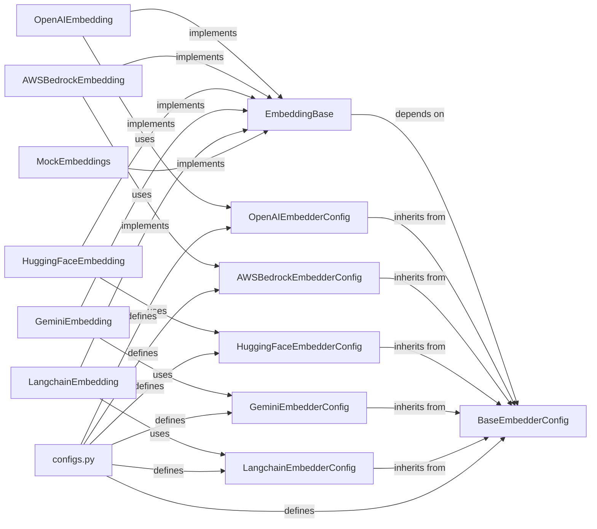

## Component Details

The `Embedding Integration` subsystem provides a standardized and extensible framework for generating vector embeddings from text, supporting various models and providers. This is crucial for enabling semantic search, similarity comparisons, and efficient retrieval of information within the `mem0` project.

### EmbeddingBase
This is the abstract base class (ABC) that defines the common interface for all embedding model implementations. It ensures that all concrete embedding providers adhere to a standard set of operations, primarily `_get_embeddings` (for generating embeddings from a list of texts) and `_get_embedding` (for a single text string). This promotes consistency and allows for interchangeable embedding backends. It also handles the initialization and configuration of the embedding model.

**Related Classes/Methods**:

- `EmbeddingBase` (1:1)

### BaseEmbedderConfig
This is the base configuration class for all embedding models. It defines common configuration parameters (e.g., `model`, `dimensions`) that are shared across different embedding providers. Concrete embedding configuration classes inherit from this to add provider-specific parameters.

**Related Classes/Methods**:

- `BaseEmbedderConfig` (1:1)

### OpenAIEmbedding
A concrete implementation of the `EmbeddingBase` interface, specifically for interacting with OpenAI's embedding models. It handles the specifics of calling the OpenAI API to generate text embeddings, including API key management and model selection.

**Related Classes/Methods**:

- `OpenAIEmbedding` (1:1)

### OpenAIEmbedderConfig
The specific configuration class for OpenAI embedding models. It inherits from `BaseEmbedderConfig` and adds parameters unique to OpenAI, such as `api_key` and `organization`.

**Related Classes/Methods**:

- `OpenAIEmbedderConfig` (1:1)

### AWSBedrockEmbedding
A concrete implementation of the `EmbeddingBase` interface for integrating with AWS Bedrock's embedding models. It manages the interaction with the AWS Bedrock service to generate embeddings, handling authentication and region specifics.

**Related Classes/Methods**:

- `AWSBedrockEmbedding` (1:1)

### HuggingFaceEmbedding
A concrete implementation of the `EmbeddingBase` interface for utilizing HuggingFace models for embeddings. This often involves loading models locally or interacting with HuggingFace inference endpoints.

**Related Classes/Methods**:

- `HuggingFaceEmbedding` (1:1)

### GeminiEmbedding
A concrete implementation of the `EmbeddingBase` interface for integrating with Google's Gemini embedding models. It handles the specifics of calling the Google Gemini API to generate text embeddings.

**Related Classes/Methods**:

- `GeminiEmbedding` (1:1)

### LangchainEmbedding
A concrete implementation that wraps Langchain's embedding capabilities, allowing `mem0` to leverage any embedding model supported by Langchain. This acts as an adapter for a broader ecosystem of models.

**Related Classes/Methods**:

- `LangchainEmbedding` (1:1)

### MockEmbeddings
A mock implementation of the `EmbeddingBase` interface, primarily used for testing or development purposes where actual embedding generation is not required. It returns dummy embedding vectors, facilitating isolated testing of components that depend on embeddings.

**Related Classes/Methods**:

- `MockEmbeddings` (1:1)

### configs.py
This Python module centralizes the definitions of all `*EmbedderConfig` classes. It serves as a single point of truth for how different embedding models are configured within the `mem0` project.

**Related Classes/Methods**:

- <a href="https://github.com/mem0ai/mem0/blob/master/mem0/embeddings/configs.py#L1-L1" target="_blank" rel="noopener noreferrer">`configs.py` (1:1)</a>

### AWSBedrockEmbedderConfig
The specific configuration class for AWS Bedrock embedding models. It inherits from `BaseEmbedderConfig` and defines parameters unique to AWS Bedrock.

**Related Classes/Methods**:

- `AWSBedrockEmbedderConfig` (1:1)

### HuggingFaceEmbedderConfig
The specific configuration class for HuggingFace embedding models. It inherits from `BaseEmbedderConfig` and defines parameters unique to HuggingFace models.

**Related Classes/Methods**:

- `HuggingFaceEmbedderConfig` (1:1)

### GeminiEmbedderConfig
The specific configuration class for Google Gemini embedding models. It inherits from `BaseEmbedderConfig` and defines parameters unique to Gemini models.

**Related Classes/Methods**:

- `GeminiEmbedderConfig` (1:1)

### LangchainEmbedderConfig
The specific configuration class for Langchain-wrapped embedding models. It inherits from `BaseEmbedderConfig` and defines parameters relevant to Langchain integrations.

**Related Classes/Methods**:

- `LangchainEmbedderConfig` (1:1)

### [FAQ](https://github.com/CodeBoarding/GeneratedOnBoardings/tree/main?tab=readme-ov-file#faq)