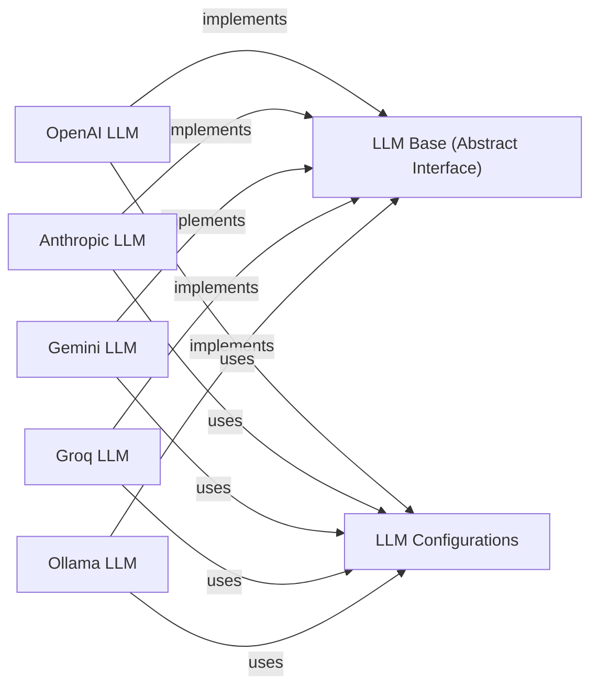

## Component Details

The `LLM Integration` component provides a standardized, pluggable interface for integrating with various Large Language Models (LLMs). It encapsulates the logic for interacting with different LLM providers, enabling `mem0` to leverage their capabilities for tasks like text generation, analysis, and information extraction.

### LLM Base (Abstract Interface)
This is the abstract base class, `mem0.llms.base.LLMBase`, which defines the common interface and abstract methods (e.g., `generate_response`) that all concrete LLM implementations must adhere to. It ensures consistency and allows for interchangeable LLM backends.

**Related Classes/Methods**:

- <a href="https://github.com/mem0ai/mem0/blob/master/mem0/llms/base.py#L6-L31" target="_blank" rel="noopener noreferrer">`mem0.llms.base.LLMBase` (6:31)</a>

### LLM Configurations
This component, primarily `mem0.llms.configs.LlmConfig`, defines Pydantic models for structured and validated configuration parameters specific to each LLM provider (e.g., API keys, model names, temperature settings).

**Related Classes/Methods**:

- <a href="https://github.com/mem0ai/mem0/blob/master/mem0/llms/configs.py#L5-L32" target="_blank" rel="noopener noreferrer">`mem0.llms.configs.LlmConfig` (5:32)</a>

### OpenAI LLM
A concrete implementation of the `LLMBase` interface, specifically designed for interacting with OpenAI's Large Language Models. It handles the specifics of API calls, request formatting, and response parsing for OpenAI models.

**Related Classes/Methods**:

- <a href="https://github.com/mem0ai/mem0/blob/master/mem0/llms/openai.py#L11-L122" target="_blank" rel="noopener noreferrer">`mem0.llms.openai.OpenAILLM` (11:122)</a>

### Anthropic LLM
A concrete implementation of the `LLMBase` interface for integrating with Anthropic's LLMs (e.g., Claude). It manages the specific API interactions for Anthropic models.

**Related Classes/Methods**:

- <a href="https://github.com/mem0ai/mem0/blob/master/mem0/llms/anthropic.py#L12-L63" target="_blank" rel="noopener noreferrer">`mem0.llms.anthropic.AnthropicLLM` (12:63)</a>

### Gemini LLM
A concrete implementation of the `LLMBase` interface for integrating with Google's Gemini LLMs. It handles the specific API calls and data formats for Gemini models.

**Related Classes/Methods**:

- <a href="https://github.com/mem0ai/mem0/blob/master/mem0/llms/gemini.py#L16-L190" target="_blank" rel="noopener noreferrer">`mem0.llms.gemini.GeminiLLM` (16:190)</a>

### Groq LLM
A concrete implementation of the `LLMBase` interface for integrating with Groq's LLMs, known for their high inference speed. It manages the specific API interactions for Groq models.

**Related Classes/Methods**:

- <a href="https://github.com/mem0ai/mem0/blob/master/mem0/llms/groq.py#L13-L86" target="_blank" rel="noopener noreferrer">`mem0.llms.groq.GroqLLM` (13:86)</a>

### Ollama LLM
A concrete implementation of the `LLMBase` interface for integrating with Ollama, which allows running large language models locally. It handles the local API interactions for Ollama-served models.

**Related Classes/Methods**:

- <a href="https://github.com/mem0ai/mem0/blob/master/mem0/llms/ollama.py#L11-L93" target="_blank" rel="noopener noreferrer">`mem0.llms.ollama.OllamaLLM` (11:93)</a>

### [FAQ](https://github.com/CodeBoarding/GeneratedOnBoardings/tree/main?tab=readme-ov-file#faq)