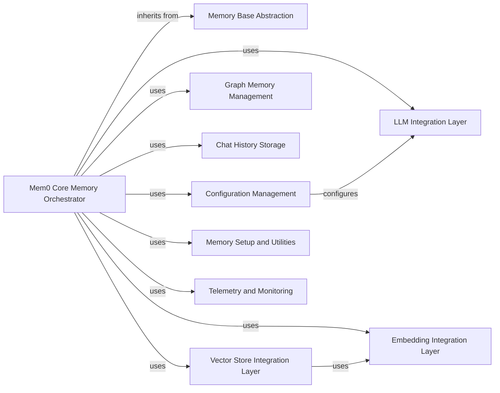

## Component Details

This analysis details the architecture of the `mem0` library's core memory management system, centered around the `Mem0 Core Memory Orchestrator`. It outlines the key components and their interdependencies, highlighting how the orchestrator integrates various specialized layers for LLM interaction, embedding generation, vector storage, graph memory, chat history, configuration, and telemetry to manage the complete memory lifecycle.

### Mem0 Core Memory Orchestrator
The core component responsible for orchestrating all memory operations. It initializes and coordinates interactions with various sub-components to manage the complete memory lifecycle.

**Related Classes/Methods**:

- <a href="https://github.com/mem0ai/mem0/blob/master/mem0/memory/main.py#L116-L966" target="_blank" rel="noopener noreferrer">`mem0.memory.main.Memory` (116:966)</a>

### Memory Base Abstraction
Defines the foundational abstract interfaces and classes (`MemoryBase`) that establish a consistent structure for different memory operations and types across the `mem0` library, ensuring extensibility.

**Related Classes/Methods**:

- <a href="https://github.com/mem0ai/mem0/blob/master/mem0/memory/base.py#L3-L62" target="_blank" rel="noopener noreferrer">`mem0.memory.base.MemoryBase` (3:62)</a>

### LLM Integration Layer
Provides a standardized and extensible interface for interacting with various Large Language Models (LLMs). It abstracts the specifics of different LLM providers, allowing the orchestrator to use them uniformly.

**Related Classes/Methods**:

- <a href="https://github.com/mem0ai/mem0/blob/master/mem0/llms/base.py#L0-L0" target="_blank" rel="noopener noreferrer">`mem0.llms.base` (0:0)</a>
- <a href="https://github.com/mem0ai/mem0/blob/master/mem0/llms/anthropic.py#L0-L0" target="_blank" rel="noopener noreferrer">`mem0.llms.anthropic` (0:0)</a>
- <a href="https://github.com/mem0ai/mem0/blob/master/mem0/llms/gemini.py#L0-L0" target="_blank" rel="noopener noreferrer">`mem0.llms.gemini` (0:0)</a>
- <a href="https://github.com/mem0ai/mem0/blob/master/mem0/llms/groq.py#L0-L0" target="_blank" rel="noopener noreferrer">`mem0.llms.groq` (0:0)</a>
- <a href="https://github.com/mem0ai/mem0/blob/master/mem0/llms/ollama.py#L0-L0" target="_blank" rel="noopener noreferrer">`mem0.llms.ollama` (0:0)</a>
- <a href="https://github.com/mem0ai/mem0/blob/master/mem0/llms/openai.py#L0-L0" target="_blank" rel="noopener noreferrer">`mem0.llms.openai` (0:0)</a>
- <a href="https://github.com/mem0ai/mem0/blob/master/mem0/llms/openai_structured.py#L0-L0" target="_blank" rel="noopener noreferrer">`mem0.llms.openai_structured` (0:0)</a>
- <a href="https://github.com/mem0ai/mem0/blob/master/mem0/utils/factory.py#L14-L42" target="_blank" rel="noopener noreferrer">`mem0.utils.factory.LlmFactory` (14:42)</a>

### Embedding Integration Layer
Manages the generation of numerical vector representations (embeddings) from textual data. These embeddings are crucial for enabling semantic understanding and similarity comparisons, especially when interacting with vector stores.

**Related Classes/Methods**:

- <a href="https://github.com/mem0ai/mem0/blob/master/mem0/embeddings/base.py#L0-L0" target="_blank" rel="noopener noreferrer">`mem0.embeddings.base` (0:0)</a>
- <a href="https://github.com/mem0ai/mem0/blob/master/mem0/embeddings/openai.py#L0-L0" target="_blank" rel="noopener noreferrer">`mem0.embeddings.openai` (0:0)</a>
- <a href="https://github.com/mem0ai/mem0/blob/master/mem0/embeddings/huggingface.py#L0-L0" target="_blank" rel="noopener noreferrer">`mem0.embeddings.huggingface` (0:0)</a>
- <a href="https://github.com/mem0ai/mem0/blob/master/mem0/embeddings/gemini.py#L0-L0" target="_blank" rel="noopener noreferrer">`mem0.embeddings.gemini` (0:0)</a>
- <a href="https://github.com/mem0ai/mem0/blob/master/mem0/utils/factory.py#L45-L69" target="_blank" rel="noopener noreferrer">`mem0.utils.factory.EmbedderFactory` (45:69)</a>

### Vector Store Integration Layer
Offers a unified interface for connecting with and utilizing various vector database solutions (e.g., Chroma, Pinecone, Qdrant). This component is essential for efficient semantic search and similarity operations on stored memories.

**Related Classes/Methods**:

- <a href="https://github.com/mem0ai/mem0/blob/master/mem0/vector_stores/base.py#L0-L0" target="_blank" rel="noopener noreferrer">`mem0.vector_stores.base` (0:0)</a>
- <a href="https://github.com/mem0ai/mem0/blob/master/mem0/vector_stores/chroma.py#L0-L0" target="_blank" rel="noopener noreferrer">`mem0.vector_stores.chroma` (0:0)</a>
- <a href="https://github.com/mem0ai/mem0/blob/master/mem0/vector_stores/pinecone.py#L0-L0" target="_blank" rel="noopener noreferrer">`mem0.vector_stores.pinecone` (0:0)</a>
- <a href="https://github.com/mem0ai/mem0/blob/master/mem0/vector_stores/qdrant.py#L0-L0" target="_blank" rel="noopener noreferrer">`mem0.vector_stores.qdrant` (0:0)</a>
- <a href="https://github.com/mem0ai/mem0/blob/master/mem0/utils/factory.py#L72-L106" target="_blank" rel="noopener noreferrer">`mem0.utils.factory.VectorStoreFactory` (72:106)</a>

### Graph Memory Management
Handles the storage, retrieval, and manipulation of knowledge in a graph-based format. This component allows for modeling complex relationships within the memory.

**Related Classes/Methods**:

- <a href="https://github.com/mem0ai/mem0/blob/master/mem0/memory/graph_memory.py#L0-L0" target="_blank" rel="noopener noreferrer">`mem0.memory.graph_memory` (0:0)</a>
- <a href="https://github.com/mem0ai/mem0/blob/master/mem0/memory/memgraph_memory.py#L0-L0" target="_blank" rel="noopener noreferrer">`mem0.memory.memgraph_memory` (0:0)</a>

### Chat History Storage
Manages the persistence and retrieval of chat history, typically using an SQLite database for efficient storage of conversational data.

**Related Classes/Methods**:

- <a href="https://github.com/mem0ai/mem0/blob/master/mem0/memory/storage.py#L9-L217" target="_blank" rel="noopener noreferrer">`mem0.memory.storage.SQLiteManager` (9:217)</a>

### Configuration Management
Provides a centralized system for managing and accessing configuration parameters across the entire `mem0` library, including settings for LLMs, embeddings, and vector stores.

**Related Classes/Methods**:

- <a href="https://github.com/mem0ai/mem0/blob/master/mem0/configs/base.py#L0-L0" target="_blank" rel="noopener noreferrer">`mem0.configs.base` (0:0)</a>
- <a href="https://github.com/mem0ai/mem0/blob/master/mem0/configs/llms/base.py#L0-L0" target="_blank" rel="noopener noreferrer">`mem0.configs.llms.base` (0:0)</a>
- <a href="https://github.com/mem0ai/mem0/blob/master/mem0/configs/embeddings/base.py#L0-L0" target="_blank" rel="noopener noreferrer">`mem0.configs.embeddings.base` (0:0)</a>
- `mem0.configs.vector_stores` (0:0)
- <a href="https://github.com/mem0ai/mem0/blob/master/mem0/configs/enums.py#L0-L0" target="_blank" rel="noopener noreferrer">`mem0.configs.enums` (0:0)</a>
- <a href="https://github.com/mem0ai/mem0/blob/master/mem0/configs/prompts.py#L0-L0" target="_blank" rel="noopener noreferrer">`mem0.configs.prompts` (0:0)</a>
- <a href="https://github.com/mem0ai/mem0/blob/master/mem0/memory/main.py#L0-L0" target="_blank" rel="noopener noreferrer">`mem0.memory.main.MemoryConfig` (0:0)</a>

### Memory Setup and Utilities
Handles the initial setup and configuration of the memory system, including dependency resolution and environment preparation. It also provides common utility functions used across various memory-related components.

**Related Classes/Methods**:

- <a href="https://github.com/mem0ai/mem0/blob/master/mem0/memory/setup.py#L0-L0" target="_blank" rel="noopener noreferrer">`mem0.memory.setup` (0:0)</a>
- <a href="https://github.com/mem0ai/mem0/blob/master/mem0/memory/utils.py#L0-L0" target="_blank" rel="noopener noreferrer">`mem0.memory.utils` (0:0)</a>
- <a href="https://github.com/mem0ai/mem0/blob/master/mem0/memory/setup.py#L11-L17" target="_blank" rel="noopener noreferrer">`mem0.memory.setup.setup_config` (11:17)</a>

### Telemetry and Monitoring
Responsible for collecting and reporting operational data and metrics related to memory operations, crucial for performance monitoring and system improvement.

**Related Classes/Methods**:

- <a href="https://github.com/mem0ai/mem0/blob/master/mem0/memory/telemetry.py#L0-L0" target="_blank" rel="noopener noreferrer">`mem0.memory.telemetry` (0:0)</a>

### [FAQ](https://github.com/CodeBoarding/GeneratedOnBoardings/tree/main?tab=readme-ov-file#faq)