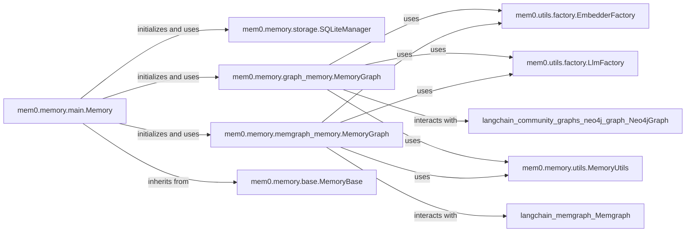

## Component Details

The `Memory Storage & Graph` component in `mem0` is a crucial subsystem dedicated to managing the persistence and retrieval of diverse memory data. Its primary purpose is to provide robust mechanisms for storing both historical memory changes and complex, relational memories, thereby enhancing the system's contextual understanding and recall capabilities. This is achieved through the integration of a local SQLite database for historical data and a flexible graph database (either Neo4j or Memgraph) for interconnected knowledge representation.

### mem0.memory.storage.SQLiteManager
This component is responsible for managing the SQLite database, which serves as the persistence layer for memory change history and associated metadata. It handles the creation of the database, schema migrations, and all operations related to storing and retrieving historical records of memory modifications and user interactions.

**Related Classes/Methods**:

- <a href="https://github.com/mem0ai/mem0/blob/master/mem0/memory/storage.py#L9-L217" target="_blank" rel="noopener noreferrer">`mem0.memory.storage.SQLiteManager` (9:217)</a>

### mem0.memory.graph_memory.MemoryGraph
This class implements the graph-based memory using a Neo4j database. Its core function is to store and retrieve complex, relational memories, enabling the system to understand and leverage the relationships between different entities. It integrates with embedding models for semantic search and Large Language Models (LLMs) for extracting and processing information to populate and query the graph.

**Related Classes/Methods**:

- <a href="https://github.com/mem0ai/mem0/blob/master/mem0/memory/graph_memory.py#L28-L617" target="_blank" rel="noopener noreferrer">`mem0.memory.graph_memory.MemoryGraph` (28:617)</a>

### mem0.memory.memgraph_memory.MemoryGraph
This component provides an alternative implementation of graph memory, specifically tailored for interaction with the Memgraph database. It offers similar functionalities to the Neo4j-based graph memory, including adding, searching, and managing data, but leverages Memgraph's optimized capabilities for graph operations.

**Related Classes/Methods**:

- <a href="https://github.com/mem0ai/mem0/blob/master/mem0/memory/memgraph_memory.py#L28-L602" target="_blank" rel="noopener noreferrer">`mem0.memory.memgraph_memory.MemoryGraph` (28:602)</a>

### mem0.memory.main.Memory
This is the central orchestrator of the entire memory subsystem. It initializes and manages instances of `SQLiteManager` for history and dynamically selects and initializes either the Neo4j or Memgraph `MemoryGraph` based on configuration. It serves as the primary public interface for all memory operations, delegating requests to the appropriate storage backend.

**Related Classes/Methods**:

- <a href="https://github.com/mem0ai/mem0/blob/master/mem0/memory/main.py#L116-L966" target="_blank" rel="noopener noreferrer">`mem0.memory.main.Memory` (116:966)</a>

### mem0.utils.factory.EmbedderFactory
A utility class responsible for creating and providing instances of various embedding models. These models are critical for converting textual data into numerical vector representations (embeddings), which are then used by the graph memory components for semantic similarity searches and contextual understanding.

**Related Classes/Methods**:

- <a href="https://github.com/mem0ai/mem0/blob/master/mem0/utils/factory.py#L45-L69" target="_blank" rel="noopener noreferrer">`mem0.utils.factory.EmbedderFactory` (45:69)</a>

### mem0.utils.factory.LlmFactory
This factory class is dedicated to creating and providing instances of Large Language Models (LLMs). LLMs are utilized by both `MemoryGraph` implementations to perform tasks such as extracting entities and relationships from raw text, which are then used to populate and enrich the graph memory.

**Related Classes/Methods**:

- <a href="https://github.com/mem0ai/mem0/blob/master/mem0/utils/factory.py#L14-L42" target="_blank" rel="noopener noreferrer">`mem0.utils.factory.LlmFactory` (14:42)</a>

### mem0.memory.base.MemoryBase
This is an abstract base class that defines a common interface and contract for all memory components within the `mem0` project. It specifies abstract methods for core memory operations like `get`, `get_all`, `update`, `delete`, and `history`, ensuring a consistent API across different memory implementations.

**Related Classes/Methods**:

- <a href="https://github.com/mem0ai/mem0/blob/master/mem0/memory/base.py#L3-L62" target="_blank" rel="noopener noreferrer">`mem0.memory.base.MemoryBase` (3:62)</a>

### mem0.memory.utils.MemoryUtils
This component provides a collection of utility functions and helper methods that are commonly used across various parts of the memory subsystem. These utilities include functionalities for prompt management, data parsing, and other common operations that support the overall functioning of memory storage and retrieval.

**Related Classes/Methods**:

- <a href="https://github.com/mem0ai/mem0/blob/master/mem0/memory/utils.py#L1-L1" target="_blank" rel="noopener noreferrer">`mem0.memory.utils.MemoryUtils` (1:1)</a>

### [FAQ](https://github.com/CodeBoarding/GeneratedOnBoardings/tree/main?tab=readme-ov-file#faq)