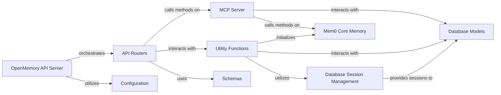

## Component Details

The `OpenMemory API Server` subsystem is designed to expose the `mem0` system's memory functionalities via a RESTful API. It acts as the primary interface for external applications, managing API requests, routing, and orchestrating operations with the core memory logic and underlying data storage.

### OpenMemory API Server
This is the top-level component, serving as the entry point for all external API interactions. It initializes the FastAPI application, registers all API routers, and sets up middleware for request processing. It orchestrates the flow of requests to the appropriate handlers within the `API Routers` and leverages `Configuration` and `Database Session Management` for application-wide settings and database connectivity.

**Related Classes/Methods**:

- `openmemory.api.app` (1:1)
- `openmemory.api.app.main` (1:1)

### API Routers
This component defines and groups the various RESTful API endpoints (e.g., for memories, applications, configuration, statistics). Each router handles specific API routes, validates incoming data using `Schemas`, interacts with the `MCP Server` or directly with `Mem0 Core Memory` for business logic, and utilizes `Utility Functions` for common tasks like database operations or permission checks.

**Related Classes/Methods**:

- <a href="https://github.com/mem0ai/mem0/blob/master/openmemory/api/app/routers/apps.py#L1-L1" target="_blank" rel="noopener noreferrer">`openmemory.api.app.routers.apps` (1:1)</a>
- <a href="https://github.com/mem0ai/mem0/blob/master/openmemory/api/app/routers/config.py#L1-L1" target="_blank" rel="noopener noreferrer">`openmemory.api.app.routers.config` (1:1)</a>
- <a href="https://github.com/mem0ai/mem0/blob/master/openmemory/api/app/routers/memories.py#L1-L1" target="_blank" rel="noopener noreferrer">`openmemory.api.app.routers.memories` (1:1)</a>
- <a href="https://github.com/mem0ai/mem0/blob/master/openmemory/api/app/routers/stats.py#L1-L1" target="_blank" rel="noopener noreferrer">`openmemory.api.app.routers.stats` (1:1)</a>

### MCP Server
This module acts as an internal proxy or facade for core memory operations. It provides a controlled interface to the `Mem0 Core Memory`, handling the actual logic for adding, searching, listing, and deleting memories. It integrates with `Database Models` for persistence and uses `Utility Functions` for tasks like permission checks and database interactions.

**Related Classes/Methods**:

- <a href="https://github.com/mem0ai/mem0/blob/master/openmemory/api/app/mcp_server.py#L1-L1" target="_blank" rel="noopener noreferrer">`openmemory.api.app.mcp_server` (1:1)</a>

### Utility Functions
A collection of helper functions and modules used across the API server for common, reusable tasks. This includes database interaction helpers (`db.py`), memory client management (`memory.py`), permission checks (`permissions.py`), and potentially categorization and prompt generation (`categorization.py`, `prompts.py`). These utilities support the `API Routers` and `MCP Server` by providing essential services.

**Related Classes/Methods**:

- <a href="https://github.com/mem0ai/mem0/blob/master/openmemory/api/app/utils/db.py#L1-L1" target="_blank" rel="noopener noreferrer">`openmemory.api.app.utils.db` (1:1)</a>
- <a href="https://github.com/mem0ai/mem0/blob/master/openmemory/api/app/utils/memory.py#L1-L1" target="_blank" rel="noopener noreferrer">`openmemory.api.app.utils.memory` (1:1)</a>
- <a href="https://github.com/mem0ai/mem0/blob/master/openmemory/api/app/utils/permissions.py#L1-L1" target="_blank" rel="noopener noreferrer">`openmemory.api.app.utils.permissions` (1:1)</a>
- <a href="https://github.com/mem0ai/mem0/blob/master/openmemory/api/app/utils/categorization.py#L1-L1" target="_blank" rel="noopener noreferrer">`openmemory.api.app.utils.categorization` (1:1)</a>
- <a href="https://github.com/mem0ai/mem0/blob/master/openmemory/api/app/utils/prompts.py#L1-L1" target="_blank" rel="noopener noreferrer">`openmemory.api.app.utils.prompts` (1:1)</a>

### Database Models
This component defines the SQLAlchemy ORM models that represent the database schema for various entities such as Memory, User, App, and Config. These models are used by the `MCP Server`, `API Routers`, and `Utility Functions` to interact with the underlying database in an object-oriented manner.

**Related Classes/Methods**:

- <a href="https://github.com/mem0ai/mem0/blob/master/openmemory/api/app/models.py#L1-L1" target="_blank" rel="noopener noreferrer">`openmemory.api.app.models` (1:1)</a>

### Schemas
This component defines Pydantic models used for data validation, serialization, and deserialization of API request and response payloads. These schemas ensure that data exchanged via the API conforms to expected structures and types, providing robust input validation and consistent output formatting.

**Related Classes/Methods**:

- <a href="https://github.com/mem0ai/mem0/blob/master/openmemory/api/app/schemas.py#L1-L1" target="_blank" rel="noopener noreferrer">`openmemory.api.app.schemas` (1:1)</a>

### Configuration
This component manages application-wide configuration settings, such as database connection strings, API keys, LLM and embedder configurations, and other environment-dependent parameters. It provides a centralized way to access these settings throughout the application.

**Related Classes/Methods**:

- <a href="https://github.com/mem0ai/mem0/blob/master/openmemory/api/app/config.py#L1-L1" target="_blank" rel="noopener noreferrer">`openmemory.api.app.config` (1:1)</a>

### Database Session Management
This component is responsible for setting up and managing database connections and sessions. It typically provides functions or dependencies to create and yield database sessions, ensuring proper session lifecycle management (e.g., opening, committing, rolling back, and closing sessions) for all database interactions.

**Related Classes/Methods**:

- <a href="https://github.com/mem0ai/mem0/blob/master/openmemory/api/app/database.py#L1-L1" target="_blank" rel="noopener noreferrer">`openmemory.api.app.database` (1:1)</a>

### Mem0 Core Memory
This is an external dependency (from the `mem0` package) that encapsulates the core memory management logic. It handles the actual storage, retrieval, embedding, and querying of memories, interacting with underlying vector databases and language models. The `MCP Server` and `Utility Functions` (specifically `utils/memory.py`) interact with this component.

**Related Classes/Methods**:

- <a href="https://github.com/mem0ai/mem0/blob/master/mem0/memory/main.py#L116-L966" target="_blank" rel="noopener noreferrer">`mem0.memory.main.Memory` (116:966)</a>

### [FAQ](https://github.com/CodeBoarding/GeneratedOnBoardings/tree/main?tab=readme-ov-file#faq)