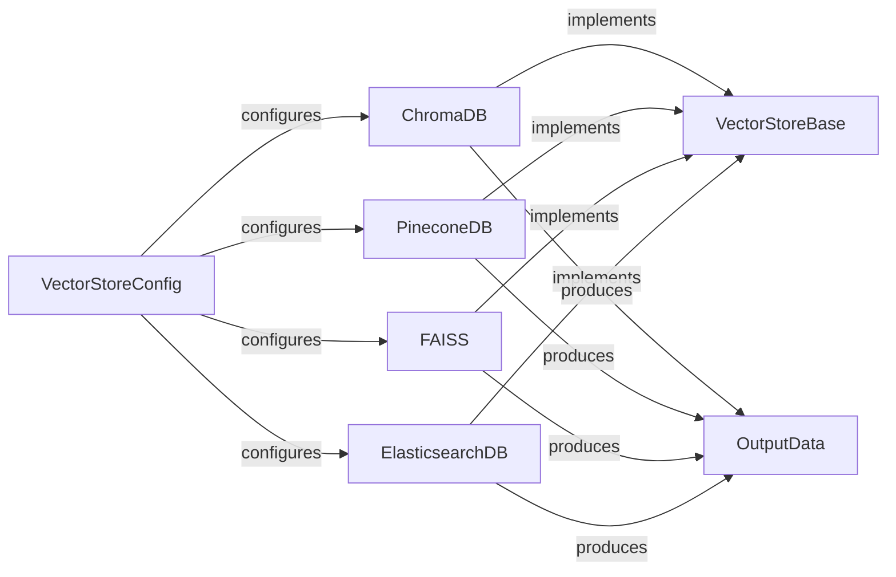

## Component Details

This component is designed to provide a unified and abstract interface for interacting with various vector databases. Its core purpose is to manage the persistence, retrieval, and manipulation of vectorized memories, allowing the rest of the `mem0` system to interact with different underlying storage solutions seamlessly without needing to know the specifics of each database.

### VectorStoreBase
This is the foundational abstract base class that defines the common interface and contract for all vector store implementations. It mandates a standard set of operations such as `create_col` (create collection/index), `insert`, `search`, `get`, `update`, `delete`, `list`, `list_cols` (list collections), `delete_col` (delete collection), and `reset`. This abstraction is crucial for ensuring consistency and interchangeability among different vector store backends, allowing new vector stores to be integrated by simply adhering to this interface.

**Related Classes/Methods**:

- <a href="https://github.com/mem0ai/mem0/blob/master/mem0/vector_stores/base.py#L0-L0" target="_blank" rel="noopener noreferrer">`mem0/vector_stores/base.py` (0:0)</a>
- <a href="https://github.com/mem0ai/mem0/blob/master/mem0/vector_stores/base.py#L0-L0" target="_blank" rel="noopener noreferrer">`mem0/vector_stores/base.py:create_col` (0:0)</a>
- <a href="https://github.com/mem0ai/mem0/blob/master/mem0/vector_stores/base.py#L0-L0" target="_blank" rel="noopener noreferrer">`mem0/vector_stores/base.py:insert` (0:0)</a>
- <a href="https://github.com/mem0ai/mem0/blob/master/mem0/vector_stores/base.py#L0-L0" target="_blank" rel="noopener noreferrer">`mem0/vector_stores/base.py:search` (0:0)</a>
- <a href="https://github.com/mem0ai/mem0/blob/master/mem0/vector_stores/base.py#L0-L0" target="_blank" rel="noopener noreferrer">`mem0/vector_stores/base.py:get` (0:0)</a>
- <a href="https://github.com/mem0ai/mem0/blob/master/mem0/vector_stores/base.py#L0-L0" target="_blank" rel="noopener noreferrer">`mem0/vector_stores/base.py:update` (0:0)</a>
- <a href="https://github.com/mem0ai/mem0/blob/master/mem0/vector_stores/base.py#L0-L0" target="_blank" rel="noopener noreferrer">`mem0/vector_stores/base.py:delete` (0:0)</a>
- <a href="https://github.com/mem0ai/mem0/blob/master/mem0/vector_stores/base.py#L0-L0" target="_blank" rel="noopener noreferrer">`mem0/vector_stores/base.py:list` (0:0)</a>
- <a href="https://github.com/mem0ai/mem0/blob/master/mem0/vector_stores/base.py#L0-L0" target="_blank" rel="noopener noreferrer">`mem0/vector_stores/base.py:list_cols` (0:0)</a>
- <a href="https://github.com/mem0ai/mem0/blob/master/mem0/vector_stores/base.py#L0-L0" target="_blank" rel="noopener noreferrer">`mem0/vector_stores/base.py:delete_col` (0:0)</a>
- <a href="https://github.com/mem0ai/mem0/blob/master/mem0/vector_stores/base.py#L0-L0" target="_blank" rel="noopener noreferrer">`mem0/vector_stores/base.py:reset` (0:0)</a>

### VectorStoreConfig
This component centralizes and defines configuration classes for various vector stores. It uses Pydantic models to allow for structured and validated configuration parameters (e.g., API keys, hostnames, collection names, specific client settings) required to connect and interact with each vector database. It dynamically loads the appropriate configuration class based on the specified `provider`, ensuring that each vector store implementation receives its necessary setup parameters.

**Related Classes/Methods**:

- <a href="https://github.com/mem0ai/mem0/blob/master/mem0/vector_stores/configs.py#L0-L0" target="_blank" rel="noopener noreferrer">`mem0/vector_stores/configs.py` (0:0)</a>

### OutputData
This is a standardized data structure (likely a Pydantic model) used to format the output of search and retrieval operations across all vector store implementations. By enforcing a consistent output format (e.g., containing `id`, `score`, and `payload`), it simplifies data processing and integration for the consuming parts of the `mem0` system, regardless of the specific vector database used.

**Related Classes/Methods**:

- <a href="https://github.com/mem0ai/mem0/blob/master/mem0/vector_stores/base.py#L0-L0" target="_blank" rel="noopener noreferrer">`mem0/vector_stores/base.py` (0:0)</a>

### ChromaDB
A concrete implementation of the `VectorStoreBase` interface tailored for ChromaDB. It handles the specifics of connecting to a ChromaDB instance, managing collections, inserting vectors with associated metadata, performing similarity searches, and parsing ChromaDB's native output into the standardized `OutputData` format.

**Related Classes/Methods**:

- <a href="https://github.com/mem0ai/mem0/blob/master/mem0/vector_stores/chroma.py#L0-L0" target="_blank" rel="noopener noreferrer">`mem0/vector_stores/chroma.py` (0:0)</a>

### PineconeDB
A concrete implementation of the `VectorStoreBase` interface for Pinecone, a cloud-native vector database. This component manages Pinecone index creation, handles batch insertion of vectors (with optional hybrid search capabilities using sparse vectors), executes vector similarity search queries with filtering, and transforms Pinecone's results into the `OutputData` format.

**Related Classes/Methods**:

- <a href="https://github.com/mem0ai/mem0/blob/master/mem0/vector_stores/pinecone.py#L0-L0" target="_blank" rel="noopener noreferrer">`mem0/vector_stores/pinecone.py` (0:0)</a>

### FAISS
A concrete implementation of the `VectorStoreBase` interface for FAISS (Facebook AI Similarity Search). This component manages in-memory vector indexes, including saving and loading them from disk for persistence. It provides methods for vector operations like insertion, search (with support for different distance strategies and filtering), and deletion, leveraging the `faiss` library for efficient similarity search.

**Related Classes/Methods**:

- <a href="https://github.com/mem0ai/mem0/blob/master/mem0/vector_stores/faiss.py#L0-L0" target="_blank" rel="noopener noreferrer">`mem0/vector_stores/faiss.py` (0:0)</a>

### ElasticsearchDB
A concrete implementation of the `VectorStoreBase` interface for Elasticsearch. It manages the creation of Elasticsearch indices with appropriate vector mappings, handles the bulk insertion of documents (vectors and metadata), and performs vector search queries (either using KNN or custom search queries). It adapts Elasticsearch's document-oriented nature to fit the `VectorStoreBase` interface and parses results into `OutputData`.

**Related Classes/Methods**:

- <a href="https://github.com/mem0ai/mem0/blob/master/mem0/vector_stores/elasticsearch.py#L0-L0" target="_blank" rel="noopener noreferrer">`mem0/vector_stores/elasticsearch.py` (0:0)</a>

### [FAQ](https://github.com/CodeBoarding/GeneratedOnBoardings/tree/main?tab=readme-ov-file#faq)