```mermaid
graph LR
    Mem0_Core_Memory["Mem0 Core Memory"]
    Mem0_Client["Mem0 Client"]
    LLM_Integration["LLM Integration"]
    Embedding_Integration["Embedding Integration"]
    Vector_Store_Integration["Vector Store Integration"]
    Memory_Storage_Graph["Memory Storage & Graph"]
    Configuration_Factory_Services["Configuration & Factory Services"]
    OpenMemory_API_Server["OpenMemory API Server"]
    Mem0_Core_Memory -- "Uses" --> LLM_Integration
    Mem0_Core_Memory -- "Uses" --> Embedding_Integration
    Mem0_Core_Memory -- "Uses" --> Vector_Store_Integration
    Mem0_Core_Memory -- "Uses" --> Memory_Storage_Graph
    Mem0_Core_Memory -- "Relies on" --> Configuration_Factory_Services
    Mem0_Client -- "Interacts with" --> Mem0_Core_Memory
    LLM_Integration -- "Relies on" --> Configuration_Factory_Services
    Embedding_Integration -- "Relies on" --> Configuration_Factory_Services
    Vector_Store_Integration -- "Relies on" --> Configuration_Factory_Services
    Memory_Storage_Graph -- "Uses" --> LLM_Integration
    Memory_Storage_Graph -- "Uses" --> Embedding_Integration
    Memory_Storage_Graph -- "Relies on" --> Configuration_Factory_Services
    Configuration_Factory_Services -- "Provides configurations to" --> LLM_Integration
    Configuration_Factory_Services -- "Provides configurations to" --> Embedding_Integration
    Configuration_Factory_Services -- "Provides configurations to" --> Vector_Store_Integration
    Configuration_Factory_Services -- "Provides configurations to" --> Memory_Storage_Graph
    OpenMemory_API_Server -- "Interacts with" --> Mem0_Core_Memory
    OpenMemory_API_Server -- "Uses" --> Configuration_Factory_Services
    click Mem0_Core_Memory href "https://github.com/CodeBoarding/GeneratedOnBoardings/blob/main//mem0/Mem0_Core_Memory.md" "Details"
    click LLM_Integration href "https://github.com/CodeBoarding/GeneratedOnBoardings/blob/main//mem0/LLM_Integration.md" "Details"
    click Embedding_Integration href "https://github.com/CodeBoarding/GeneratedOnBoardings/blob/main//mem0/Embedding_Integration.md" "Details"
    click Vector_Store_Integration href "https://github.com/CodeBoarding/GeneratedOnBoardings/blob/main//mem0/Vector_Store_Integration.md" "Details"
    click Memory_Storage_Graph href "https://github.com/CodeBoarding/GeneratedOnBoardings/blob/main//mem0/Memory_Storage_Graph.md" "Details"
    click OpenMemory_API_Server href "https://github.com/CodeBoarding/GeneratedOnBoardings/blob/main//mem0/OpenMemory_API_Server.md" "Details"
```

## Component Details

The `mem0` architecture is designed around a modular and extensible memory management system, primarily focused on integrating various AI capabilities (LLMs, embeddings) with diverse data storage solutions (vector stores, graph databases, SQLite). The core idea is to provide a unified interface for managing conversational and factual memory for AI agents and applications.

### Mem0 Core Memory
This is the central orchestrator of the `mem0` library. It manages the complete lifecycle of memories, including adding, retrieving, searching, updating, and deleting. It acts as the primary coordination point, integrating and directing operations across various underlying components for vector storage, graph memory, LLM interactions, and chat history persistence. It also leverages external frameworks like Embedchain for certain semantic memory operations.

**Related Classes/Methods**:

- <a href="https://github.com/mem0ai/mem0/blob/master/mem0/memory/main.py#L1-L1" target="_blank" rel="noopener noreferrer">`mem0.memory.main` (1:1)</a>

### Mem0 Client
Provides a simplified, high-level Python client interface (both synchronous and asynchronous) for applications to interact with the `Mem0 Core Memory`. It abstracts away the complexities of direct core memory object instantiation and management, offering a clean API for developers.

**Related Classes/Methods**:

- <a href="https://github.com/mem0ai/mem0/blob/master/mem0/client/main.py#L1-L1" target="_blank" rel="noopener noreferrer">`mem0.client.main` (1:1)</a>

### LLM Integration
This component provides a standardized, pluggable interface for integrating with various Large Language Models (LLMs) such as OpenAI, Anthropic, Gemini, Groq, and Ollama. It encapsulates the logic for interacting with different LLM providers, enabling `mem0` to leverage their capabilities for tasks like text generation, analysis, and information extraction.

**Related Classes/Methods**:

- <a href="https://github.com/mem0ai/mem0/blob/master/mem0/llms/base.py#L1-L1" target="_blank" rel="noopener noreferrer">`mem0.llms.base` (1:1)</a>
- <a href="https://github.com/mem0ai/mem0/blob/master/mem0/llms/openai.py#L1-L1" target="_blank" rel="noopener noreferrer">`mem0.llms.openai` (1:1)</a>
- <a href="https://github.com/mem0ai/mem0/blob/master/mem0/llms/anthropic.py#L1-L1" target="_blank" rel="noopener noreferrer">`mem0.llms.anthropic` (1:1)</a>
- <a href="https://github.com/mem0ai/mem0/blob/master/mem0/llms/gemini.py#L1-L1" target="_blank" rel="noopener noreferrer">`mem0.llms.gemini` (1:1)</a>
- <a href="https://github.com/mem0ai/mem0/blob/master/mem0/llms/groq.py#L1-L1" target="_blank" rel="noopener noreferrer">`mem0.llms.groq` (1:1)</a>
- <a href="https://github.com/mem0ai/mem0/blob/master/mem0/llms/ollama.py#L1-L1" target="_blank" rel="noopener noreferrer">`mem0.llms.ollama` (1:1)</a>

### Embedding Integration
Offers a common, extensible interface for generating vector embeddings from text using various embedding models (e.g., OpenAI, AWS Bedrock, HuggingFace). These embeddings are crucial for enabling semantic search, similarity comparisons, and efficient retrieval of memories from vector stores.

**Related Classes/Methods**:

- <a href="https://github.com/mem0ai/mem0/blob/master/mem0/embeddings/base.py#L1-L1" target="_blank" rel="noopener noreferrer">`mem0.embeddings.base` (1:1)</a>
- <a href="https://github.com/mem0ai/mem0/blob/master/mem0/embeddings/openai.py#L1-L1" target="_blank" rel="noopener noreferrer">`mem0.embeddings.openai` (1:1)</a>
- <a href="https://github.com/mem0ai/mem0/blob/master/mem0/embeddings/aws_bedrock.py#L1-L1" target="_blank" rel="noopener noreferrer">`mem0.embeddings.aws_bedrock` (1:1)</a>
- <a href="https://github.com/mem0ai/mem0/blob/master/mem0/embeddings/huggingface.py#L1-L1" target="_blank" rel="noopener noreferrer">`mem0.embeddings.huggingface` (1:1)</a>

### Vector Store Integration
This component abstracts interactions with a variety of vector databases (e.g., Chroma, Elasticsearch, FAISS, Pinecone, Qdrant, Redis, Supabase, Weaviate). It is responsible for the actual persistence, retrieval, and management of vectorized memories, providing a unified way to interact with different underlying storage solutions.

**Related Classes/Methods**:

- <a href="https://github.com/mem0ai/mem0/blob/master/mem0/vector_stores/base.py#L1-L1" target="_blank" rel="noopener noreferrer">`mem0.vector_stores.base` (1:1)</a>
- <a href="https://github.com/mem0ai/mem0/blob/master/mem0/vector_stores/chroma.py#L1-L1" target="_blank" rel="noopener noreferrer">`mem0.vector_stores.chroma` (1:1)</a>
- <a href="https://github.com/mem0ai/mem0/blob/master/mem0/vector_stores/elasticsearch.py#L1-L1" target="_blank" rel="noopener noreferrer">`mem0.vector_stores.elasticsearch` (1:1)</a>
- <a href="https://github.com/mem0ai/mem0/blob/master/mem0/vector_stores/faiss.py#L1-L1" target="_blank" rel="noopener noreferrer">`mem0.vector_stores.faiss` (1:1)</a>
- <a href="https://github.com/mem0ai/mem0/blob/master/mem0/vector_stores/pinecone.py#L1-L1" target="_blank" rel="noopener noreferrer">`mem0.vector_stores.pinecone` (1:1)</a>
- <a href="https://github.com/mem0ai/mem0/blob/master/mem0/vector_stores/qdrant.py#L1-L1" target="_blank" rel="noopener noreferrer">`mem0.vector_stores.qdrant` (1:1)</a>
- <a href="https://github.com/mem0ai/mem0/blob/master/mem0/vector_stores/redis.py#L1-L1" target="_blank" rel="noopener noreferrer">`mem0.vector_stores.redis` (1:1)</a>
- <a href="https://github.com/mem0ai/mem0/blob/master/mem0/vector_stores/supabase.py#L1-L1" target="_blank" rel="noopener noreferrer">`mem0.vector_stores.supabase` (1:1)</a>
- <a href="https://github.com/mem0ai/mem0/blob/master/mem0/vector_stores/weaviate.py#L1-L1" target="_blank" rel="noopener noreferrer">`mem0.vector_stores.weaviate` (1:1)</a>

### Memory Storage & Graph
This consolidated component manages the diverse persistence mechanisms for memory data. It includes the `SQLite History Manager` for local storage of memory change history and metadata, and the `Graph Memory` for storing and retrieving complex, relational memories, enhancing contextual understanding.

**Related Classes/Methods**:

- <a href="https://github.com/mem0ai/mem0/blob/master/mem0/memory/storage.py#L1-L1" target="_blank" rel="noopener noreferrer">`mem0.memory.storage` (1:1)</a>
- <a href="https://github.com/mem0ai/mem0/blob/master/mem0/memory/graph_memory.py#L1-L1" target="_blank" rel="noopener noreferrer">`mem0.memory.graph_memory` (1:1)</a>
- <a href="https://github.com/mem0ai/mem0/blob/master/mem0/memory/memgraph_memory.py#L1-L1" target="_blank" rel="noopener noreferrer">`mem0.memory.memgraph_memory` (1:1)</a>

### Configuration & Factory Services
This component is responsible for defining and loading system configurations for all pluggable parts of `mem0`, including LLMs, embedding models, vector stores, and graph stores. It also provides factory methods to dynamically create instances of these various integration components based on the loaded configurations, promoting a highly modular and extensible architecture.

**Related Classes/Methods**:

- <a href="https://github.com/mem0ai/mem0/blob/master/mem0/configs/base.py#L1-L1" target="_blank" rel="noopener noreferrer">`mem0.configs.base` (1:1)</a>
- <a href="https://github.com/mem0ai/mem0/blob/master/mem0/configs/llms/base.py#L1-L1" target="_blank" rel="noopener noreferrer">`mem0.configs.llms.base` (1:1)</a>
- <a href="https://github.com/mem0ai/mem0/blob/master/mem0/configs/embeddings/base.py#L1-L1" target="_blank" rel="noopener noreferrer">`mem0.configs.embeddings.base` (1:1)</a>
- <a href="https://github.com/mem0ai/mem0/blob/master/mem0/configs/vector_stores/chroma.py#L1-L1" target="_blank" rel="noopener noreferrer">`mem0.configs.vector_stores.chroma` (1:1)</a>
- <a href="https://github.com/mem0ai/mem0/blob/master/mem0/utils/factory.py#L1-L1" target="_blank" rel="noopener noreferrer">`mem0.utils.factory` (1:1)</a>

### OpenMemory API Server
This component provides the RESTful API interface for the `mem0` system, enabling external applications to interact with the memory functionalities over HTTP. It handles incoming requests, manages API routing, and orchestrates calls to the `Mem0 Core Memory` to fulfill memory-related operations.

**Related Classes/Methods**:

- <a href="https://github.com/mem0ai/mem0/blob/master/openmemory/api/app/mcp_server.py#L1-L1" target="_blank" rel="noopener noreferrer">`openmemory.api.app.mcp_server` (1:1)</a>
- <a href="https://github.com/mem0ai/mem0/blob/master/openmemory/api/app/routers/apps.py#L1-L1" target="_blank" rel="noopener noreferrer">`openmemory.api.app.routers.apps` (1:1)</a>
- <a href="https://github.com/mem0ai/mem0/blob/master/openmemory/api/app/routers/config.py#L1-L1" target="_blank" rel="noopener noreferrer">`openmemory.api.app.routers.config` (1:1)</a>
- <a href="https://github.com/mem0ai/mem0/blob/master/openmemory/api/app/routers/memories.py#L1-L1" target="_blank" rel="noopener noreferrer">`openmemory.api.app.routers.memories` (1:1)</a>
- <a href="https://github.com/mem0ai/mem0/blob/master/openmemory/api/app/utils/db.py#L1-L1" target="_blank" rel="noopener noreferrer">`openmemory.api.app.utils.db` (1:1)</a>
- <a href="https://github.com/mem0ai/mem0/blob/master/openmemory/api/app/utils/memory.py#L1-L1" target="_blank" rel="noopener noreferrer">`openmemory.api.app.utils.memory` (1:1)</a>
- <a href="https://github.com/mem0ai/mem0/blob/master/openmemory/api/app/utils/permissions.py#L1-L1" target="_blank" rel="noopener noreferrer">`openmemory.api.app.utils.permissions` (1:1)</a>

### [FAQ](https://github.com/CodeBoarding/GeneratedOnBoardings/tree/main?tab=readme-ov-file#faq)