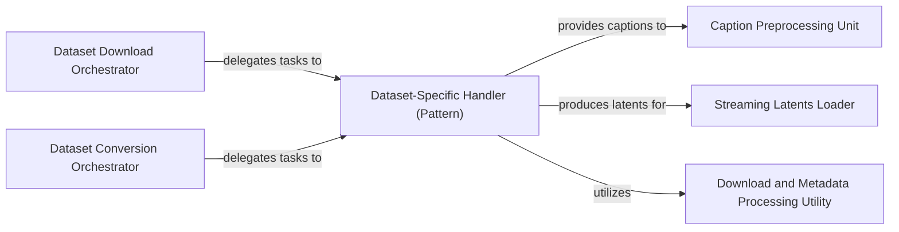

## Details

The `micro_diffusion.datasets` subsystem is structured around the preparation and delivery of diverse datasets for diffusion models. It operates through a pattern of conceptual orchestrators that delegate specific tasks to a family of `Dataset-Specific Handlers`. These handlers encapsulate the unique logic for downloading, converting, and precomputing data for individual datasets. During this process, they interact with a `Caption Preprocessing Unit` for text data and conceptually utilize a `Download and Metadata Processing Utility` for shared functionalities. The ultimate output of this subsystem, precomputed latent representations, is efficiently managed and streamed by the `Streaming Latents Loader`, which serves as the interface for downstream model training or inference pipelines. This modular design allows for easy integration of new datasets while maintaining a clear separation of concerns.

### Dataset Download Orchestrator
This is a conceptual component representing the high-level process of initiating and managing the download of various raw image and text datasets. It delegates specific download tasks to individual dataset-specific handlers. There isn't a single, dedicated code entity for this orchestrator; rather, its functionality is distributed across higher-level scripts that invoke the download methods of individual dataset handlers.

**Related Classes/Methods**: _None_

### Dataset Conversion Orchestrator
Similar to the download orchestrator, this is a conceptual component that manages the conversion process of raw or downloaded datasets into standardized, clean, and model-consumable formats, such as precomputed latent representations. It delegates conversion tasks to specific dataset handlers. Its functionality is distributed across higher-level scripts that invoke the conversion methods of individual dataset handlers.

**Related Classes/Methods**: _None_

### Caption Preprocessing Unit
Responsible for cleaning and standardizing text captions associated with image data. This includes tasks like basic cleaning and more specific caption logic, ensuring captions are ready for model consumption.

**Related Classes/Methods**:

- <a href="https://github.com/SonyResearch/micro_diffusion/blob/main/micro_diffusion/datasets/captions.py#L1-L1000" target="_blank" rel="noopener noreferrer">`micro_diffusion.datasets.captions`:1-1000</a>

### Dataset-Specific Handler (Pattern)
Represents a family of components (e.g., `CC12M Dataset Handler`, `DiffDB Dataset Handler`, `JDB Dataset Handler`, `SA1B Dataset Handler`, `COCO Dataset Handler`, `TextCaps Dataset Handler`) that encapsulate the specific logic for downloading, converting, and potentially precomputing data for individual datasets. They interact with utilities for common tasks.

**Related Classes/Methods**:

- <a href="https://github.com/SonyResearch/micro_diffusion/blob/main/micro_diffusion/datasets/prepare/cc12m/download.py#L1-L1000" target="_blank" rel="noopener noreferrer">`micro_diffusion.datasets.prepare.cc12m.download`:1-1000</a>
- <a href="https://github.com/SonyResearch/micro_diffusion/blob/main/micro_diffusion/datasets/prepare/cc12m/convert.py#L1-L1000" target="_blank" rel="noopener noreferrer">`micro_diffusion.datasets.prepare.cc12m.convert`:1-1000</a>
- <a href="https://github.com/SonyResearch/micro_diffusion/blob/main/micro_diffusion/datasets/prepare/diffdb/download.py#L1-L1000" target="_blank" rel="noopener noreferrer">`micro_diffusion.datasets.prepare.diffdb.download`:1-1000</a>
- <a href="https://github.com/SonyResearch/micro_diffusion/blob/main/micro_diffusion/datasets/prepare/diffdb/convert.py#L1-L1000" target="_blank" rel="noopener noreferrer">`micro_diffusion.datasets.prepare.diffdb.convert`:1-1000</a>
- <a href="https://github.com/SonyResearch/micro_diffusion/blob/main/micro_diffusion/datasets/prepare/jdb/download.py#L1-L1000" target="_blank" rel="noopener noreferrer">`micro_diffusion.datasets.prepare.jdb.download`:1-1000</a>
- <a href="https://github.com/SonyResearch/micro_diffusion/blob/main/micro_diffusion/datasets/prepare/jdb/convert.py#L1-L1000" target="_blank" rel="noopener noreferrer">`micro_diffusion.datasets.prepare.jdb.convert`:1-1000</a>
- <a href="https://github.com/SonyResearch/micro_diffusion/blob/main/micro_diffusion/datasets/prepare/sa1b/download.py#L1-L1000" target="_blank" rel="noopener noreferrer">`micro_diffusion.datasets.prepare.sa1b.download`:1-1000</a>
- <a href="https://github.com/SonyResearch/micro_diffusion/blob/main/micro_diffusion/datasets/prepare/sa1b/convert.py#L1-L1000" target="_blank" rel="noopener noreferrer">`micro_diffusion.datasets.prepare.sa1b.convert`:1-1000</a>
- <a href="https://github.com/SonyResearch/micro_diffusion/blob/main/#L1-L1000" target="_blank" rel="noopener noreferrer">`micro_diffusion.datasets.prepare.coco.download`:1-1000</a>
- <a href="https://github.com/SonyResearch/micro_diffusion/blob/main/micro_diffusion/datasets/prepare/coco/convert.py#L1-L1000" target="_blank" rel="noopener noreferrer">`micro_diffusion.datasets.prepare.coco.convert`:1-1000</a>
- <a href="https://github.com/SonyResearch/micro_diffusion/blob/main/#L1-L1000" target="_blank" rel="noopener noreferrer">`micro_diffusion.datasets.prepare.textcaps.download`:1-1000</a>
- <a href="https://github.com/SonyResearch/micro_diffusion/blob/main/micro_diffusion/datasets/prepare/textcaps/convert.py#L1-L1000" target="_blank" rel="noopener noreferrer">`micro_diffusion.datasets.prepare.textcaps.convert`:1-1000</a>

### Streaming Latents Loader
Manages the efficient loading and streaming of precomputed latent representations of images. This component is crucial for feeding the processed data into the training or inference pipeline, ensuring data is available in a model-consumable format.

**Related Classes/Methods**:

- <a href="https://github.com/SonyResearch/micro_diffusion/blob/main/micro_diffusion/datasets/latents_loader.py#L1-L1000" target="_blank" rel="noopener noreferrer">`micro_diffusion.datasets.latents_loader`:1-1000</a>

### Download and Metadata Processing Utility
This is a conceptual component representing common utility functions for managing metadata and facilitating the download process across various dataset handlers. There isn't a single, dedicated source file for this component; rather, its functionalities are likely distributed across various `base.py` files or other shared modules within the `prepare` package.

**Related Classes/Methods**: _None_

### [FAQ](https://github.com/CodeBoarding/GeneratedOnBoardings/tree/main?tab=readme-ov-file#faq)