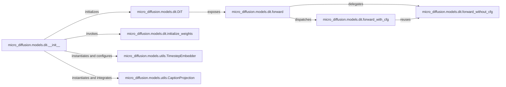

## Details

The Diffusion Transformer (DiT) Architecture subsystem is primarily encapsulated within the micro_diffusion.models.dit module, with key dependencies on shared utilities in micro_diffusion.models.utils. This subsystem defines the core neural network structure, its initialization, and its forward pass logic, aligning with the "Model Definition" and "Model-Centric View" patterns of an ML Toolkit/Research Project.

### micro_diffusion.models.dit.DiT
The top-level orchestrator and container for the entire Diffusion Transformer model. It serves as the primary interface for model inference and encapsulates the complete architecture.

**Related Classes/Methods**:

- <a href="https://github.com/SonyResearch/micro_diffusion/blob/main/micro_diffusion/models/dit.py#L249-L627" target="_blank" rel="noopener noreferrer">`micro_diffusion.models.dit.DiT`:249-627</a>

### micro_diffusion.models.dit.__init__
Manages the construction of the `DiT` network, including the instantiation of its various blocks, layers, and the integration of necessary utility components (e.g., `TimestepEmbedder`, `CaptionProjection`).

**Related Classes/Methods**:

- <a href="https://github.com/SonyResearch/micro_diffusion/blob/main/micro_diffusion/models/dit.py#L277-L453" target="_blank" rel="noopener noreferrer">`micro_diffusion.models.dit.__init__`:277-453</a>

### micro_diffusion.models.dit.forward
Orchestrates the model's inference flow, including the decision to apply classifier-free guidance (CFG) and delegating to specific forward pass methods (`forward_without_cfg` or `forward_with_cfg`).

**Related Classes/Methods**:

- <a href="https://github.com/SonyResearch/micro_diffusion/blob/main/micro_diffusion/models/dit.py#L552-L564" target="_blank" rel="noopener noreferrer">`micro_diffusion.models.dit.forward`:552-564</a>

### micro_diffusion.models.dit.initialize_weights
Manages the initial setup and configuration of the model's parameters and weights, ensuring proper initialization for training stability and performance.

**Related Classes/Methods**:

- <a href="https://github.com/SonyResearch/micro_diffusion/blob/main/micro_diffusion/models/dit.py#L577-L627" target="_blank" rel="noopener noreferrer">`micro_diffusion.models.dit.initialize_weights`:577-627</a>

### micro_diffusion.models.dit.forward_without_cfg
Implements the fundamental forward pass logic of the DiT model when classifier-free guidance is *not* applied. This represents the core computational path for unconditional generation.

**Related Classes/Methods**:

- <a href="https://github.com/SonyResearch/micro_diffusion/blob/main/micro_diffusion/models/dit.py#L455-L519" target="_blank" rel="noopener noreferrer">`micro_diffusion.models.dit.forward_without_cfg`:455-519</a>

### micro_diffusion.models.dit.forward_with_cfg
Implements the forward pass logic that incorporates classifier-free guidance, typically by combining conditional and unconditional outputs to enhance generation quality.

**Related Classes/Methods**:

- <a href="https://github.com/SonyResearch/micro_diffusion/blob/main/micro_diffusion/models/dit.py#L521-L550" target="_blank" rel="noopener noreferrer">`micro_diffusion.models.dit.forward_with_cfg`:521-550</a>

### micro_diffusion.models.utils.TimestepEmbedder
Transforms numerical timestep values into dense, learnable embeddings suitable for neural network consumption, crucial for informing the model about the diffusion process stage.

**Related Classes/Methods**:

- <a href="https://github.com/SonyResearch/micro_diffusion/blob/main/micro_diffusion/models/utils.py#L243-L289" target="_blank" rel="noopener noreferrer">`micro_diffusion.models.utils.TimestepEmbedder`:243-289</a>

### micro_diffusion.models.utils.CaptionProjection
Projects textual caption embeddings into a compatible dimension for integration into the DiT model, allowing text-based conditioning.

**Related Classes/Methods**:

- <a href="https://github.com/SonyResearch/micro_diffusion/blob/main/micro_diffusion/models/utils.py#L292-L318" target="_blank" rel="noopener noreferrer">`micro_diffusion.models.utils.CaptionProjection`:292-318</a>

### [FAQ](https://github.com/CodeBoarding/GeneratedOnBoardings/tree/main?tab=readme-ov-file#faq)