```mermaid
graph LR
    Configuration_Management["Configuration Management"]
    Data_Ingestion_Preprocessing["Data Ingestion & Preprocessing"]
    Streaming_Data_Loaders["Streaming Data Loaders"]
    Diffusion_Transformer_DiT_Architecture["Diffusion Transformer (DiT) Architecture"]
    Latent_Diffusion_Model_Orchestrator["Latent Diffusion Model Orchestrator"]
    Configuration_Management -- "configures" --> Data_Ingestion_Preprocessing
    Configuration_Management -- "configures" --> Streaming_Data_Loaders
    Configuration_Management -- "configures" --> Latent_Diffusion_Model_Orchestrator
    Data_Ingestion_Preprocessing -- "provides processed data to" --> Streaming_Data_Loaders
    Streaming_Data_Loaders -- "feeds data batches to" --> Latent_Diffusion_Model_Orchestrator
    Latent_Diffusion_Model_Orchestrator -- "utilizes" --> Diffusion_Transformer_DiT_Architecture
    Diffusion_Transformer_DiT_Architecture -- "returns results to" --> Latent_Diffusion_Model_Orchestrator
    click Data_Ingestion_Preprocessing href "https://github.com/CodeBoarding/GeneratedOnBoardings/blob/main/micro_diffusion/Data_Ingestion_Preprocessing.md" "Details"
    click Streaming_Data_Loaders href "https://github.com/CodeBoarding/GeneratedOnBoardings/blob/main/micro_diffusion/Streaming_Data_Loaders.md" "Details"
    click Diffusion_Transformer_DiT_Architecture href "https://github.com/CodeBoarding/GeneratedOnBoardings/blob/main/micro_diffusion/Diffusion_Transformer_DiT_Architecture.md" "Details"
```

## Details

The `micro_diffusion` project is structured around a core Latent Diffusion Model, orchestrated by the `Latent Diffusion Model Orchestrator`. This orchestrator leverages a `Diffusion Transformer (DiT) Architecture` for its generative capabilities. Data flow begins with `Configuration Management`, which dictates parameters for both `Data Ingestion & Preprocessing` and `Streaming Data Loaders`. The `Data Ingestion & Preprocessing` component is responsible for acquiring and transforming raw data into a usable format, which is then efficiently provided to the `Streaming Data Loaders`. These loaders, in turn, feed processed data batches to the `Latent Diffusion Model Orchestrator` for training and inference. The orchestrator interacts with the DiT architecture to compute and return results, forming a cyclical data flow during model training and generation.

### Configuration Management
Centralized management of all project configurations, including dataset paths, model hyperparameters, training schedules, and inference settings. These configurations drive the behavior of the entire pipeline.

**Related Classes/Methods**:

- <a href="https://github.com/SonyResearch/micro_diffusion/blob/main/configs/res_256_finetune.yaml" target="_blank" rel="noopener noreferrer">`configs/res_256_finetune.yaml`</a>
- <a href="https://github.com/SonyResearch/micro_diffusion/blob/main/configs/res_512_pretrain.yaml" target="_blank" rel="noopener noreferrer">`configs/res_512_pretrain.yaml`</a>

### Data Ingestion & Preprocessing [[Expand]](./Data_Ingestion_Preprocessing.md)
Handles the entire lifecycle of data preparation, from initial acquisition of raw image and text datasets to their transformation into a standardized, clean, and model-consumable format. This includes downloading, cleaning captions, and converting data (e.g., to latent representations).

**Related Classes/Methods**:

- <a href="https://github.com/SonyResearch/micro_diffusion/blob/main/micro_diffusion/datasets/prepare/" target="_blank" rel="noopener noreferrer">`micro_diffusion.datasets.prepare.download.main`</a>
- <a href="https://github.com/SonyResearch/micro_diffusion/blob/main/micro_diffusion/datasets/prepare/" target="_blank" rel="noopener noreferrer">`micro_diffusion.datasets.prepare.convert.main`</a>
- <a href="https://github.com/SonyResearch/micro_diffusion/blob/main/micro_diffusion/datasets/captions.py#L36-L37" target="_blank" rel="noopener noreferrer">`micro_diffusion.datasets.captions.clean_caption`:36-37</a>
- <a href="https://github.com/SonyResearch/micro_diffusion/blob/main/micro_diffusion/datasets/prepare/cc12m/download.py" target="_blank" rel="noopener noreferrer">`micro_diffusion.datasets.prepare.cc12m.download`</a>
- <a href="https://github.com/SonyResearch/micro_diffusion/blob/main/micro_diffusion/datasets/prepare/diffdb/download.py" target="_blank" rel="noopener noreferrer">`micro_diffusion.datasets.prepare.diffdb.download`</a>
- <a href="https://github.com/SonyResearch/micro_diffusion/blob/main/micro_diffusion/datasets/prepare/cc12m/convert.py" target="_blank" rel="noopener noreferrer">`micro_diffusion.datasets.prepare.cc12m.convert`</a>
- <a href="https://github.com/SonyResearch/micro_diffusion/blob/main/micro_diffusion/datasets/captions.py" target="_blank" rel="noopener noreferrer">`micro_diffusion.datasets.captions`</a>

### Streaming Data Loaders [[Expand]](./Streaming_Data_Loaders.md)
Provides efficient, on-the-fly access to large preprocessed datasets, optimized for high-throughput data delivery during training and inference, often leveraging streaming capabilities to handle datasets larger than memory.

**Related Classes/Methods**:

- <a href="https://github.com/SonyResearch/micro_diffusion/blob/main/micro_diffusion/datasets/latents_loader.py#L73-L108" target="_blank" rel="noopener noreferrer">`micro_diffusion.datasets.latents_loader.build_streaming_latents_dataloader`:73-108</a>
- <a href="https://github.com/SonyResearch/micro_diffusion/blob/main/micro_diffusion/datasets/prepare/" target="_blank" rel="noopener noreferrer">`micro_diffusion.datasets.prepare.base.build_streaming_precompute_dataloader`</a>
- <a href="https://github.com/SonyResearch/micro_diffusion/blob/main/micro_diffusion/datasets/latents_loader.py" target="_blank" rel="noopener noreferrer">`micro_diffusion.datasets.latents_loader`</a>
- <a href="https://github.com/SonyResearch/micro_diffusion/blob/main/micro_diffusion/datasets/prepare/" target="_blank" rel="noopener noreferrer">`micro_diffusion.datasets.prepare.base`</a>

### Diffusion Transformer (DiT) Architecture [[Expand]](./Diffusion_Transformer_DiT_Architecture.md)
Encapsulates the core neural network architecture of the Diffusion Transformer model. This includes the definition of its layers, blocks, forward pass logic, and weight initialization schemes. It leverages shared `Model Utilities` for common operations.

**Related Classes/Methods**:

- <a href="https://github.com/SonyResearch/micro_diffusion/blob/main/micro_diffusion/models/dit.py#L277-L453" target="_blank" rel="noopener noreferrer">`micro_diffusion.models.dit.__init__`:277-453</a>
- <a href="https://github.com/SonyResearch/micro_diffusion/blob/main/micro_diffusion/models/dit.py#L552-L564" target="_blank" rel="noopener noreferrer">`micro_diffusion.models.dit.forward`:552-564</a>
- <a href="https://github.com/SonyResearch/micro_diffusion/blob/main/micro_diffusion/models/dit.py#L577-L627" target="_blank" rel="noopener noreferrer">`micro_diffusion.models.dit.initialize_weights`:577-627</a>
- <a href="https://github.com/SonyResearch/micro_diffusion/blob/main/micro_diffusion/models/dit.py" target="_blank" rel="noopener noreferrer">`micro_diffusion.models.dit`</a>
- <a href="https://github.com/SonyResearch/micro_diffusion/blob/main/micro_diffusion/models/utils.py" target="_blank" rel="noopener noreferrer">`micro_diffusion.models.utils`</a>

### Latent Diffusion Model Orchestrator
The central control component for the latent diffusion model's lifecycle. It manages the overall training loop, loss calculation (e.g., EDM loss), sampling procedures, and model creation. This component integrates the DiT architecture with data loaders and training utilities, and interacts with callbacks for monitoring and logging.

**Related Classes/Methods**:

- <a href="https://github.com/SonyResearch/micro_diffusion/blob/main/micro_diffusion/models/model.py#L356-L405" target="_blank" rel="noopener noreferrer">`micro_diffusion.models.model.create_latent_diffusion`:356-405</a>
- <a href="https://github.com/SonyResearch/micro_diffusion/blob/main/micro_diffusion/models/model.py#L104-L142" target="_blank" rel="noopener noreferrer">`micro_diffusion.models.model.forward`:104-142</a>
- <a href="https://github.com/SonyResearch/micro_diffusion/blob/main/micro_diffusion/models/model.py#L181-L210" target="_blank" rel="noopener noreferrer">`micro_diffusion.models.model.edm_loss`:181-210</a>
- <a href="https://github.com/SonyResearch/micro_diffusion/blob/main/micro_diffusion/models/model.py#L231-L297" target="_blank" rel="noopener noreferrer">`micro_diffusion.models.model.edm_sampler_loop`:231-297</a>
- <a href="https://github.com/SonyResearch/micro_diffusion/blob/main/micro_diffusion/models/model.py#L299-L353" target="_blank" rel="noopener noreferrer">`micro_diffusion.models.model.generate`:299-353</a>
- <a href="https://github.com/SonyResearch/micro_diffusion/blob/main/micro_diffusion/models/model.py" target="_blank" rel="noopener noreferrer">`micro_diffusion.models.model`</a>
- <a href="https://github.com/SonyResearch/micro_diffusion/blob/main/micro_diffusion/models/callbacks.py" target="_blank" rel="noopener noreferrer">`micro_diffusion.models.callbacks`</a>

### [FAQ](https://github.com/CodeBoarding/GeneratedOnBoardings/tree/main?tab=readme-ov-file#faq)