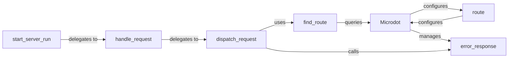

## Details

The `Microdot Application Core` subsystem is primarily defined by the `src.microdot.microdot.Microdot` class and its integral methods. This subsystem encompasses the core functionalities for application initialization, request lifecycle management, routing, middleware application, error handling, and server startup, forming the central control plane of the Microdot framework.

### Microdot
The central orchestrator of the Microdot framework. It initializes the application, manages global state (e.g., `url_map`, middleware handlers, error handlers), and provides the API for defining application behavior. It acts as the main entry point for configuring and running the web application.

**Related Classes/Methods**:

- <a href="https://github.com/miguelgrinberg/microdot/blob/main/src/microdot/microdot.py#L927-L1525" target="_blank" rel="noopener noreferrer">`src.microdot.microdot.Microdot`:927-1525</a>

### handle_request
Manages the lifecycle of a single HTTP request from the moment it's received until the response is sent back. It acts as the initial entry point for processing individual client connections, delegating further processing to `dispatch_request`.

**Related Classes/Methods**:

- <a href="https://github.com/miguelgrinberg/microdot/blob/main/src/microdot/microdot.py#L1366-L1387" target="_blank" rel="noopener noreferrer">`src.microdot.microdot.handle_request`:1366-1387</a>

### dispatch_request
The core routing and request processing engine. It determines which handler should process the request, applies middleware, invokes the handler, and processes its return value into a standardized response. It relies on `find_route` to identify the correct handler.

**Related Classes/Methods**:

- <a href="https://github.com/miguelgrinberg/microdot/blob/main/src/microdot/microdot.py#L927-L1525" target="_blank" rel="noopener noreferrer">`src.microdot.microdot.Microdot:dispatch_request`:927-1525</a>

### route
A decorator factory used to register URL patterns and associate them with specific handler functions. It's the primary mechanism for defining application endpoints, configuring the `Microdot` instance's `url_map`.

**Related Classes/Methods**:

- <a href="https://github.com/miguelgrinberg/microdot/blob/main/src/microdot/microdot.py#L927-L1525" target="_blank" rel="noopener noreferrer">`src.microdot.microdot.Microdot:route`:927-1525</a>

### find_route
Responsible for matching an incoming request's URL path and HTTP method against the application's registered routes. It queries the `Microdot` instance's internal routing table to find the appropriate handler.

**Related Classes/Methods**:

- <a href="https://github.com/miguelgrinberg/microdot/blob/main/src/microdot/microdot.py#L927-L1525" target="_blank" rel="noopener noreferrer">`src.microdot.microdot.Microdot:find_route`:927-1525</a>

### error_response
Generates an HTTP error response, prioritizing custom error handlers registered by the application. It ensures that errors are gracefully handled and appropriate HTTP status codes and messages are returned to the client.

**Related Classes/Methods**:

- <a href="https://github.com/miguelgrinberg/microdot/blob/main/src/microdot/microdot.py#L927-L1525" target="_blank" rel="noopener noreferrer">`src.microdot.microdot.Microdot:error_response`:927-1525</a>

### start_server_run
Provides the entry point for starting the Microdot web server, handling the underlying network listening. The `run` method is a synchronous wrapper for the asynchronous `start_server`, managing the server's operational lifecycle.

**Related Classes/Methods**:

- <a href="https://github.com/miguelgrinberg/microdot/blob/main/src/microdot/microdot.py#L927-L1525" target="_blank" rel="noopener noreferrer">`src.microdot.microdot.Microdot:start_server`:927-1525</a>
- <a href="https://github.com/miguelgrinberg/microdot/blob/main/src/microdot/microdot.py#L927-L1525" target="_blank" rel="noopener noreferrer">`src.microdot.microdot.Microdot:run`:927-1525</a>

### [FAQ](https://github.com/CodeBoarding/GeneratedOnBoardings/tree/main?tab=readme-ov-file#faq)