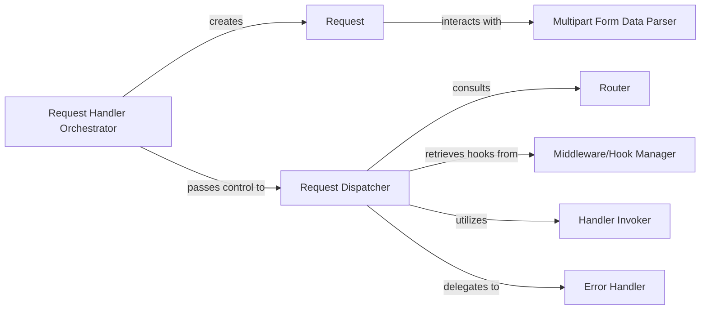

## Details

The `Request Processing & Routing` subsystem in Microdot is responsible for the entire lifecycle of an incoming HTTP request, from its initial reception to the invocation of the appropriate handler and the generation of a response. This includes parsing the raw HTTP request, identifying the target URL, matching it to a registered route, applying any relevant middleware or hooks, executing the designated handler function, and managing errors that may occur during this process.

### Request Handler Orchestrator
The primary entry point for processing an individual HTTP connection. It manages the initial reception of an HTTP request, creates a `Request` object, and delegates the core processing to the `Request Dispatcher`.

**Related Classes/Methods**:

- <a href="https://github.com/miguelgrinberg/microdot/blob/main/src/microdot/microdot.py#L1366-L1387" target="_blank" rel="noopener noreferrer">`microdot.handle_request`:1366-1387</a>

### Request
Encapsulates all incoming HTTP request details. It stores and provides access to all components of an incoming HTTP request, including headers, method, URL, and body content. It also handles the parsing of various content types.

**Related Classes/Methods**:

- <a href="https://github.com/miguelgrinberg/microdot/blob/main/src/microdot/microdot.py#L288-L530" target="_blank" rel="noopener noreferrer">`microdot.Request`:288-530</a>
- <a href="https://github.com/miguelgrinberg/microdot/blob/main/src/microdot/microdot.py" target="_blank" rel="noopener noreferrer">`microdot.Request:form`</a>
- <a href="https://github.com/miguelgrinberg/microdot/blob/main/src/microdot/microdot.py" target="_blank" rel="noopener noreferrer">`microdot.Request:_parse_urlencoded`</a>
- <a href="https://github.com/miguelgrinberg/microdot/blob/main/src/microdot/microdot.py" target="_blank" rel="noopener noreferrer">`microdot.Request:body`</a>

### Router
Defines and matches URL patterns to specific handler functions. It manages the application's routing table, allowing the registration of URL patterns and their associated handler functions. It provides mechanisms to find a matching route for a given request path and method.

**Related Classes/Methods**:

- <a href="https://github.com/miguelgrinberg/microdot/blob/main/src/microdot/microdot.py#L952-L987" target="_blank" rel="noopener noreferrer">`microdot.route`:952-987</a>
- <a href="https://github.com/miguelgrinberg/microdot/blob/main/src/microdot/microdot.py#L1334-L1354" target="_blank" rel="noopener noreferrer">`microdot.find_route`:1334-1354</a>

### Request Dispatcher
The core routing engine that finds the appropriate handler, applies middleware-like functions (hooks), and invokes the matched handler. It acts as the central orchestrator of the request processing pipeline.

**Related Classes/Methods**:

- <a href="https://github.com/miguelgrinberg/microdot/blob/main/src/microdot/microdot.py#L1404-L1525" target="_blank" rel="noopener noreferrer">`microdot.dispatch_request`:1404-1525</a>

### Handler Invoker
Executes the Python function (view function) associated with a matched route. It is responsible for calling the application-defined function that has been matched to the incoming request by the `Router` and `Request Dispatcher`.

**Related Classes/Methods**:

- <a href="https://github.com/miguelgrinberg/microdot/blob/main/src/microdot/microdot.py#L37-L46" target="_blank" rel="noopener noreferrer">`microdot.invoke_handler`:37-46</a>

### Multipart Form Data Parser
Specifically handles parsing and iterating over `multipart/form-data` request bodies. It provides specialized parsing capabilities for this encoding, allowing efficient iteration over form fields and files.

**Related Classes/Methods**:

- <a href="https://github.com/miguelgrinberg/microdot/blob/main/src/microdot/multipart.py#L7-L131" target="_blank" rel="noopener noreferrer">`multipart.FormDataIter`:7-131</a>
- <a href="https://github.com/miguelgrinberg/microdot/blob/main/src/microdot/multipart.py#L270-L290" target="_blank" rel="noopener noreferrer">`multipart.wrapper`:270-290</a>

### Middleware/Hook Manager
Manages and retrieves `before_request` and `after_request` handlers, as well as error handlers. It provides access to global and route-specific functions that can modify the request or response, or handle errors.

**Related Classes/Methods**:

- <a href="https://github.com/miguelgrinberg/microdot/blob/main/src/microdot/microdot.py#L1389-L1394" target="_blank" rel="noopener noreferrer">`microdot.get_request_handlers`:1389-1394</a>

### Error Handler
Generates appropriate HTTP error responses for exceptions that occur during request processing. It catches exceptions and maps them to standard HTTP error codes (e.g., 404 Not Found, 500 Internal Server Error).

**Related Classes/Methods**:

- <a href="https://github.com/miguelgrinberg/microdot/blob/main/src/microdot/microdot.py#L1396-L1402" target="_blank" rel="noopener noreferrer">`microdot.error_response`:1396-1402</a>

### [FAQ](https://github.com/CodeBoarding/GeneratedOnBoardings/tree/main?tab=readme-ov-file#faq)