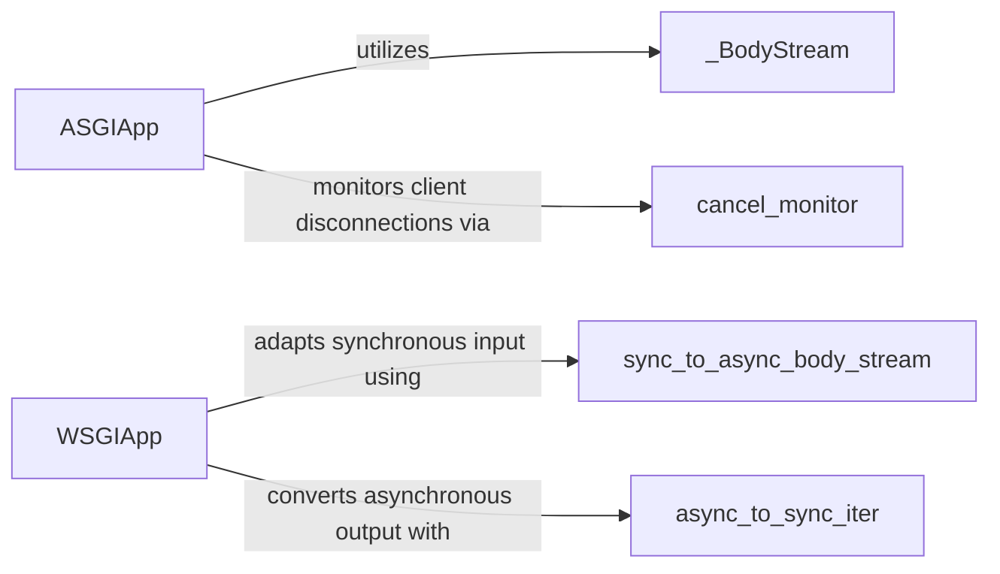

## Details

The `microdot` project's core functionality for handling web requests is encapsulated within its ASGI and WSGI adapters. The `ASGIApp` serves as the asynchronous entry point, efficiently managing request body streams and monitoring client disconnections to ensure robust communication. Conversely, the `WSGIApp` provides a synchronous interface, seamlessly adapting asynchronous internal operations to the synchronous WSGI standard by converting both incoming request bodies and outgoing response iterators. These two central components, along with their specialized utility classes, form the backbone of Microdot's ability to interface with diverse web server environments while maintaining its asynchronous processing capabilities.

### ASGIApp
Acts as the main entry point for ASGI-compliant web servers. It translates incoming ASGI requests into Microdot's internal request format, dispatches them to the Microdot application, and converts the application's asynchronous responses back into the ASGI protocol. It manages the asynchronous flow of data, including request bodies and response streaming.

**Related Classes/Methods**:

- <a href="https://github.com/miguelgrinberg/microdot/blob/main/src/microdot/asgi.py#L10-L44" target="_blank" rel="noopener noreferrer">`microdot.asgi._BodyStream`:10-44</a>
- <a href="https://github.com/miguelgrinberg/microdot/blob/main/src/microdot/asgi.py#L117-L125" target="_blank" rel="noopener noreferrer">`microdot.asgi.cancel_monitor`:117-125</a>

### WSGIApp
Serves as the primary entry point for WSGI-compliant web servers. It translates synchronous WSGI requests into Microdot's internal request format, dispatches them, and formats the application's responses back into the WSGI protocol. It specifically adapts Microdot's potentially asynchronous internal operations to the synchronous nature of WSGI using an asyncio event loop.

**Related Classes/Methods**:

- <a href="https://github.com/miguelgrinberg/microdot/blob/main/src/microdot/wsgi.py#L40-L51" target="_blank" rel="noopener noreferrer">`microdot.wsgi.sync_to_async_body_stream`:40-51</a>
- <a href="https://github.com/miguelgrinberg/microdot/blob/main/src/microdot/wsgi.py#L123-L139" target="_blank" rel="noopener noreferrer">`microdot.wsgi.async_to_sync_iter`:123-139</a>

### _BodyStream
A utility class within the ASGI adapter responsible for efficiently handling and streaming the incoming request body data from an ASGI `receive` channel. It provides an asynchronous interface for reading the body in chunks, managing the `more_body` flag to determine if more data is expected.

**Related Classes/Methods**: _None_

### cancel_monitor
An asynchronous task (defined as a nested function within `ASGIApp`) responsible for monitoring client disconnections during the streaming of responses in an ASGI environment. It continuously checks for `http.disconnect` events from the `receive` channel to set a `cancelled` flag, enabling graceful termination of response generation.

**Related Classes/Methods**: _None_

### sync_to_async_body_stream
A utility class (defined as a nested class within `WSGIApp`) that wraps a synchronous WSGI input stream (e.g., `wsgi.input`) and provides an asynchronous interface for reading its content. This bridges the synchronous nature of WSGI input with Microdot's asynchronous processing capabilities by exposing `read`, `readline`, and `readexactly` asynchronous methods.

**Related Classes/Methods**: _None_

### async_to_sync_iter
A utility class (defined as a nested class within `WSGIApp`) that converts an asynchronous iterator (typically representing the Microdot application's response body) into a synchronous iterator suitable for WSGI servers. This allows asynchronous Microdot responses to be consumed by synchronous WSGI environments by implementing the `__iter__` and `__next__` methods, running asynchronous iterations in a provided event loop.

**Related Classes/Methods**: _None_

### [FAQ](https://github.com/CodeBoarding/GeneratedOnBoardings/tree/main?tab=readme-ov-file#faq)