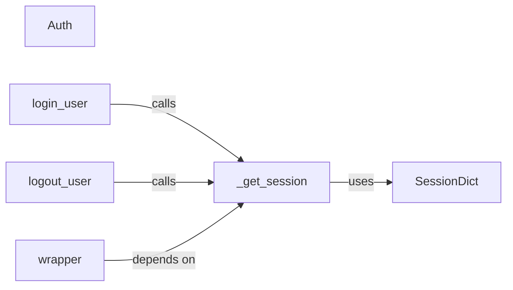

## Details

Analysis of the Session & Authentication subsystem in Microdot.

### SessionDict
Acts as the primary storage and management unit for user session data, maintaining state across multiple requests. It's analogous to a session store in traditional web frameworks.

**Related Classes/Methods**:

- <a href="https://github.com/miguelgrinberg/microdot/blob/main/src/microdot/session.py#L6-L22" target="_blank" rel="noopener noreferrer">`src.microdot.session.SessionDict`:6-22</a>

### Auth
Serves as the abstract base or configuration point for defining and handling authentication schemes. It provides the framework for integrating different authentication methods.

**Related Classes/Methods**:

- <a href="https://github.com/miguelgrinberg/microdot/blob/main/src/microdot/auth.py" target="_blank" rel="noopener noreferrer">`src.microdot.auth.Auth`</a>

### login_user
Orchestrates the entire user login process. This includes verifying credentials, establishing a user session, and managing persistent login cookies (e.g., "remember me" functionality).

**Related Classes/Methods**:

- <a href="https://github.com/miguelgrinberg/microdot/blob/main/src/microdot/login.py#L61-L93" target="_blank" rel="noopener noreferrer">`src.microdot.login.login_user`:61-93</a>

### logout_user
Manages the user logout process. Its responsibilities include clearing session data associated with the user and invalidating any persistent login cookies.

**Related Classes/Methods**:

- <a href="https://github.com/miguelgrinberg/microdot/blob/main/src/microdot/login.py#L95-L108" target="_blank" rel="noopener noreferrer">`src.microdot.login.logout_user`:95-108</a>

### _get_session
Provides a centralized and abstracted interface for retrieving the current session object. This component encapsulates the details of how the session is accessed, promoting modularity.

**Related Classes/Methods**:

- <a href="https://github.com/miguelgrinberg/microdot/blob/main/src/microdot/login.py#L25-L26" target="_blank" rel="noopener noreferrer">`src.microdot.login._get_session`:25-26</a>

### wrapper
Functions as a middleware or decorator to protect routes and resources. It intercepts requests, checks the user's authentication status, and redirects unauthenticated users, enforcing access control.

**Related Classes/Methods**:

- <a href="https://github.com/miguelgrinberg/microdot/blob/main/src/microdot/login.py#L157-L161" target="_blank" rel="noopener noreferrer">`src.microdot.login.wrapper`:157-161</a>

### [FAQ](https://github.com/CodeBoarding/GeneratedOnBoardings/tree/main?tab=readme-ov-file#faq)