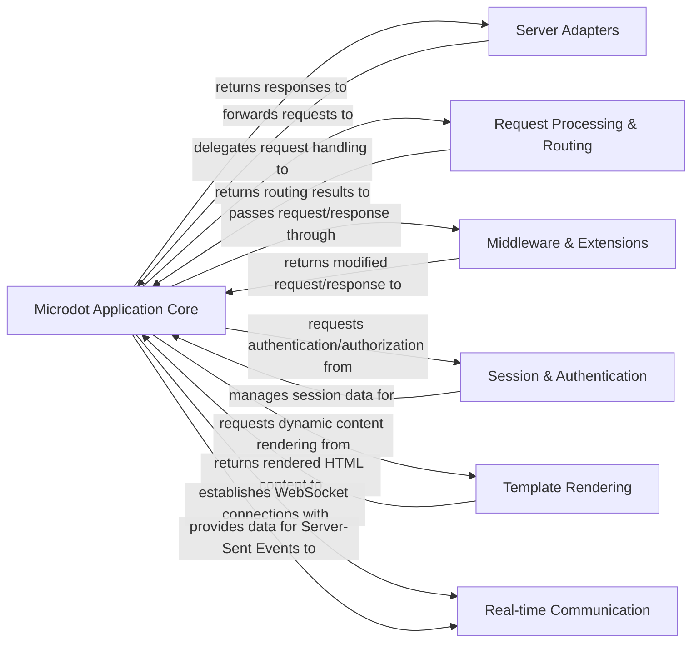

## Details

The Microdot framework's architecture is built around a central `Microdot Application Core` that orchestrates the entire request-response lifecycle. It receives incoming requests from various `Server Adapters` (e.g., ASGI, WSGI), ensuring compatibility across different server environments. The core then delegates to `Request Processing & Routing` to determine the appropriate handler for the request. Along the processing pipeline, `Middleware & Extensions` can modify requests or responses, providing a flexible mechanism for cross-cutting concerns. For managing user state and access, `Session & Authentication` components are integrated. When dynamic content is required, the core interacts with `Template Rendering` to generate HTML. Furthermore, the framework supports modern web interactions through `Real-time Communication` components for WebSockets and Server-Sent Events. This modular and extensible design allows Microdot to efficiently handle web requests and provide a robust foundation for web applications.

### Microdot Application Core [[Expand]](./Microdot_Application_Core.md)
The central orchestrator of the Microdot framework, managing the application lifecycle, coordinating request handling, applying middleware, and dispatching requests to appropriate handlers.

**Related Classes/Methods**:

- <a href="https://github.com/miguelgrinberg/microdot/blob/main/src/microdot/microdot.py#L927-L1525" target="_blank" rel="noopener noreferrer">`src.microdot.microdot.Microdot`:927-1525</a>
- <a href="https://github.com/miguelgrinberg/microdot/blob/main/src/microdot/microdot.py#L1366-L1387" target="_blank" rel="noopener noreferrer">`src.microdot.microdot.handle_request`:1366-1387</a>

### Server Adapters [[Expand]](./Server_Adapters.md)
Provides the interface for Microdot to run on various web server specifications (ASGI, WSGI), translating server-specific protocols into Microdot's internal request/response format.

**Related Classes/Methods**:

- <a href="https://github.com/miguelgrinberg/microdot/blob/main/src/microdot/asgi.py#L58-L146" target="_blank" rel="noopener noreferrer">`src.microdot.asgi.asgi_app`:58-146</a>
- <a href="https://github.com/miguelgrinberg/microdot/blob/main/src/microdot/wsgi.py#L23-L141" target="_blank" rel="noopener noreferrer">`src.microdot.wsgi.wsgi_app`:23-141</a>

### Request Processing & Routing [[Expand]](./Request_Processing_Routing.md)
Handles parsing incoming HTTP requests, mapping URLs to specific handler functions, and dispatching requests to the appropriate code.

**Related Classes/Methods**:

- <a href="https://github.com/miguelgrinberg/microdot/blob/main/src/microdot/microdot.py#L1404-L1525" target="_blank" rel="noopener noreferrer">`src.microdot.microdot.dispatch_request`:1404-1525</a>
- <a href="https://github.com/miguelgrinberg/microdot/blob/main/src/microdot/microdot.py#L952-L987" target="_blank" rel="noopener noreferrer">`src.microdot.microdot.route`:952-987</a>
- <a href="https://github.com/miguelgrinberg/microdot/blob/main/src/microdot/multipart.py#L7-L131" target="_blank" rel="noopener noreferrer">`src.microdot.multipart.FormDataIter`:7-131</a>

### Middleware & Extensions
A flexible layer for injecting processing logic into the request/response pipeline, including functionalities like Cross-Origin Resource Sharing (CORS).

**Related Classes/Methods**:

- <a href="https://github.com/miguelgrinberg/microdot/blob/main/src/microdot/cors.py#L1-L111" target="_blank" rel="noopener noreferrer">`src.microdot.cors.CORS`:1-111</a>

### Session & Authentication [[Expand]](./Session_Authentication.md)
Manages user session data to maintain state across requests and provides mechanisms for user identity verification and access control to protected resources.

**Related Classes/Methods**:

- <a href="https://github.com/miguelgrinberg/microdot/blob/main/src/microdot/session.py#L6-L22" target="_blank" rel="noopener noreferrer">`src.microdot.session.SessionDict`:6-22</a>
- <a href="https://github.com/miguelgrinberg/microdot/blob/main/src/microdot/auth.py" target="_blank" rel="noopener noreferrer">`src.microdot.auth.Auth`</a>
- <a href="https://github.com/miguelgrinberg/microdot/blob/main/src/microdot/login.py#L61-L93" target="_blank" rel="noopener noreferrer">`src.microdot.login.login_user`:61-93</a>

### Template Rendering
Integrates with template engines (uTemplate for MicroPython, Jinja for standard Python) to render dynamic content, allowing for separation of presentation from application logic.

**Related Classes/Methods**:

- <a href="https://github.com/miguelgrinberg/microdot/blob/main/src/microdot/utemplate.py#L41-L44" target="_blank" rel="noopener noreferrer">`src.microdot.utemplate.render`:41-44</a>
- <a href="https://github.com/miguelgrinberg/microdot/blob/main/src/microdot/jinja.py#L53-L56" target="_blank" rel="noopener noreferrer">`src.microdot.jinja.render`:53-56</a>

### Real-time Communication
Manages the full lifecycle of WebSocket connections for bidirectional communication and facilitates Server-Sent Events (SSE) for one-way server-to-client updates.

**Related Classes/Methods**:

- <a href="https://github.com/miguelgrinberg/microdot/blob/main/src/microdot/websocket.py#L169-L192" target="_blank" rel="noopener noreferrer">`src.microdot.websocket.websocket_upgrade`:169-192</a>
- <a href="https://github.com/miguelgrinberg/microdot/blob/main/src/microdot/websocket.py#L51-L59" target="_blank" rel="noopener noreferrer">`src.microdot.websocket.receive`:51-59</a>
- <a href="https://github.com/miguelgrinberg/microdot/blob/main/src/microdot/websocket.py#L61-L72" target="_blank" rel="noopener noreferrer">`src.microdot.websocket.send`:61-72</a>
- <a href="https://github.com/miguelgrinberg/microdot/blob/main/src/microdot/sse.py#L46-L100" target="_blank" rel="noopener noreferrer">`src.microdot.sse.sse_response`:46-100</a>

### [FAQ](https://github.com/CodeBoarding/GeneratedOnBoardings/tree/main?tab=readme-ov-file#faq)