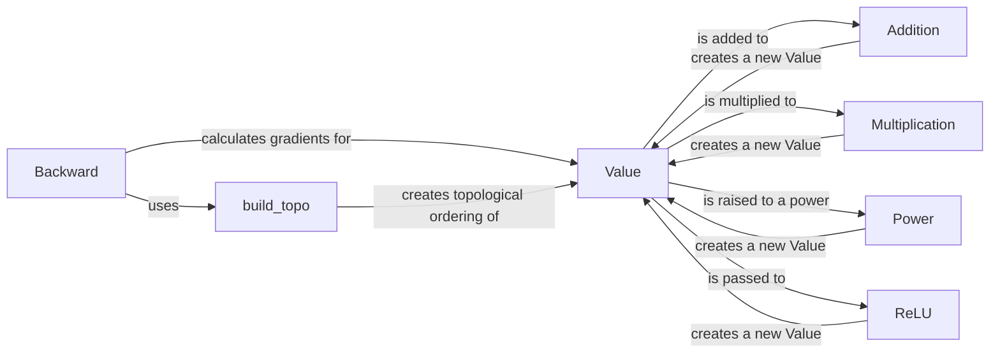

## Component Details

The Autograd Engine enables automatic differentiation by tracking scalar values and their gradients. It overloads arithmetic operations to construct a computational graph, allowing for backpropagation to compute gradients. The core component is the `Value` class, which represents a node in the graph. Operations like addition, multiplication, and ReLU are overloaded to create new `Value` instances and record the operations. The `backward` method performs backpropagation to calculate gradients, utilizing a topological sort to ensure correct ordering.

### Value
The Value class represents a node in the computational graph. It holds a scalar value (data), its gradient (grad), and the operation that created it (_op). It also tracks its children (_prev) to enable automatic differentiation via backpropagation.

**Related Classes/Methods**:

- <a href="https://github.com/karpathy/micrograd/blob/master/micrograd/engine.py#L2-L94" target="_blank" rel="noopener noreferrer">`micrograd.engine.Value` (2:94)</a>

### Addition
The `__add__` method overloads the addition operation for Value instances. It creates a new Value instance representing the sum of two Value instances and records the addition operation in the computational graph.

**Related Classes/Methods**:

- <a href="https://github.com/karpathy/micrograd/blob/master/micrograd/engine.py#L13-L22" target="_blank" rel="noopener noreferrer">`micrograd.engine.Value:__add__` (13:22)</a>

### Multiplication
The `__mul__` method overloads the multiplication operation for Value instances. It creates a new Value instance representing the product of two Value instances and records the multiplication operation in the computational graph.

**Related Classes/Methods**:

- <a href="https://github.com/karpathy/micrograd/blob/master/micrograd/engine.py#L24-L33" target="_blank" rel="noopener noreferrer">`micrograd.engine.Value:__mul__` (24:33)</a>

### Power
The `__pow__` method overloads the power operation for Value instances. It creates a new Value instance representing the result of raising a Value instance to a power and records the power operation in the computational graph.

**Related Classes/Methods**:

- <a href="https://github.com/karpathy/micrograd/blob/master/micrograd/engine.py#L35-L43" target="_blank" rel="noopener noreferrer">`micrograd.engine.Value:__pow__` (35:43)</a>

### ReLU
The `relu` method applies the Rectified Linear Unit activation function to a Value instance. It creates a new Value instance representing the ReLU output and records the ReLU operation in the computational graph.

**Related Classes/Methods**:

- <a href="https://github.com/karpathy/micrograd/blob/master/micrograd/engine.py#L45-L52" target="_blank" rel="noopener noreferrer">`micrograd.engine.Value:relu` (45:52)</a>

### Backward
The `backward` method performs backpropagation to compute gradients for each Value instance in the computational graph. It uses a topological sort to determine the order in which to compute gradients, starting from the output Value instance and working backwards through the graph.

**Related Classes/Methods**:

- <a href="https://github.com/karpathy/micrograd/blob/master/micrograd/engine.py#L54-L70" target="_blank" rel="noopener noreferrer">`micrograd.engine.Value:backward` (54:70)</a>

### build_topo
The `build_topo` method is a helper function used by the `backward` method to create a topological ordering of the computational graph. This ordering ensures that gradients are computed in the correct sequence during backpropagation.

**Related Classes/Methods**:

- `micrograd.engine.Value.backward.build_topo` (55:61)