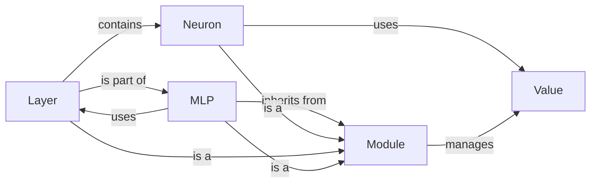

## Component Details

The Multi-Layer Perceptron (MLP) component represents a neural network composed of interconnected layers of neurons. The core functionality revolves around the forward pass, where input data is propagated through the network, undergoing weighted sums and activation functions at each neuron. The network's parameters (weights and biases) are adjusted during training using backpropagation, which leverages the automatic differentiation capabilities of the Value objects. The MLP class inherits from the Module class, providing parameter management and gradient zeroing capabilities. The network architecture is constructed using Layer objects, each containing a set of Neuron objects. The Value class is fundamental, enabling the tracking of gradients for each operation performed during the forward and backward passes.

### Value
The `Value` class represents a scalar value and is the core of the automatic differentiation engine. It stores the value, its gradient, and the operation that created it, allowing for backpropagation to compute gradients. It interacts with `Neuron` during forward and backward passes.

**Related Classes/Methods**:

- <a href="https://github.com/karpathy/micrograd/blob/master/micrograd/engine.py#L2-L94" target="_blank" rel="noopener noreferrer">`micrograd.engine.Value` (2:94)</a>

### Module
The `Module` class is a base class for neural network modules. It provides a mechanism for tracking parameters and performing operations like zeroing gradients. It serves as the foundation for building more complex neural network architectures like `Layer` and `MLP`. It manages the parameters of its submodules.

**Related Classes/Methods**:

- <a href="https://github.com/karpathy/micrograd/blob/master/micrograd/nn.py#L4-L11" target="_blank" rel="noopener noreferrer">`micrograd.nn.Module` (4:11)</a>
- <a href="https://github.com/karpathy/micrograd/blob/master/micrograd/nn.py#L6-L8" target="_blank" rel="noopener noreferrer">`micrograd.nn.Module:zero_grad` (6:8)</a>
- <a href="https://github.com/karpathy/micrograd/blob/master/micrograd/nn.py#L10-L11" target="_blank" rel="noopener noreferrer">`micrograd.nn.Module.parameters` (10:11)</a>

### Neuron
The `Neuron` class represents a single neuron in a neural network. It takes a number of inputs, applies weights and a bias (both `Value` objects), and then applies an activation function (tanh). It uses `Value` objects to store the weights and bias, enabling automatic differentiation. It interacts with `Value` objects for calculations and `Layer` to form a layer of neurons.

**Related Classes/Methods**:

- <a href="https://github.com/karpathy/micrograd/blob/master/micrograd/nn.py#L13-L28" target="_blank" rel="noopener noreferrer">`micrograd.nn.Neuron` (13:28)</a>
- <a href="https://github.com/karpathy/micrograd/blob/master/micrograd/nn.py#L15-L18" target="_blank" rel="noopener noreferrer">`micrograd.nn.Neuron:__init__` (15:18)</a>

### Layer
The `Layer` class represents a layer of neurons in a neural network. It consists of a list of `Neuron` objects. The number of neurons in the layer is determined during initialization. It interacts with `Neuron` to create a layer and `MLP` to form a multi-layer perceptron.

**Related Classes/Methods**:

- <a href="https://github.com/karpathy/micrograd/blob/master/micrograd/nn.py#L30-L43" target="_blank" rel="noopener noreferrer">`micrograd.nn.Layer` (30:43)</a>
- <a href="https://github.com/karpathy/micrograd/blob/master/micrograd/nn.py#L32-L33" target="_blank" rel="noopener noreferrer">`micrograd.nn.Layer:__init__` (32:33)</a>

### MLP
The `MLP` class represents a multi-layer perceptron, a type of feedforward neural network. It consists of a sequence of `Layer` objects. The number of layers and the number of neurons in each layer are configurable during initialization. It inherits from `Module` and uses `Layer` objects to construct the network architecture.

**Related Classes/Methods**:

- <a href="https://github.com/karpathy/micrograd/blob/master/micrograd/nn.py#L45-L60" target="_blank" rel="noopener noreferrer">`micrograd.nn.MLP` (45:60)</a>
- <a href="https://github.com/karpathy/micrograd/blob/master/micrograd/nn.py#L47-L49" target="_blank" rel="noopener noreferrer">`micrograd.nn.MLP:__init__` (47:49)</a>