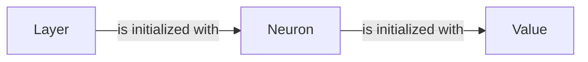

## Component Details

The neural network layers component defines the structure and behavior of individual neurons and layers within a neural network. The Value class from the Autograd Engine is used to represent numerical values and their gradients, enabling automatic differentiation. The Neuron class represents a single neuron with weights and a bias, using Value objects for calculations. The Layer class represents a collection of neurons, forming a layer in the network. These components are fundamental building blocks for constructing and training neural networks.

### Value
The Value class represents a node in the computational graph. It holds a scalar value (data), its gradient (grad), and the operation that created it (_op). It also keeps track of its children (i.e., the Values that were used to create it). It is a core component of the autograd engine, enabling automatic differentiation.

**Related Classes/Methods**:

- <a href="https://github.com/karpathy/micrograd/blob/master/micrograd/engine.py#L2-L94" target="_blank" rel="noopener noreferrer">`micrograd.engine.Value` (2:94)</a>

### Neuron
The Neuron class represents a single neuron in a neural network. It contains a set of weights (w) and a bias (b), all of which are Value objects. The forward method computes the output of the neuron given an input x, also a Value object. The neuron uses the Value objects to perform calculations and track gradients.

**Related Classes/Methods**:

- <a href="https://github.com/karpathy/micrograd/blob/master/micrograd/nn.py#L13-L28" target="_blank" rel="noopener noreferrer">`micrograd.nn.Neuron` (13:28)</a>
- <a href="https://github.com/karpathy/micrograd/blob/master/micrograd/nn.py#L15-L18" target="_blank" rel="noopener noreferrer">`micrograd.nn.Neuron.__init__` (15:18)</a>

### Layer
The Layer class represents a layer of neurons in a neural network. It contains a list of Neuron objects. The forward method computes the output of the layer by passing the input x through each neuron in the layer. The layer aggregates the outputs of its neurons to produce a layer output.

**Related Classes/Methods**:

- <a href="https://github.com/karpathy/micrograd/blob/master/micrograd/nn.py#L30-L43" target="_blank" rel="noopener noreferrer">`micrograd.nn.Layer` (30:43)</a>
- <a href="https://github.com/karpathy/micrograd/blob/master/micrograd/nn.py#L32-L33" target="_blank" rel="noopener noreferrer">`micrograd.nn.Layer.__init__` (32:33)</a>