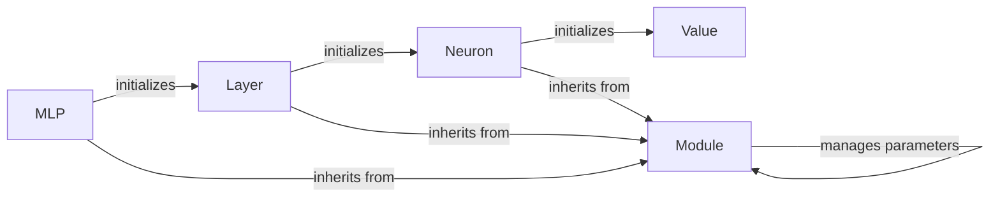

## Component Details

The micrograd neural network library provides a set of classes for building and training neural networks. The core component is the `Value` class, which enables automatic differentiation. The `Module` class serves as a base class for neural network layers and models, providing a standardized interface for managing parameters and zeroing gradients. The `Neuron`, `Layer`, and `MLP` classes build upon these core components to create increasingly complex neural network architectures. The flow involves defining the network structure using these classes, performing forward passes to compute outputs, and then using backpropagation (enabled by the `Value` class) to calculate gradients and update the network's parameters.

### Value
The `Value` class represents a scalar value and is the core of the automatic differentiation engine. It stores the value, its gradient, and the operation that created it, allowing for backpropagation to compute gradients. It is used by the Neuron class to store weights and biases.

**Related Classes/Methods**:

- <a href="https://github.com/karpathy/micrograd/blob/master/micrograd/engine.py#L2-L94" target="_blank" rel="noopener noreferrer">`micrograd.engine.Value` (2:94)</a>

### Module
The `Module` class is a base class for neural network modules. It provides a mechanism for tracking parameters and performing operations like zeroing gradients. It serves as the foundation for building more complex neural network architectures. Neuron, Layer, and MLP inherit from this class.

**Related Classes/Methods**:

- <a href="https://github.com/karpathy/micrograd/blob/master/micrograd/nn.py#L4-L11" target="_blank" rel="noopener noreferrer">`micrograd.nn.Module` (4:11)</a>
- <a href="https://github.com/karpathy/micrograd/blob/master/micrograd/nn.py#L6-L8" target="_blank" rel="noopener noreferrer">`micrograd.nn.Module:zero_grad` (6:8)</a>
- <a href="https://github.com/karpathy/micrograd/blob/master/micrograd/nn.py#L10-L11" target="_blank" rel="noopener noreferrer">`.mnt.e.StartUp.micrograd.micrograd.nn.Module.parameters` (10:11)</a>

### Neuron
The `Neuron` class represents a single neuron in a neural network. It takes a number of inputs, applies weights and a bias (stored as `Value` objects), and then applies an activation function (implicitly).

**Related Classes/Methods**:

- <a href="https://github.com/karpathy/micrograd/blob/master/micrograd/nn.py#L15-L18" target="_blank" rel="noopener noreferrer">`micrograd.nn.Neuron:__init__` (15:18)</a>
- <a href="https://github.com/karpathy/micrograd/blob/master/micrograd/engine.py#L2-L94" target="_blank" rel="noopener noreferrer">`micrograd.engine.Value` (2:94)</a>

### Layer
The `Layer` class represents a layer of neurons in a neural network. It consists of a list of `Neuron` objects. The number of neurons in the layer is determined during initialization.

**Related Classes/Methods**:

- <a href="https://github.com/karpathy/micrograd/blob/master/micrograd/nn.py#L32-L33" target="_blank" rel="noopener noreferrer">`micrograd.nn.Layer:__init__` (32:33)</a>
- <a href="https://github.com/karpathy/micrograd/blob/master/micrograd/nn.py#L13-L28" target="_blank" rel="noopener noreferrer">`.mnt.e.StartUp.micrograd.micrograd.nn.Neuron` (13:28)</a>

### MLP
The `MLP` class represents a multi-layer perceptron, a type of feedforward neural network. It consists of a sequence of `Layer` objects. The number of layers and the number of neurons in each layer are configurable during initialization.

**Related Classes/Methods**:

- <a href="https://github.com/karpathy/micrograd/blob/master/micrograd/nn.py#L47-L49" target="_blank" rel="noopener noreferrer">`micrograd.nn.MLP:__init__` (47:49)</a>
- <a href="https://github.com/karpathy/micrograd/blob/master/micrograd/nn.py#L30-L43" target="_blank" rel="noopener noreferrer">`.mnt.e.StartUp.micrograd.micrograd.nn.Layer` (30:43)</a>