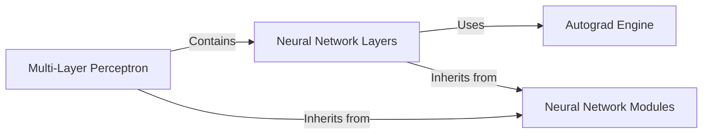

## Component Details

The micrograd library implements a simplified version of automatic differentiation and neural network building blocks. The core is the Value Tracking Engine, which enables the creation of expression graphs and automatic gradient computation. This engine is used to build neural network components like Neurons, Layers, and MLPs. The library provides a foundation for understanding the basic principles of deep learning without the complexity of larger frameworks.

### Autograd Engine
The Autograd Engine is responsible for tracking scalar values and their gradients, enabling automatic differentiation. It overloads arithmetic operations to construct a computational graph, allowing for backpropagation to compute gradients. This component forms the foundation for building and training neural networks.

**Related Classes/Methods**:

- <a href="https://github.com/karpathy/micrograd/blob/master/micrograd/engine.py#L2-L94" target="_blank" rel="noopener noreferrer">`micrograd.engine.Value` (2:94)</a>
- <a href="https://github.com/karpathy/micrograd/blob/master/micrograd/engine.py#L13-L22" target="_blank" rel="noopener noreferrer">`micrograd.engine.Value:__add__` (13:22)</a>
- <a href="https://github.com/karpathy/micrograd/blob/master/micrograd/engine.py#L24-L33" target="_blank" rel="noopener noreferrer">`micrograd.engine.Value:__mul__` (24:33)</a>
- <a href="https://github.com/karpathy/micrograd/blob/master/micrograd/engine.py#L35-L43" target="_blank" rel="noopener noreferrer">`micrograd.engine.Value:__pow__` (35:43)</a>
- <a href="https://github.com/karpathy/micrograd/blob/master/micrograd/engine.py#L45-L52" target="_blank" rel="noopener noreferrer">`micrograd.engine.Value:relu` (45:52)</a>
- <a href="https://github.com/karpathy/micrograd/blob/master/micrograd/engine.py#L54-L70" target="_blank" rel="noopener noreferrer">`micrograd.engine.Value:backward` (54:70)</a>

### Neural Network Modules
The Neural Network Modules component provides a base class for all neural network modules, offering a standardized interface. It includes a method for zeroing gradients, which is essential for training neural networks. Neuron, Layer, and MLP components inherit from this base class.

**Related Classes/Methods**:

- <a href="https://github.com/karpathy/micrograd/blob/master/micrograd/nn.py#L4-L11" target="_blank" rel="noopener noreferrer">`micrograd.nn.Module` (4:11)</a>
- <a href="https://github.com/karpathy/micrograd/blob/master/micrograd/nn.py#L6-L8" target="_blank" rel="noopener noreferrer">`micrograd.nn.Module:zero_grad` (6:8)</a>

### Neural Network Layers
The Neural Network Layers component defines the structure and behavior of individual neurons and layers within a neural network. The Neuron class represents a single neuron with weights and a bias, using the Autograd Engine for calculations. The Layer class represents a collection of neurons, forming a layer in the network.

**Related Classes/Methods**:

- <a href="https://github.com/karpathy/micrograd/blob/master/micrograd/nn.py#L13-L28" target="_blank" rel="noopener noreferrer">`micrograd.nn.Neuron` (13:28)</a>
- <a href="https://github.com/karpathy/micrograd/blob/master/micrograd/nn.py#L15-L18" target="_blank" rel="noopener noreferrer">`micrograd.nn.Neuron:__init__` (15:18)</a>
- <a href="https://github.com/karpathy/micrograd/blob/master/micrograd/nn.py#L30-L43" target="_blank" rel="noopener noreferrer">`micrograd.nn.Layer` (30:43)</a>
- <a href="https://github.com/karpathy/micrograd/blob/master/micrograd/nn.py#L32-L33" target="_blank" rel="noopener noreferrer">`micrograd.nn.Layer:__init__` (32:33)</a>

### Multi-Layer Perceptron
The Multi-Layer Perceptron (MLP) component represents a complete neural network, composed of multiple layers. It inherits from the Neural Network Modules base class and utilizes the Layer component to construct the network architecture. This component provides a high-level interface for creating and using neural networks.

**Related Classes/Methods**:

- <a href="https://github.com/karpathy/micrograd/blob/master/micrograd/nn.py#L45-L60" target="_blank" rel="noopener noreferrer">`micrograd.nn.MLP` (45:60)</a>
- <a href="https://github.com/karpathy/micrograd/blob/master/micrograd/nn.py#L47-L49" target="_blank" rel="noopener noreferrer">`micrograd.nn.MLP:__init__` (47:49)</a>