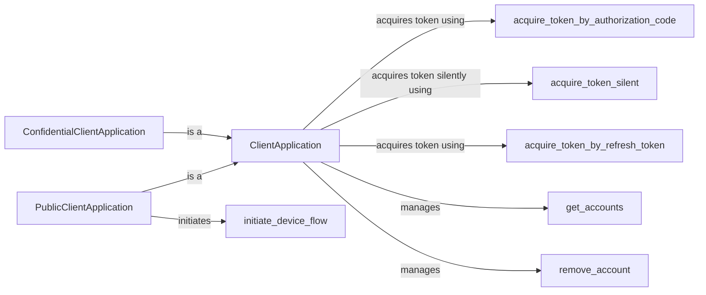

## Component Details

The MSAL Python library provides authentication and authorization services for applications accessing Microsoft cloud resources. The core functionality revolves around the `ClientApplication` class and its subclasses (`PublicClientApplication`, `ConfidentialClientApplication`), which manage the application's lifecycle, configuration, and token acquisition/renewal. Different authentication flows are supported, including authorization code, silent acquisition, refresh token, username/password (discouraged), client credentials, and on-behalf-of flows. The library also handles account management (listing and removal) and device flow for headless devices. It simplifies the process of integrating with Azure Active Directory and other Microsoft identity platforms.

### ClientApplication
The base class for client applications, providing common functionality for token acquisition and management. It handles authority configuration, telemetry, and client building. It defines the common interface and logic for acquiring tokens and managing accounts, serving as the foundation for more specialized client types.
- **Related Classes/Methods**: `msal.application.ClientApplication`

### PublicClientApplication
Represents a public client application (e.g., a desktop or mobile app) that can acquire tokens on behalf of a user. It supports interactive authentication and device flow. It extends the `ClientApplication` class with specific methods for handling public client scenarios, such as interactive login and device code flow.
- **Related Classes/Methods**: `msal.application.PublicClientApplication`

### ConfidentialClientApplication
Represents a confidential client application (e.g., a web app or service) that can securely store a client secret. It supports client credentials flow and on-behalf-of flow. It extends the `ClientApplication` class with methods tailored for confidential client scenarios, such as acquiring tokens using client credentials or acting on behalf of a user.
- **Related Classes/Methods**: `msal.application.ConfidentialClientApplication`

### acquire_token_by_authorization_code
Acquires a token using an authorization code obtained from an authorization server. This is a standard OAuth 2.0 flow, where the application redirects the user to the authorization server, receives an authorization code, and then exchanges it for an access token.
- **Related Classes/Methods**: `msal.application.ClientApplication:acquire_token_by_authorization_code`

### acquire_token_silent
Attempts to acquire a token silently, without user interaction, using cached tokens or refresh tokens. This method checks the cache for valid tokens and, if none are found, attempts to use a refresh token to obtain a new access token without prompting the user.
- **Related Classes/Methods**: `msal.application.ClientApplication:acquire_token_silent`

### acquire_token_by_refresh_token
Acquires a new access token using a refresh token. This allows the application to maintain long-term access without requiring the user to re-authenticate. Refresh tokens are typically long-lived and can be used to obtain new access tokens as needed.
- **Related Classes/Methods**: `msal.application.ClientApplication:acquire_token_by_refresh_token`

### get_accounts
Retrieves a list of accounts that are currently signed in. This method allows the application to enumerate the accounts for which it has tokens in the cache, enabling scenarios such as displaying a list of signed-in users or allowing the user to switch between accounts.
- **Related Classes/Methods**: `msal.application.ClientApplication:get_accounts`

### remove_account
Removes an account from the cache, effectively signing the user out. This method deletes the tokens associated with a specific account from the cache, requiring the user to re-authenticate the next time the application needs to access resources on their behalf.
- **Related Classes/Methods**: `msal.application.ClientApplication:remove_account`

### initiate_device_flow
Initiates the device code flow, which allows users to authenticate on devices without a browser. This method generates a device code and verification URI, which the user can use to authenticate on a separate device with a browser.
- **Related Classes/Methods**: `msal.application.PublicClientApplication:initiate_device_flow`
