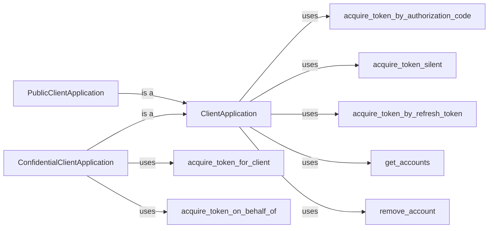

## Component Details

The MSAL Python library provides authentication and authorization services for applications interacting with Microsoft identity platform. The core functionality revolves around the `ClientApplication` class, which serves as the main entry point for developers. It supports different client types like `PublicClientApplication` for desktop/mobile apps and `ConfidentialClientApplication` for web apps/services. The library offers methods to acquire tokens using various flows such as authorization code flow, silent token acquisition, refresh token flow, client credentials flow, and on-behalf-of flow. It also provides functionalities for managing user accounts and interacting with the token cache.

### ClientApplication
The central class for managing authentication and authorization. It handles the lifecycle of client applications, manages token acquisition, account management, and interacts with the token cache and broker. It serves as the base class for PublicClientApplication and ConfidentialClientApplication.
- **Related Classes/Methods**: `microsoft-authentication-library-for-python.msal.application.ClientApplication`

### PublicClientApplication
A subclass of ClientApplication designed for public client applications (e.g., desktop or mobile apps). It supports interactive authentication flows and device code flow, where the client secret cannot be securely stored.
- **Related Classes/Methods**: `microsoft-authentication-library-for-python.msal.application.PublicClientApplication`

### ConfidentialClientApplication
A subclass of ClientApplication tailored for confidential client applications (e.g., web apps or services). It supports client credentials flow and on-behalf-of flow, where the client secret can be securely stored securely on the server-side.
- **Related Classes/Methods**: `microsoft-authentication-library-for-python.msal.application.ConfidentialClientApplication`

### acquire_token_by_authorization_code
Acquires a token using the authorization code flow. This method is called after the user has granted consent and the application has received an authorization code from the authorization server.
- **Related Classes/Methods**: `microsoft-authentication-library-for-python.msal.application.ClientApplication:acquire_token_by_authorization_code`, `microsoft-authentication-library-for-python.msal.application.ClientApplication:acquire_token_by_auth_code_flow`

### acquire_token_silent
Acquires a token silently from the cache or by refreshing the token if necessary. This method attempts to acquire a token without user interaction, checking the cache for valid tokens and refreshing them if needed.
- **Related Classes/Methods**: `microsoft-authentication-library-for-python.msal.application.ClientApplication:acquire_token_silent`, `microsoft-authentication-library-for-python.msal.application.ClientApplication:_acquire_token_silent_with_error`, `microsoft-authentication-library-for-python.msal.application.ClientApplication:_acquire_token_silent_from_cache_and_possibly_refresh_it`

### acquire_token_by_refresh_token
Acquires a new access token using a refresh token. This allows the application to obtain a new token without requiring the user to re-authenticate, using the refresh token obtained during a previous authentication flow.
- **Related Classes/Methods**: `microsoft-authentication-library-for-python.msal.application.ClientApplication:acquire_token_by_refresh_token`

### acquire_token_for_client
Acquires a token for a client application using client credentials. This is typically used in service-to-service authentication scenarios, where the application authenticates itself using its own credentials.
- **Related Classes/Methods**: `microsoft-authentication-library-for-python.msal.application.ConfidentialClientApplication:acquire_token_for_client`, `microsoft-authentication-library-for-python.msal.application.ConfidentialClientApplication:_acquire_token_for_client`

### acquire_token_on_behalf_of
Acquires a token on behalf of a user, using a user assertion (e.g., a SAML token). This is used in scenarios where a service needs to act on behalf of a user, delegating the user's identity to the service.
- **Related Classes/Methods**: `microsoft-authentication-library-for-python.msal.application.ConfidentialClientApplication:acquire_token_on_behalf_of`

### get_accounts
Retrieves a list of accounts from the token cache. This allows the application to enumerate the accounts that are currently signed in.
- **Related Classes/Methods**: `microsoft-authentication-library-for-python.msal.application.ClientApplication:get_accounts`

### remove_account
Removes an account from the token cache. This allows the application to sign out a user and remove their credentials from the cache.
- **Related Classes/Methods**: `microsoft-authentication-library-for-python.msal.application.ClientApplication:remove_account`
