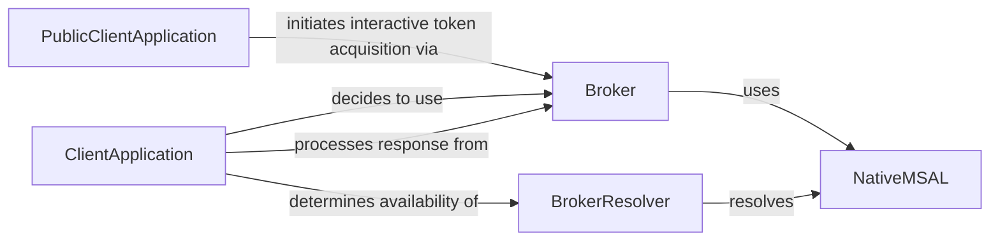

## Component Details

The Authentication Broker Connector in MSAL Python facilitates secure and seamless authentication experiences by integrating with authentication brokers like Microsoft Authentication Broker (MAM). It enables applications to leverage the broker for enhanced security features such as single sign-on (SSO) and device-wide authentication. The core flow involves the `ClientApplication` determining the availability of a broker through the `BrokerResolver`, initiating authentication requests via the `Broker`, and processing responses received from the broker. The `NativeMSAL` component handles the low-level communication with the native MSAL library, enabling the `Broker` to interact with the broker.

### ClientApplication
The base class for client applications in MSAL. It determines whether to use the broker for authentication and processes the broker's response. It contains the common logic for PublicClientApplication and ConfidentialClientApplication.
- **Related Classes/Methods**: `microsoft-authentication-library-for-python.msal.application.ClientApplication:_decide_broker`, `microsoft-authentication-library-for-python.msal.application.ClientApplication:_process_broker_response`

### PublicClientApplication
A specialization of ClientApplication designed for public client applications (e.g., desktop or mobile apps). It initiates interactive token acquisition via the broker.
- **Related Classes/Methods**: `microsoft-authentication-library-for-python.msal.application.PublicClientApplication:_acquire_token_interactive_via_broker`

### Broker
The Broker module encapsulates the core logic for interacting with the authentication broker. It handles silent and interactive sign-in/token acquisition, reads account information, and converts errors and results to be consumed by the ClientApplication.
- **Related Classes/Methods**: `microsoft-authentication-library-for-python.msal.broker:_convert_error`, `microsoft-authentication-library-for-python.msal.broker:_read_account_by_id`, `microsoft-authentication-library-for-python.msal.broker:_convert_result`, `microsoft-authentication-library-for-python.msal.broker:_signin_silently`, `microsoft-authentication-library-for-python.msal.broker:_signin_interactively`, `microsoft-authentication-library-for-python.msal.broker:_acquire_token_silently`, `microsoft-authentication-library-for-python.msal.broker:_signout_silently`

### BrokerResolver
The BrokerResolver class is responsible for determining the availability and type of broker to use. It checks for the presence of a broker and its compatibility with the application.
- **Related Classes/Methods**: `microsoft-authentication-library-for-python.msal.broker.BrokerResolver`

### NativeMSAL
The NativeMSAL class provides the low-level interface for interacting with the native MSAL library. It handles the actual communication with the broker.
- **Related Classes/Methods**: `microsoft-authentication-library-for-python.msal.broker.NativeMSAL`
