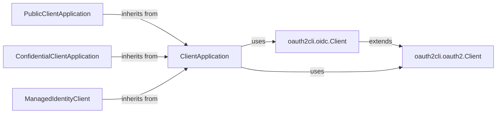

## Component Details

The Authentication Flow Engine orchestrates the acquisition of tokens using various authentication flows supported by MSAL. It encompasses the logic for handling authorization code, device code, username/password, and refresh token flows. The engine interacts with the Token Cache for storing and retrieving tokens and the Authority Resolver for validating the authority. It uses different client application types (Public, Confidential, Managed Identity) to initiate and execute the appropriate flow based on the application's environment and security requirements. The engine relies on the oauth2cli library for core OAuth 2.0 protocol interactions.

### ClientApplication
The base class providing common functionality for acquiring tokens, including token caching, authority validation, and request construction. It serves as the foundation for PublicClientApplication and ConfidentialClientApplication.
- **Related Classes/Methods**: `microsoft-authentication-library-for-python.msal.application.ClientApplication`

### PublicClientApplication
A client application type designed for devices or browsers where client secrets cannot be safely stored. It supports interactive authentication flows like authorization code flow with PKCE and device code flow.
- **Related Classes/Methods**: `microsoft-authentication-library-for-python.msal.application.PublicClientApplication`

### ConfidentialClientApplication
A client application type suitable for server-side applications where client secrets can be securely stored. It supports client credentials flow and other flows appropriate for server-side authentication.
- **Related Classes/Methods**: `microsoft-authentication-library-for-python.msal.application.ConfidentialClientApplication`

### oauth2cli.oauth2.Client
A client class that handles the core OAuth 2.0 protocol interactions, such as building authorization request URIs and obtaining tokens from the token endpoint.
- **Related Classes/Methods**: `microsoft-authentication-library-for-python.msal.oauth2cli.oauth2.Client`

### oauth2cli.oidc.Client
Extends the oauth2.Client to support OpenID Connect (OIDC) specific features, such as handling ID tokens and userinfo endpoint.
- **Related Classes/Methods**: `microsoft-authentication-library-for-python.msal.oauth2cli.oidc.Client`

### ManagedIdentityClient
A client for acquiring tokens using managed identities, which are identities managed by Azure for applications running in Azure environments.
- **Related Classes/Methods**: `microsoft-authentication-library-for-python.msal.managed_identity.ManagedIdentityClient`
