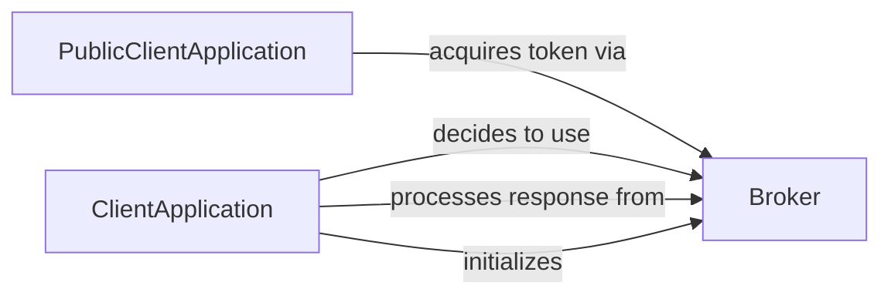

## Component Details

The Broker Communication Module facilitates authentication and token acquisition using an authentication broker like Microsoft Authentication Broker (MAM). It enables applications to seamlessly sign in, acquire tokens silently, and sign out through the broker, providing a secure and efficient authentication experience. The module abstracts the complexities of broker communication, handling error conversion, account information retrieval, and result conversion.

### ClientApplication
The base class for client applications, responsible for application lifecycle management, configuration, and coordinating authentication flows. It initializes the broker, processes responses from it, and determines whether to use the broker for authentication.
- **Related Classes/Methods**: `microsoft-authentication-library-for-python.msal.application.ClientApplication:_decide_broker`, `microsoft-authentication-library-for-python.msal.application.ClientApplication:_process_broker_response`, `microsoft-authentication-library-for-python.msal.application.ClientApplication:_init_broker`

### PublicClientApplication
A specialized client application designed for devices or desktops, enabling interactive sign-in and token acquisition, potentially involving a broker. It extends the ClientApplication and provides methods for acquiring tokens interactively via the broker.
- **Related Classes/Methods**: `microsoft-authentication-library-for-python.msal.application.PublicClientApplication:_acquire_token_interactive_via_broker`

### Broker
This component provides the core functionalities for interacting with an authentication broker. It handles tasks such as error conversion, account information retrieval, result conversion, and facilitates silent and interactive sign-in/sign-out operations. It abstracts the underlying broker communication protocols and provides a high-level interface for authentication and token management.
- **Related Classes/Methods**: `microsoft-authentication-library-for-python.msal.broker:_convert_error`, `microsoft-authentication-library-for-python.msal.broker:_read_account_by_id`, `microsoft-authentication-library-for-python.msal.broker:_convert_result`, `microsoft-authentication-library-for-python.msal.broker:_signin_silently`, `microsoft-authentication-library-for-python.msal.broker:_signin_interactively`, `microsoft-authentication-library-for-python.msal.broker:_acquire_token_silently`, `microsoft-authentication-library-for-python.msal.broker:_signout_silently`
