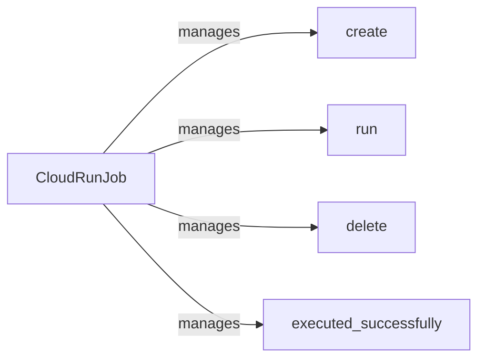

## Component Details

The CloudRunJobManager orchestrates the lifecycle of Cloud Run jobs, providing a simplified interface for managing these jobs. It encapsulates the complexities of interacting with the Google Cloud Run service, handling job creation, execution, deletion, and status checking. The main flow involves creating a Cloud Run job based on a given configuration, running the job, monitoring its execution, and then either deleting the job or reporting its successful execution.

### CloudRunJob
Represents a Cloud Run job and encapsulates the logic for interacting with the Cloud Run service. It provides methods for creating, running, deleting, and checking the status of a Cloud Run job.
- **Related Classes/Methods**: `VertFlow.src.cloud_run.CloudRunJob`

### create
Creates a new Cloud Run job based on the provided configuration. This involves defining the job's specifications, such as image, command, and resource requirements, and then deploying it to Cloud Run.
- **Related Classes/Methods**: `VertFlow.src.cloud_run.CloudRunJob:create`

### run
Executes the Cloud Run job. This involves triggering the job to start running and monitoring its progress.
- **Related Classes/Methods**: `VertFlow.src.cloud_run.CloudRunJob:run`

### delete
Deletes the Cloud Run job. This removes the job from the Cloud Run service.
- **Related Classes/Methods**: `VertFlow.src.cloud_run.CloudRunJob:delete`

### executed_successfully
Checks if the Cloud Run job executed successfully. This involves examining the job's logs and status to determine if it completed without errors.
- **Related Classes/Methods**: `VertFlow.src.cloud_run.CloudRunJob:executed_successfully`
