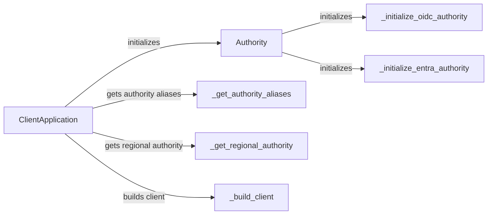

## Component Details

The Identity Provider Resolver subsystem is responsible for resolving the authority URL and retrieving metadata about the identity provider. It handles different authority types (e.g., Azure AD, ADFS) and provides information about the endpoints and capabilities of the authority. This enables the library to dynamically adapt to different identity provider configurations and ensures that the library can communicate with the correct identity provider and utilize its specific features. The main flow involves the `ClientApplication` initializing the `Authority` component, which then determines the specific authority type (OIDC or Entra) and retrieves the necessary metadata.

### ClientApplication
The main entry point for developers using MSAL. It encapsulates the authentication logic and provides methods for acquiring tokens. It is responsible for deciding which broker to use, building the telemetry context, determining the regional authority, and building the underlying client.
- **Related Classes/Methods**: `microsoft-authentication-library-for-python.msal.application.ClientApplication`

### Authority
Represents the authority (identity provider) that the application will use for authentication. It determines the type of authority (OIDC or Entra) and initializes it accordingly. It encapsulates the logic for interacting with the authority's metadata and endpoints.
- **Related Classes/Methods**: `microsoft-authentication-library-for-python.msal.authority.Authority`

### _initialize_oidc_authority
Initializes the authority as an OpenID Connect (OIDC) authority. It performs the necessary steps to configure the authority based on OIDC standards.
- **Related Classes/Methods**: `microsoft-authentication-library-for-python.msal.authority.Authority`

### _initialize_entra_authority
Initializes the authority as an Entra (Azure Active Directory) authority. It performs the necessary steps to configure the authority based on Entra-specific configurations.
- **Related Classes/Methods**: `microsoft-authentication-library-for-python.msal.authority.Authority`

### _get_authority_aliases
Retrieves the aliases for the authority. Authority aliases are alternative names or URLs that can be used to identify the same authority. This is used for things like regional authorities.
- **Related Classes/Methods**: `microsoft-authentication-library-for-python.msal.application.ClientApplication`

### _get_regional_authority
Determines the regional authority to use for authentication. Regional authorities are specific instances of the authority that are located in different geographic regions. This allows the application to connect to the authority that is closest to the user, which can improve performance.
- **Related Classes/Methods**: `microsoft-authentication-library-for-python.msal.application.ClientApplication`

### _build_client
Builds the underlying client that will be used to make authentication requests. The client is responsible for handling the communication with the authority and for exchanging tokens.
- **Related Classes/Methods**: `microsoft-authentication-library-for-python.msal.application.ClientApplication`
