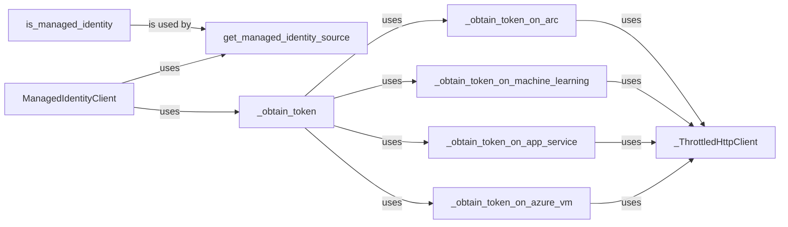

## Component Details

The Managed Identity Adapter enables applications running in Azure environments to authenticate using managed identities, eliminating the need for explicit credentials. The central component, `ManagedIdentityClient`, determines the appropriate endpoint based on the environment and delegates token acquisition to environment-specific methods. The adapter supports both system-assigned and user-assigned managed identities, securely retrieving tokens from the Azure Instance Metadata Service. It uses a throttled HTTP client to handle potential throttling issues when communicating with the metadata service.

### ManagedIdentityClient
The central client responsible for acquiring tokens using Managed Identity. It determines the appropriate endpoint based on the environment and delegates the actual token acquisition to specific methods. It initializes either a SystemAssignedManagedIdentity or UserAssignedManagedIdentity based on the provided client_id.
- **Related Classes/Methods**: `microsoft-authentication-library-for-python.msal.managed_identity.ManagedIdentityClient:__init__`, `microsoft-authentication-library-for-python.msal.managed_identity.ManagedIdentityClient:acquire_token_for_client`

### is_managed_identity
A utility function to determine if the application is running in a managed identity environment by checking for specific environment variables or other indicators.
- **Related Classes/Methods**: `microsoft-authentication-library-for-python.msal.managed_identity:is_managed_identity`

### get_managed_identity_source
This function determines the source of the managed identity (e.g., Azure VM, App Service, Azure Arc, Azure Machine Learning) by inspecting the environment. It returns an enum representing the source.
- **Related Classes/Methods**: `microsoft-authentication-library-for-python.msal.managed_identity:get_managed_identity_source`

### _obtain_token
A general function to obtain a token from managed identity. It uses the `get_managed_identity_source` to determine the environment and calls the appropriate environment-specific token acquisition method (e.g., `_obtain_token_on_azure_vm`, `_obtain_token_on_app_service`).
- **Related Classes/Methods**: `microsoft-authentication-library-for-python.msal.managed_identity:_obtain_token`

### _obtain_token_on_azure_vm
Obtains a token when the application is running on an Azure Virtual Machine. It interacts with the Azure Instance Metadata Service (IMDS) to retrieve the token.
- **Related Classes/Methods**: `microsoft-authentication-library-for-python.msal.managed_identity:_obtain_token_on_azure_vm`

### _obtain_token_on_app_service
Obtains a token when the application is running on an Azure App Service. It interacts with the App Service's managed identity endpoint to retrieve the token.
- **Related Classes/Methods**: `microsoft-authentication-library-for-python.msal.managed_identity:_obtain_token_on_app_service`

### _obtain_token_on_machine_learning
Obtains a token when the application is running on Azure Machine Learning. It interacts with the Machine Learning's managed identity endpoint to retrieve the token.
- **Related Classes/Methods**: `microsoft-authentication-library-for-python.msal.managed_identity:_obtain_token_on_machine_learning`

### _obtain_token_on_arc
Obtains a token when the application is running on Azure Arc. It interacts with the Azure Arc's managed identity endpoint to retrieve the token.
- **Related Classes/Methods**: `microsoft-authentication-library-for-python.msal.managed_identity:_obtain_token_on_arc`

### _ThrottledHttpClient
A custom HTTP client that handles throttling by retrying requests with exponential backoff when the Azure Instance Metadata Service returns a throttling error.
- **Related Classes/Methods**: `microsoft-authentication-library-for-python.msal.managed_identity._ThrottledHttpClient:__init__`
