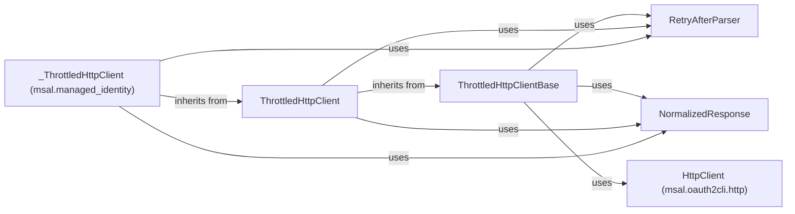

## Component Details

The Network Communication Handler ensures reliable communication with the Microsoft identity platform by managing HTTP requests with throttling and retry logic. It normalizes responses, parses 'Retry-After' headers, and provides a consistent interface for making HTTP requests, handling potential errors, and optimizing performance. The core components work together to provide a robust and resilient communication layer for the library, especially in scenarios where throttling is expected.

### ThrottledHttpClientBase
This abstract base class defines the interface for HTTP clients that implement throttling logic. It outlines the methods for handling HTTP requests and managing retries based on server-side throttling signals. It serves as a blueprint for concrete throttled HTTP client implementations.
- **Related Classes/Methods**: `microsoft-authentication-library-for-python.msal.throttled_http_client.ThrottledHttpClientBase`

### ThrottledHttpClient
This class implements the ThrottledHttpClientBase and provides a concrete implementation for handling throttled HTTP requests. It incorporates retry mechanisms based on the 'Retry-After' header, allowing the client to automatically retry requests after a specified delay. It builds upon the base class to provide a functional throttled HTTP client.
- **Related Classes/Methods**: `microsoft-authentication-library-for-python.msal.throttled_http_client.ThrottledHttpClient`

### RetryAfterParser
This class is responsible for parsing the 'Retry-After' header from HTTP responses. It extracts the delay duration specified by the server, which indicates how long the client should wait before retrying the request. It provides a utility for interpreting the server's throttling instructions.
- **Related Classes/Methods**: `microsoft-authentication-library-for-python.msal.throttled_http_client.RetryAfterParser`

### NormalizedResponse
This class normalizes the HTTP response. It provides a consistent interface for accessing response data, such as status code and headers. It also includes a method for raising exceptions based on the response status, ensuring consistent error handling across different HTTP client implementations.
- **Related Classes/Methods**: `microsoft-authentication-library-for-python.msal.throttled_http_client.NormalizedResponse`

### HttpClient (msal.oauth2cli.http)
This class provides basic HTTP client functionality for making HTTP requests (POST and GET). It is a dependency for the ThrottledHttpClientBase, providing the underlying mechanism for sending and receiving HTTP data.
- **Related Classes/Methods**: `microsoft-authentication-library-for-python.msal.oauth2cli.http.HttpClient`

### _ThrottledHttpClient (msal.managed_identity)
This class is a specialized HTTP client tailored for managed identity scenarios. It likely incorporates throttling logic similar to ThrottledHttpClient, potentially with customizations specific to managed identity environments. It inherits from ThrottledHttpClient and uses RetryAfterParser and NormalizedResponse.
- **Related Classes/Methods**: `microsoft-authentication-library-for-python.msal.managed_identity._ThrottledHttpClient`
