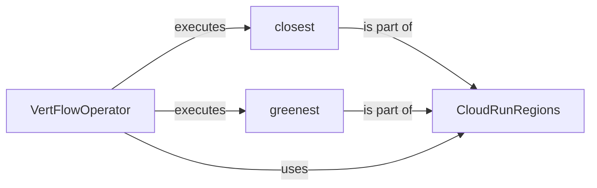

## Component Details

The Region Selection subsystem within VertFlow is responsible for determining the optimal Cloud Run region for executing jobs. It leverages the CloudRunRegions data class to provide methods for identifying the closest and greenest available regions, enabling optimization based on latency, cost, or environmental impact. The VertFlowOperator orchestrates the process by calling the appropriate methods to select the region and execute the job.

### VertFlowOperator
The VertFlowOperator orchestrates the execution of the VertFlow process. It interacts with the CloudRunRegions component to determine the most suitable Cloud Run region (closest or greenest) based on the specified criteria. It then uses this information to execute the job in the selected region.
- **Related Classes/Methods**: `VertFlow.src.operator.VertFlowOperator`

### CloudRunRegions
The CloudRunRegions data class encapsulates the logic for determining the closest and greenest Cloud Run regions. It provides methods to retrieve these regions based on various factors such as location and carbon footprint data. This component serves as a central repository for region-related information and selection algorithms.
- **Related Classes/Methods**: `VertFlow.src.data.CloudRunRegions`

### closest
The `closest` method within the CloudRunRegions class determines the Cloud Run region that is geographically closest to a given location. This method is used when minimizing latency is a primary concern.
- **Related Classes/Methods**: `VertFlow.src.data.CloudRunRegions:closest`

### greenest
The `greenest` method within the CloudRunRegions class identifies the Cloud Run region with the lowest carbon footprint. This method is used when minimizing environmental impact is a priority.
- **Related Classes/Methods**: `VertFlow.src.data.CloudRunRegions:greenest`
