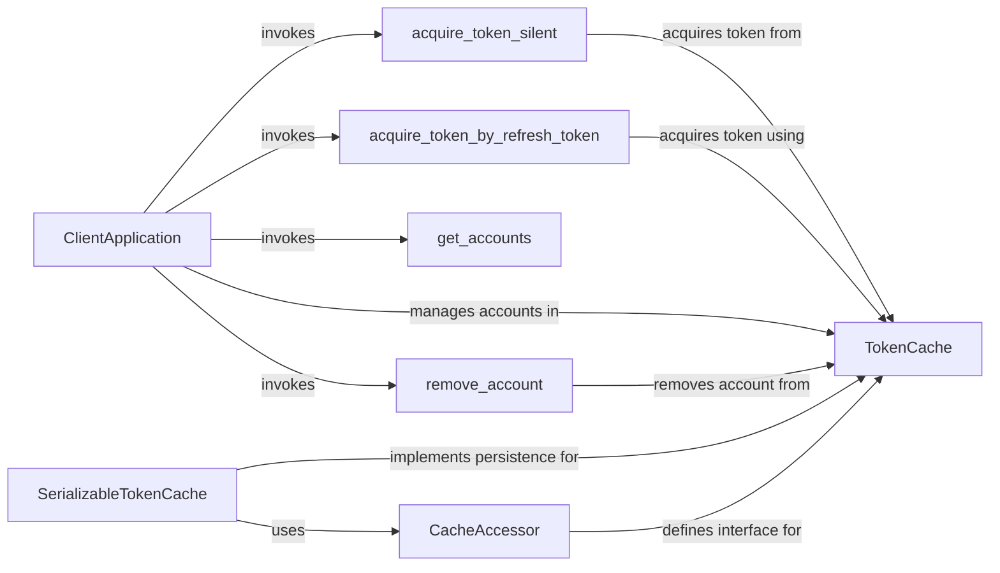

## Component Details

The Token Management System in MSAL Python is responsible for securely storing, retrieving, and managing tokens used for authentication and authorization. It optimizes token retrieval to minimize repeated authentication requests and ensures tokens are readily available for subsequent requests. The system uses a cache to persist tokens and provides methods for searching, adding, removing, and updating tokens. It also handles serialization and deserialization of the cache for persistent storage.

### ClientApplication
The ClientApplication is the main entry point for developers to interact with the MSAL library. It provides methods to acquire tokens, manage user accounts, and configure the authentication flow. It orchestrates the token acquisition process by interacting with the TokenCache and other internal components.
- **Related Classes/Methods**: `microsoft-authentication-library-for-python.msal.application.ClientApplication`

### TokenCache
The TokenCache is responsible for storing and retrieving tokens securely. It provides methods to add, search, update, and remove tokens from the cache. It interacts with the ClientApplication to provide tokens when available and persist them after acquisition.
- **Related Classes/Methods**: `microsoft-authentication-library-for-python.msal.token_cache.TokenCache`, `microsoft-authentication-library-for-python.msal.token_cache.SerializableTokenCache`

### acquire_token_silent
acquire_token_silent attempts to acquire a token from the cache without prompting the user. It checks the cache for a valid token and returns it if found. If no valid token is found, it may attempt to refresh an existing token using a refresh token.
- **Related Classes/Methods**: `microsoft-authentication-library-for-python.msal.application.ClientApplication:acquire_token_silent`, `microsoft-authentication-library-for-python.msal.application.ClientApplication:_acquire_token_silent_with_error`, `microsoft-authentication-library-for-python.msal.application.ClientApplication:_acquire_token_silent_from_cache_and_possibly_refresh_it`

### acquire_token_by_refresh_token
acquire_token_by_refresh_token acquires a new access token using a refresh token. It exchanges the refresh token for a new access token and updates the cache with the new token.
- **Related Classes/Methods**: `microsoft-authentication-library-for-python.msal.application.ClientApplication:acquire_token_by_refresh_token`

### get_accounts
get_accounts retrieves a list of accounts from the token cache. It allows the application to enumerate the accounts for which it has tokens.
- **Related Classes/Methods**: `microsoft-authentication-library-for-python.msal.application.ClientApplication:get_accounts`

### remove_account
remove_account removes all tokens associated with a specific account from the token cache. It is used to sign out a user from the application.
- **Related Classes/Methods**: `microsoft-authentication-library-for-python.msal.application.ClientApplication:remove_account`, `microsoft-authentication-library-for-python.msal.token_cache.TokenCache:remove_account`

### CacheAccessor
CacheAccessor is an abstract base class for token cache persistence. Defines the interface for reading and writing the token cache to persistent storage.
- **Related Classes/Methods**: `microsoft-authentication-library-for-python.msal.token_cache.CacheAccessor`

### SerializableTokenCache
SerializableTokenCache is a concrete implementation of TokenCache that supports serialization and deserialization of the cache to persistent storage. It uses a CacheAccessor to handle the actual reading and writing of the cache data.
- **Related Classes/Methods**: `microsoft-authentication-library-for-python.msal.token_cache.SerializableTokenCache`
