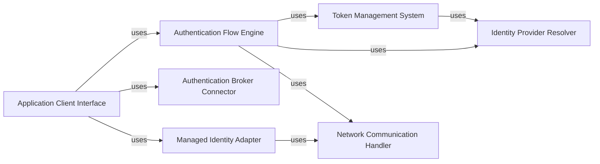

## Component Details

The Microsoft Authentication Library for Python (MSAL for Python) enables developers to acquire security tokens from the Microsoft identity platform to authenticate users and access secured web APIs. It supports various authentication flows, token caching, and integration with authentication brokers and managed identities, providing a comprehensive solution for building secure applications.

### Application Client Interface
This component provides the main interface for developers to interact with the MSAL library. It manages the lifecycle of client applications, handling initialization, configuration, and token acquisition/renewal for different client types (Public, Confidential). It encapsulates the complexity of authentication flows and token management, offering a simplified API for developers.
- **Related Classes/Methods**: `msal.application.ClientApplication`, `msal.application.PublicClientApplication`, `msal.application.ConfidentialClientApplication`

### Authentication Flow Engine
This component orchestrates the different authentication flows supported by MSAL, including authorization code, device code, username/password, and refresh token flows. It interacts with other components like the Token Cache and Authority Resolver to execute these flows and acquire tokens. It handles the specific logic for each flow, ensuring the correct sequence of steps and interactions with the identity provider.
- **Related Classes/Methods**: `msal.application.ClientApplication.initiate_auth_code_flow`, `msal.application.ClientApplication.acquire_token_by_auth_code_flow`, `msal.application.ClientApplication.acquire_token_silent`, `msal.application.ClientApplication.acquire_token_by_refresh_token`, `msal.application.PublicClientApplication.acquire_token_interactive`, `msal.application.PublicClientApplication.initiate_device_flow`, `msal.application.PublicClientApplication.acquire_token_by_device_flow`, `msal.application.ConfidentialClientApplication.acquire_token_for_client`, `msal.oauth2cli.oauth2.Client`

### Token Management System
This component manages the storage and retrieval of tokens, providing methods for searching, adding, removing, and updating tokens in the cache. It handles serialization and deserialization of the cache for persistence, ensuring that tokens are securely stored and readily available for subsequent authentication requests. It optimizes token retrieval to minimize the need for repeated authentication.
- **Related Classes/Methods**: `msal.token_cache.TokenCache`, `msal.token_cache.SerializableTokenCache`

### Identity Provider Resolver
This component resolves the authority URL and retrieves metadata about the identity provider, handling different authority types (e.g., Azure AD, ADFS). It provides information about the endpoints and capabilities of the authority, enabling the library to dynamically adapt to different identity provider configurations. It ensures that the library can communicate with the correct identity provider and utilize its specific features.
- **Related Classes/Methods**: `msal.authority.Authority`

### Authentication Broker Connector
This component handles integration with authentication brokers, such as the Microsoft Authentication Broker (MAM). It provides methods for signing in, acquiring tokens silently, and signing out through the broker, enabling seamless authentication experiences. It leverages the broker to provide enhanced security and single sign-on capabilities.
- **Related Classes/Methods**: `msal.broker`

### Managed Identity Adapter
This component handles authentication using managed identities in Azure environments, supporting system-assigned and user-assigned managed identities. It allows applications running in Azure to authenticate without requiring explicit credentials, simplifying deployment and management. It securely retrieves tokens from the Azure Instance Metadata Service.
- **Related Classes/Methods**: `msal.managed_identity`, `msal.managed_identity.ManagedIdentityClient`

### Network Communication Handler
This component handles HTTP requests with throttling and retry logic, ensuring reliable communication with the Microsoft identity platform. It manages the underlying network requests and responses, handling potential errors and optimizing performance. It provides a robust and resilient communication layer for the library.
- **Related Classes/Methods**: `msal.throttled_http_client`