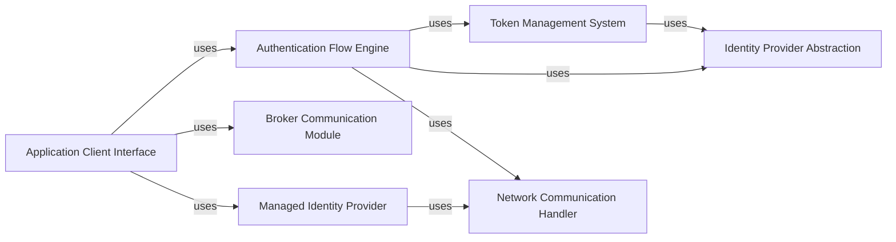

## Component Details

The Microsoft Authentication Library for Python (MSAL for Python) enables developers to acquire security tokens from the Microsoft identity platform to authenticate users and access secured web APIs. It supports various authentication flows, token caching, and integration with authentication brokers to provide a seamless authentication experience for applications.

### Application Client Interface
This component serves as the primary interface for developers to interact with the MSAL library. It manages the lifecycle of client applications, handling initialization, configuration, and token acquisition/renewal for different client types (Public, Confidential). It provides methods to acquire tokens using various authentication flows and acts as the entry point for authentication operations.
- **Related Classes/Methods**: `msal.application.ClientApplication`, `msal.application.PublicClientApplication`, `msal.application.ConfidentialClientApplication`

### Authentication Flow Engine
This component orchestrates the different authentication flows supported by MSAL, including authorization code flow, device flow, username/password flow, and refresh token flow. It interacts with other components like the Token Cache and Authority Resolver to execute these flows, acquire tokens, and handle the complexities of the authentication process. It encapsulates the logic for different authentication protocols and ensures a consistent and secure authentication experience.
- **Related Classes/Methods**: `msal.application.ClientApplication.initiate_auth_code_flow`, `msal.application.ClientApplication.acquire_token_by_auth_code_flow`, `msal.application.ClientApplication.acquire_token_silent`, `msal.application.ClientApplication.acquire_token_by_refresh_token`, `msal.application.PublicClientApplication.acquire_token_interactive`, `msal.application.PublicClientApplication.initiate_device_flow`, `msal.application.PublicClientApplication.acquire_token_by_device_flow`, `msal.application.ConfidentialClientApplication.acquire_token_for_client`, `msal.oauth2cli.oauth2.Client`

### Token Management System
This component is responsible for securely storing and retrieving tokens. It provides methods for searching, adding, removing, and updating tokens in the cache. It also handles serialization and deserialization of the cache for persistence, ensuring that tokens are available across application sessions and minimizing the need for repeated authentication.
- **Related Classes/Methods**: `msal.token_cache.TokenCache`, `msal.token_cache.SerializableTokenCache`

### Identity Provider Abstraction
This component abstracts the interaction with different identity providers, such as Azure AD and ADFS. It resolves the authority URL, retrieves metadata about the authority, and provides information about the endpoints and capabilities of the identity provider. This abstraction allows MSAL to support various identity providers without requiring significant code changes.
- **Related Classes/Methods**: `msal.authority.Authority`

### Broker Communication Module
This component handles integration with authentication brokers, such as the Microsoft Authentication Broker (MAM). It provides methods for signing in, acquiring tokens silently, and signing out through the broker, enabling seamless authentication experiences for users on devices where a broker is available. It facilitates secure communication with the broker to obtain and manage tokens.
- **Related Classes/Methods**: `msal.broker`

### Managed Identity Provider
This component handles authentication using managed identities in Azure environments, supporting system-assigned and user-assigned managed identities. It allows applications running in Azure to authenticate without requiring explicit credentials, simplifying the authentication process and improving security. It retrieves tokens from the Azure Instance Metadata Service (IMDS).
- **Related Classes/Methods**: `msal.managed_identity`, `msal.managed_identity.ManagedIdentityClient`

### Network Communication Handler
This component handles HTTP requests with throttling and retry logic, providing a reliable communication layer for interacting with the Microsoft identity platform. It manages the underlying network requests and responses, ensuring that requests are sent efficiently and that errors are handled gracefully. It encapsulates the logic for handling HTTP connections, retries, and throttling.
- **Related Classes/Methods**: `msal.throttled_http_client`