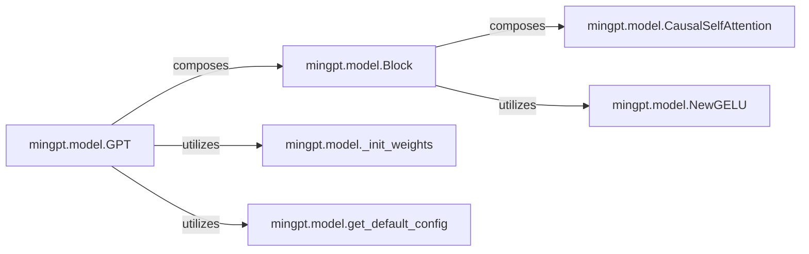

## Details

The `mingpt.model` subsystem forms the foundational architecture of a Generative Pre-trained Transformer (GPT) model. At its core, the `GPT` component acts as the primary orchestrator, assembling a series of `Block` components to construct the deep neural network. Each `Block` encapsulates a complete Transformer layer, featuring a `CausalSelfAttention` mechanism responsible for processing sequential data while adhering to causality, and a feed-forward network that employs the `NewGELU` activation function for non-linearity. The `GPT` model further leverages helper functions such as `_init_weights` for initializing model parameters and `get_default_config` to establish default architectural hyperparameters, ensuring a structured and efficient model setup. This modular design facilitates clear understanding of the model's data flow and component interactions.

### mingpt.model.GPT
The top-level orchestrator of the GPT model. It is responsible for constructing the entire network by assembling multiple `Block` components, managing the overall forward pass, and handling the loading of pre-trained model weights. This component serves as the primary interface for interacting with the complete GPT model.

**Related Classes/Methods**:

- <a href="https://github.com/karpathy/minGPT/blob/master/mingpt/model.py#L95-L310" target="_blank" rel="noopener noreferrer">`mingpt.model.GPT`:95-310</a>

### mingpt.model.Block
Represents a single, complete Transformer layer. It encapsulates the two main sub-layers of a Transformer: the causal self-attention mechanism and a position-wise feed-forward neural network. This component is a fundamental, reusable building block for constructing the multi-layered GPT architecture.

**Related Classes/Methods**:

- <a href="https://github.com/karpathy/minGPT/blob/master/mingpt/model.py" target="_blank" rel="noopener noreferrer">`mingpt.model.Block`</a>

### mingpt.model.CausalSelfAttention
Implements the core causal self-attention mechanism, which is crucial for generative models. Its primary responsibility is to compute attention scores while ensuring that each token can only attend to preceding tokens in the sequence, preventing information leakage from future tokens. It performs linear projections for query, key, and value, applies dropout, and uses a causal mask.

**Related Classes/Methods**:

- <a href="https://github.com/karpathy/minGPT/blob/master/mingpt/model.py#L29-L71" target="_blank" rel="noopener noreferrer">`mingpt.model.CausalSelfAttention`:29-71</a>

### mingpt.model.NewGELU
Implements the GELU (Gaussian Error Linear Units) activation function, used within the feed-forward network of a `Block`. It provides non-linearity to the model.

**Related Classes/Methods**:

- <a href="https://github.com/karpathy/minGPT/blob/master/mingpt/model.py#L21-L27" target="_blank" rel="noopener noreferrer">`mingpt.model.NewGELU`:21-27</a>

### mingpt.model._init_weights
A utility method responsible for initializing the weights and biases of linear, embedding, and layer normalization modules within the GPT model. It ensures proper initialization for stable training.

**Related Classes/Methods**:

- <a href="https://github.com/karpathy/minGPT/blob/master/mingpt/model.py#L163-L172" target="_blank" rel="noopener noreferrer">`mingpt.model._init_weights`:163-172</a>

### mingpt.model.get_default_config
A static method that provides a default configuration object for the GPT model. It defines essential hyperparameters like model type, number of layers, heads, embedding dimensions, vocabulary size, block size, and dropout rates.

**Related Classes/Methods**:

- <a href="https://github.com/karpathy/minGPT/blob/master/mingpt/model.py#L98-L113" target="_blank" rel="noopener noreferrer">`mingpt.model.get_default_config`:98-113</a>

### [FAQ](https://github.com/CodeBoarding/GeneratedOnBoardings/tree/main?tab=readme-ov-file#faq)