```mermaid
graph LR
    Configuration_Management["Configuration Management"]
    Data_Processing_Tokenization["Data Processing & Tokenization"]
    GPT_Model_Core["GPT Model Core"]
    Training_Orchestration["Training Orchestration"]
    Project_Applications["Project Applications"]
    Configuration_Management -- "Provides Configuration To" --> GPT_Model_Core
    Configuration_Management -- "Provides Configuration To" --> Training_Orchestration
    Configuration_Management -- "Provides Configuration To" --> Project_Applications
    Data_Processing_Tokenization -- "Provides Tokenized Input To" --> GPT_Model_Core
    GPT_Model_Core -- "Generates Tokenized Output To" --> Data_Processing_Tokenization
    Training_Orchestration -- "Trains" --> GPT_Model_Core
    Project_Applications -- "Initiates & Configures" --> Training_Orchestration
    Project_Applications -- "Defines Callbacks For" --> Training_Orchestration
    Project_Applications -- "Retrieves Configuration From" --> Configuration_Management
    Project_Applications -- "Utilizes" --> Data_Processing_Tokenization
    click GPT_Model_Core href "https://github.com/CodeBoarding/GeneratedOnBoardings/blob/main/minGPT/GPT_Model_Core.md" "Details"
```

## Details

The minGPT architecture is structured as a clear, modular pipeline for building and training Generative Pre-trained Transformer models, emphasizing simplicity and interpretability. At its foundation, the Configuration Management component centralizes all settings, providing essential parameters to the GPT Model Core, Training Orchestration, and various Project Applications. Data flows through the Data Processing & Tokenization component, which prepares raw text into numerical sequences for the GPT Model Core and handles decoding of its outputs. The Training Orchestration component manages the entire training lifecycle, leveraging configurations and training the GPT Model Core. Finally, Project Applications serve as concrete examples or specific tasks, orchestrating the training process by initiating Training Orchestration, defining custom callbacks, and utilizing the Data Processing & Tokenization for their specific datasets, thereby showcasing the library's reusability and extensibility.

### Configuration Management
Centralized component responsible for defining, loading, and providing configuration settings for models, training, and project-specific parameters. It ensures consistency and reusability of configurations across the system.

**Related Classes/Methods**:

- <a href="https://github.com/karpathy/minGPT/blob/master/mingpt/utils.py" target="_blank" rel="noopener noreferrer">`mingpt.utils.get_default_config`</a>
- <a href="https://github.com/karpathy/minGPT/blob/master/projects/chargpt/chargpt.py#L18-L38" target="_blank" rel="noopener noreferrer">`projects.chargpt.chargpt.get_config`:18-38</a>
- <a href="https://github.com/karpathy/minGPT/blob/master/projects/adder/adder.py#L19-L39" target="_blank" rel="noopener noreferrer">`projects.adder.adder.get_config`:19-39</a>

### Data Processing & Tokenization
Handles the crucial task of converting raw text into numerical token sequences (encoding) and vice-versa (decoding) using Byte Pair Encoding (BPE). This component is modular and reusable across different text-based applications.

**Related Classes/Methods**:

- <a href="https://github.com/karpathy/minGPT/blob/master/mingpt/bpe.py" target="_blank" rel="noopener noreferrer">`mingpt.bpe.Encoder`</a>
- <a href="https://github.com/karpathy/minGPT/blob/master/mingpt/bpe.py#L223-L253" target="_blank" rel="noopener noreferrer">`mingpt.bpe.get_encoder`:223-253</a>

### GPT Model Core [[Expand]](./GPT_Model_Core.md)
Encapsulates the fundamental Generative Pre-trained Transformer (GPT) architecture, including its layers, attention mechanisms, and forward pass logic. This is the central intellectual property of the library, designed for clarity and interpretability.

**Related Classes/Methods**:

- <a href="https://github.com/karpathy/minGPT/blob/master/mingpt/model.py#L95-L310" target="_blank" rel="noopener noreferrer">`mingpt.model.GPT`:95-310</a>
- <a href="https://github.com/karpathy/minGPT/blob/master/mingpt/model.py#L29-L71" target="_blank" rel="noopener noreferrer">`mingpt.model.CausalSelfAttention`:29-71</a>
- <a href="https://github.com/karpathy/minGPT/blob/master/mingpt/model.py" target="_blank" rel="noopener noreferrer">`mingpt.model.Block`</a>

### Training Orchestration
Manages the entire training lifecycle, including iterating over data, performing optimization steps, and executing various callbacks at different stages. It provides a structured pipeline for training, promoting modularity by separating training logic from the model definition.

**Related Classes/Methods**:

- <a href="https://github.com/karpathy/minGPT/blob/master/mingpt/trainer.py#L13-L109" target="_blank" rel="noopener noreferrer">`mingpt.trainer.Trainer`:13-109</a>

### Project Applications
Demonstrative or specific machine learning applications built on top of the minGPT library, showcasing its usage for different tasks (e.g., character-level language modeling, arithmetic). These components highlight the reusability and extensibility of the core library.

**Related Classes/Methods**:

- <a href="https://github.com/karpathy/minGPT/blob/master/projects/chargpt/chargpt.py" target="_blank" rel="noopener noreferrer">`projects.chargpt.chargpt`</a>
- <a href="https://github.com/karpathy/minGPT/blob/master/projects/adder/adder.py" target="_blank" rel="noopener noreferrer">`projects.adder.adder`</a>

### [FAQ](https://github.com/CodeBoarding/GeneratedOnBoardings/tree/main?tab=readme-ov-file#faq)