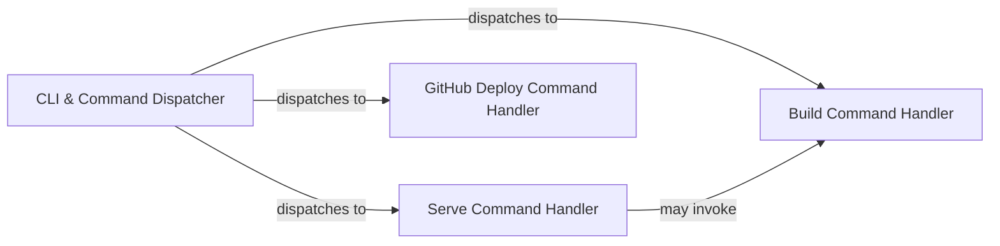

## Details

The `CLI & Command Dispatcher` subsystem is primarily defined by the `mkdocs/__main__.py` file, which serves as the main entry point for the MkDocs command-line interface, and the `mkdocs/commands/` directory, specifically the `build.py`, `serve.py`, and `gh_deploy.py` modules. These files collectively manage command parsing, dispatching, and the initial execution of core MkDocs operations.

### CLI & Command Dispatcher [[Expand]](./CLI_Command_Dispatcher.md)
This component acts as the central orchestrator and primary user interface for MkDocs. It is responsible for parsing command-line arguments, initializing the CLI environment (e.g., enabling warnings), and dispatching control to the appropriate command-specific handler based on the user's input (e.g., `build`, `serve`, `gh_deploy`). It is the initial point of contact for all user-initiated operations.

**Related Classes/Methods**:

- <a href="https://github.com/mkdocs/mkdocs/blob/master/mkdocs/__main__.py" target="_blank" rel="noopener noreferrer">`mkdocs.__main__`</a>

### Build Command Handler
This component encapsulates the core logic for generating the static documentation site. When invoked, it orchestrates the entire build pipeline, including loading configuration, processing Markdown content, applying themes, and writing the final static HTML and associated assets to the output directory.

**Related Classes/Methods**:

- <a href="https://github.com/mkdocs/mkdocs/blob/master/mkdocs/commands/build.py" target="_blank" rel="noopener noreferrer">`mkdocs.commands.build`</a>

### Serve Command Handler
This component manages the local development server functionality. It typically initiates an initial site build, then serves the generated static files, and often includes a file watcher to automatically trigger rebuilds and browser reloads upon detecting changes in source files.

**Related Classes/Methods**:

- <a href="https://github.com/mkdocs/mkdocs/blob/master/mkdocs/commands/serve.py" target="_blank" rel="noopener noreferrer">`mkdocs.commands.serve`</a>

### GitHub Deploy Command Handler
This component handles the specialized logic for deploying the generated static site to GitHub Pages. It manages the necessary Git operations, branch handling, and pushing the compiled documentation to the remote GitHub repository.

**Related Classes/Methods**:

- <a href="https://github.com/mkdocs/mkdocs/blob/master/mkdocs/commands/gh_deploy.py" target="_blank" rel="noopener noreferrer">`mkdocs.commands.gh_deploy`</a>

### [FAQ](https://github.com/CodeBoarding/GeneratedOnBoardings/tree/main?tab=readme-ov-file#faq)