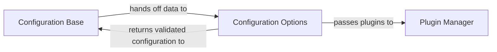

## Details

The Configuration & Plugin Manager subsystem is responsible for loading, validating, and managing the mkdocs.yml configuration, as well as orchestrating the loading and execution of plugins and dispatching events throughout the build lifecycle.

### Configuration Base
Acts as the primary orchestrator for loading, initializing, and performing high-level validation of the entire mkdocs.yml configuration. It sets up the configuration object and manages the overall validation flow, serving as the entry point for configuration processing.

**Related Classes/Methods**:

- <a href="https://github.com/mkdocs/mkdocs/blob/master/mkdocs/config/base.py" target="_blank" rel="noopener noreferrer">`mkdocs.config.base`</a>

### Configuration Options
Defines and enforces the validation rules for individual configuration settings. This component is responsible for parsing specific data types, handling nested configurations, and critically, identifying and initiating the loading of plugins as specified in the configuration. It provides the granular validation logic for each setting.

**Related Classes/Methods**:

- <a href="https://github.com/mkdocs/mkdocs/blob/master/mkdocs/config/config_options.py" target="_blank" rel="noopener noreferrer">`mkdocs.config.config_options`</a>

### Plugin Manager [[Expand]](./Plugin_Manager.md)
Manages the lifecycle of plugins, from registration to event dispatching. It provides the extensible framework through which plugins can hook into various stages of the MkDocs build process, allowing for custom modifications and extensions to the core functionality.

**Related Classes/Methods**:

- <a href="https://github.com/mkdocs/mkdocs/blob/master/mkdocs/plugins.py" target="_blank" rel="noopener noreferrer">`mkdocs.plugins`</a>

### [FAQ](https://github.com/CodeBoarding/GeneratedOnBoardings/tree/main?tab=readme-ov-file#faq)