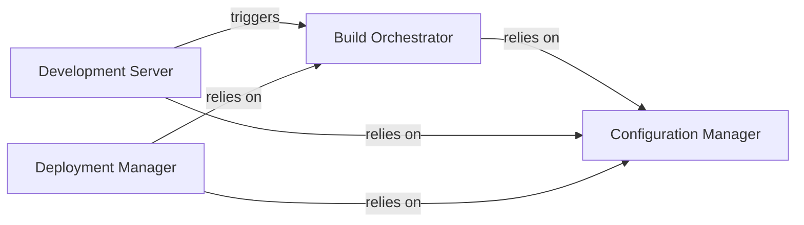

## Details

The mkdocs system is orchestrated around three primary functional components: the Build Orchestrator, Development Server, and Deployment Manager. The Build Orchestrator is central to generating the static site content. The Development Server provides a local preview environment, triggering the Build Orchestrator for live updates. The Deployment Manager handles the publication of the generated site. All three core components critically rely on the Configuration Manager, which centralizes the loading and management of project settings, ensuring consistent behavior across the build, serve, and deploy processes. This architecture promotes modularity and clear separation of concerns, with configuration acting as a foundational dependency for operational components.

### Build Orchestrator
This component is the primary driver for generating the static site. It coordinates the rendering of all site elements, including templates and content pages, and manages the final output to the file system. It ensures all necessary files are correctly placed in the output directory.

**Related Classes/Methods**:

- <a href="https://github.com/mkdocs/mkdocs/blob/master/mkdocs/commands/build.py#L249-L364" target="_blank" rel="noopener noreferrer">`mkdocs.commands.build.build`:249-364</a>

### Development Server
Provides a local HTTP server for previewing the generated site during development. It integrates with the build process to offer live reloading capabilities, automatically refreshing the browser when source content changes. This component is crucial for a smooth developer experience.

**Related Classes/Methods**:

- <a href="https://github.com/mkdocs/mkdocs/blob/master/mkdocs/commands/serve.py#L20-L110" target="_blank" rel="noopener noreferrer">`mkdocs.commands.serve.serve`:20-110</a>

### Deployment Manager
Handles the specific logic and workflow for deploying the generated static site to remote platforms, with a focus on GitHub Pages. This includes pre-deployment checks, Git repository interactions, and pushing the compiled site content to the remote host.

**Related Classes/Methods**:

- <a href="https://github.com/mkdocs/mkdocs/blob/master/mkdocs/commands/gh_deploy.py#L100-L169" target="_blank" rel="noopener noreferrer">`mkdocs.commands.gh_deploy.gh_deploy`:100-169</a>

### Configuration Manager
This component is responsible for loading, parsing, and validating the project's configuration settings. It ensures that all other components have access to the correct and consistent configuration data required for their operations, such as build parameters, server settings, and deployment options.

**Related Classes/Methods**:

- <a href="https://github.com/mkdocs/mkdocs/blob/master/" target="_blank" rel="noopener noreferrer">`mkdocs.config.config.Config`</a>

### [FAQ](https://github.com/CodeBoarding/GeneratedOnBoardings/tree/main?tab=readme-ov-file#faq)