```mermaid
graph LR
    CLI_Command_Dispatcher["CLI & Command Dispatcher"]
    Configuration_Plugin_Manager["Configuration & Plugin Manager"]
    Content_Processing_Pipeline["Content Processing Pipeline"]
    Theming_Rendering_Engine["Theming & Rendering Engine"]
    Output_Deployment_Handler["Output & Deployment Handler"]
    CLI_Command_Dispatcher -- "Initiates Command" --> Configuration_Plugin_Manager
    CLI_Command_Dispatcher -- "Triggers Build/Serve/Deploy" --> Output_Deployment_Handler
    Configuration_Plugin_Manager -- "Provides Configuration" --> Content_Processing_Pipeline
    Configuration_Plugin_Manager -- "Provides Configuration" --> Theming_Rendering_Engine
    Configuration_Plugin_Manager -- "Provides Configuration" --> Output_Deployment_Handler
    Configuration_Plugin_Manager -- "Dispatches Events" --> Content_Processing_Pipeline
    Configuration_Plugin_Manager -- "Dispatches Events" --> Theming_Rendering_Engine
    Content_Processing_Pipeline -- "Provides Processed Content" --> Theming_Rendering_Engine
    Theming_Rendering_Engine -- "Generates HTML" --> Output_Deployment_Handler
    click CLI_Command_Dispatcher href "https://github.com/CodeBoarding/GeneratedOnBoardings/blob/main/mkdocs/CLI_Command_Dispatcher.md" "Details"
    click Configuration_Plugin_Manager href "https://github.com/CodeBoarding/GeneratedOnBoardings/blob/main/mkdocs/Configuration_Plugin_Manager.md" "Details"
    click Content_Processing_Pipeline href "https://github.com/CodeBoarding/GeneratedOnBoardings/blob/main/mkdocs/Content_Processing_Pipeline.md" "Details"
    click Output_Deployment_Handler href "https://github.com/CodeBoarding/GeneratedOnBoardings/blob/main/mkdocs/Output_Deployment_Handler.md" "Details"
```

## Details

The `mkdocs` architecture is structured around a clear pipeline for static site generation. The `CLI & Command Dispatcher` serves as the entry point, interpreting user commands and initiating the build, serve, or deploy processes. This dispatcher interacts with the `Configuration & Plugin Manager` to load project settings and orchestrate plugin execution, which in turn provides essential configuration and dispatches events to other components. The `Content Processing Pipeline` is responsible for transforming raw Markdown into structured content, which is then passed to the `Theming & Rendering Engine`. This engine applies themes and renders the final HTML. Finally, the `Output & Deployment Handler` takes the generated HTML and assets, writing them to the output directory, serving them locally, or deploying them to remote services.

### CLI & Command Dispatcher [[Expand]](./CLI_Command_Dispatcher.md)
The user's primary interface, responsible for parsing commands (`build`, `serve`, `deploy`) and initiating the corresponding high-level processes.

**Related Classes/Methods**:

- <a href="https://github.com/mkdocs/mkdocs/blob/master/mkdocs/__main__.py" target="_blank" rel="noopener noreferrer">`mkdocs.__main__.py`</a>
- <a href="https://github.com/mkdocs/mkdocs/blob/master/mkdocs/commands/build.py" target="_blank" rel="noopener noreferrer">`mkdocs/commands/build.py`</a>
- <a href="https://github.com/mkdocs/mkdocs/blob/master/mkdocs/commands/serve.py" target="_blank" rel="noopener noreferrer">`mkdocs/commands/serve.py`</a>
- <a href="https://github.com/mkdocs/mkdocs/blob/master/mkdocs/commands/gh_deploy.py" target="_blank" rel="noopener noreferrer">`mkdocs/commands/gh_deploy.py`</a>

### Configuration & Plugin Manager [[Expand]](./Configuration_Plugin_Manager.md)
Loads, validates, and manages the `mkdocs.yml` configuration. It also orchestrates the loading and execution of plugins, dispatching events throughout the build lifecycle.

**Related Classes/Methods**:

- <a href="https://github.com/mkdocs/mkdocs/blob/master/mkdocs/config/base.py" target="_blank" rel="noopener noreferrer">`mkdocs/config/base.py`</a>
- <a href="https://github.com/mkdocs/mkdocs/blob/master/mkdocs/plugins.py" target="_blank" rel="noopener noreferrer">`mkdocs/plugins.py`</a>

### Content Processing Pipeline [[Expand]](./Content_Processing_Pipeline.md)
Discovers source files, processes raw Markdown into structured page objects, resolves internal links, extracts metadata, and builds the site's navigation hierarchy.

**Related Classes/Methods**:

- <a href="https://github.com/mkdocs/mkdocs/blob/master/mkdocs/structure/files.py" target="_blank" rel="noopener noreferrer">`mkdocs/structure/files.py`</a>
- <a href="https://github.com/mkdocs/mkdocs/blob/master/mkdocs/structure/pages.py" target="_blank" rel="noopener noreferrer">`mkdocs/structure/pages.py`</a>
- <a href="https://github.com/mkdocs/mkdocs/blob/master/mkdocs/structure/nav.py" target="_blank" rel="noopener noreferrer">`mkdocs/structure/nav.py`</a>

### Theming & Rendering Engine
Manages theme loading, applies theme-specific configurations, and uses Jinja2 to render processed page content and navigation data into final HTML files.

**Related Classes/Methods**:

- <a href="https://github.com/mkdocs/mkdocs/blob/master/mkdocs/theme.py" target="_blank" rel="noopener noreferrer">`mkdocs/theme.py`</a>
- <a href="https://github.com/mkdocs/mkdocs/blob/master/mkdocs/utils/templates.py" target="_blank" rel="noopener noreferrer">`mkdocs/utils/templates.py`</a>

### Output & Deployment Handler [[Expand]](./Output_Deployment_Handler.md)
Writes the generated static HTML and asset files to the output directory. Also handles serving the site locally (development server) or deploying it to remote services (e.g., GitHub Pages).

**Related Classes/Methods**:

- <a href="https://github.com/mkdocs/mkdocs/blob/master/mkdocs/commands/build.py" target="_blank" rel="noopener noreferrer">`mkdocs/commands/build.py`</a>
- <a href="https://github.com/mkdocs/mkdocs/blob/master/mkdocs/commands/serve.py" target="_blank" rel="noopener noreferrer">`mkdocs/commands/serve.py`</a>
- <a href="https://github.com/mkdocs/mkdocs/blob/master/mkdocs/commands/gh_deploy.py" target="_blank" rel="noopener noreferrer">`mkdocs/commands/gh_deploy.py`</a>

### [FAQ](https://github.com/CodeBoarding/GeneratedOnBoardings/tree/main?tab=readme-ov-file#faq)